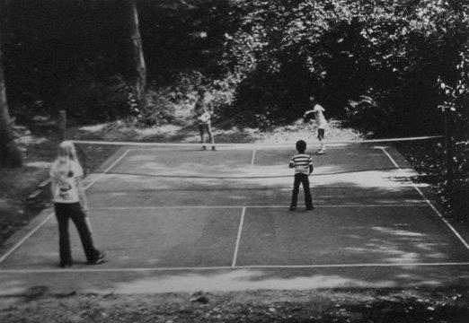
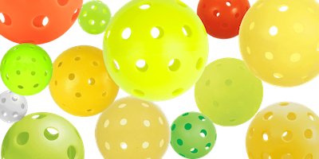
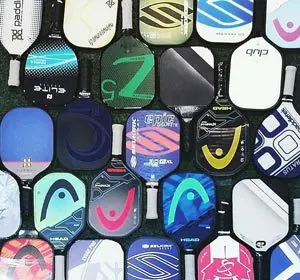
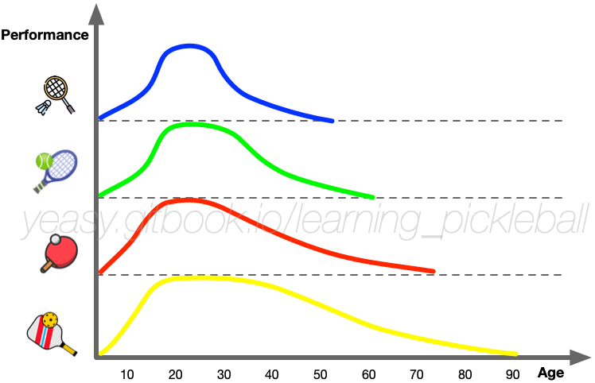

# 背景知识

匹克球（Pickleball）是一项诞生于上世纪六十年代的新兴球类运动，已经风靡北美，并在全世界受到越来越多的关注。

匹克球融合了网球、羽毛球、乒乓球等运动的特点，打法有趣、容易上手，并且活动量适中、不易受伤，可谓老少咸宜。无论是七八十的长者，还是十来岁的孩童，谁都可以参与进来。

## 起源与发展

1965 年夏天，匹克球由国会议员 Joel Pritchard（1925 ~ 1997）和其朋友 Bill Bell（1923 ~ 2006）、Barney McCallum（1926 ~ 2019）在美国西雅图市的贝恩布里奇岛 （Bainbridge Island）度假时发明。

几位发明人都热衷于打羽毛球和网球，但因门槛较高，其家人经常无法参与一起享受这些运动的乐趣。他们一直想创造一项老少皆宜的运动。在一个夏天的周六，刚打完高尔夫球的Joel Pritchard和朋友 Bill Bell回到了家中，发现他们的家人都闲着没什么事可做。社区内有一个废弃的羽毛球场，但是他们没找齐羽毛球设备，于是即兴发挥，用乒乓球拍打一个穿了孔的塑料球。最开始他们隔着羽毛球网打，很快发现把网降低后当网球打，塑料球在沥青地面上弹跳得很不错。后来，Barney McCallum也被邀请加入了游戏中。三个人参考当时的羽毛球规则，并且考虑到方便没有运动基础的家人们一起参与，制定了匹克球最早的游戏规则。

这项运动一经推出，便深受当地人喜爱，并迅速传播开来。匹克球这个名字源于当地的赛艇活动。“Pickle Boat”是指由没有队伍愿意挑选的选手组成的船，通常是比赛的最后一名。

到 1990 年，匹克球已经推广到全美 50 个州。

2010 年，国际匹克球联盟（International Federation of Pickleball，IFP）正式成立，致力于在全球推广匹克球运动。2018年，世界匹克球联盟（World Pickleball Federation，WPF）正式成立，同样希望能推动匹克球的发展。2023 年 10 月，奥组委宣布在 2028 年奥运会上接受 9 个新运动，其中没有匹克球。同年 11 月，全球匹克球联盟（Global Pickleball Federation，GPF）成立，作为一个统一的国际匹克球组织来推动匹克球在全球的发展，并确保匹克球成为2032年奥运会的正式项目。

为了纪念匹克球的发明地，自 2017 年开始的世界匹克球大赛命名其奖杯为“贝恩布里奇岛杯（Bainbridge Cup）”。先后在西班牙、意大利、德国、美国、印度等国家举办。

## 匹克球器材

匹克球是一种硬质塑料球，比网球略大，通常为黄色或橙色等颜色。球面上有26到40个直径1厘米左右的圆形孔洞（室内和室外球存在差异，室内球较软较轻，为26孔，孔径较大，飞行速度较慢）。球的旋转不会太剧烈，同时弹性也不大，使得其在空中飞行的速度相对较慢。

匹克球的球拍像是大号的不带胶皮的乒乓球拍，长度和宽度之和不能超过 24 英寸（60.96 cm），其中长度不能超过 17 英寸（43.18 cm）。通常球拍长多为 15.5 ~ 17 英寸（39.37 ~ 43.18 cm），拍柄部分长4~5.5英寸（10.16 ~ 13.97 cm），宽为7 ~ 8.25 英寸（17.78 ~ 20.96 cm）。最初球拍多为木质，后来也采用了玻璃纤维、碳纤维等新材料制作。球拍弹性不大，表面比较光滑。匹克球十分容易上手，但要想打得好需要花费一定的时间和精力来学习技巧、提高体能和掌握合适的策略。

## 基本规则

匹克球场地大小为 44x20 英尺（约为 13.41x6.10 米），球网中间高 34 英寸（约为 86.36 厘米），两边高度为 36 英寸（约为 91.44 厘米）。球场底线后要预留 10 英尺（约 3.05 米）以上的距离，边线外要预留 7 英尺（约 2.13 米）以上的距离。线宽为 2 英寸（5.08 厘米）。室内球场顶高至少为 20 英尺（约 6.10 米）。

球网两侧各 7 英尺（约 2.13 米）范围地面区域称为非截击区“（Non-Volley Zone，NVZ）”或“厨房（Kitchen）”。截击前、中、后，球员身体任何部位（包括球拍和饰物）不得触碰到非截击区。

匹克球场地和羽毛球场地大小相同。因此，同一个场地把球网升起来可打羽毛球，降下来可打匹克球，十分方便。

匹克球计分规则参考了早期羽毛球的发球得分制规则，即只有发球方赢得发球回合时可以得分。

以双打为例，每局 11 分，发球侧两名选手各有一次发球机会（每侧共计两次发球机会）。发球后，对方需要等球触地后接球，接发球回来，发球方需要等球再次触地后把球打到对面。从第四拍开始，双方可以触地接球，也可以截击未落地过的球。

如果发球方在发球回合得分，则与队友换边后继续发球，否则换队友发球。只有发球方赢球后可以得分，接发球方即便赢得回合也不得分。

## 运动特点

匹克球融合了羽毛球、乒乓球和网球的元素，是一项全面的运动。在常见的双打比赛中，四名球员分为两队，由于场地相对较小，对跑动的要求不高。有时人们戏称匹克球是中老年网球（seniors' tennis）。但实际上，其专业比赛的激烈程度常常超过网球，需要高超的技巧和策略。

匹克球运动时具有好上手、易控制、运动量适中（没有网球羽毛球对弹跳和跑动要求那么高）等特点。原因包括：匹克球的活动场地不大（比网球场地小）、匹克球重量较轻（仅 20 余克）且弹性不大，球拍重量较轻等。因此匹克球可以单打或双打，室内室外场地均可，受到不同年龄层人们的喜爱。

匹克球整体的活动量适中，但是技巧十分丰富，除了抽球、扣球、吊球、削球，还有截击、挑球等打法。双方比拼的不仅有力量或速度，更重要的是对球的控制。尤其在双打时，团队配合特别重要。匹克球比赛的回合数往往较多，既有狂风骤雨般的极速对攻，又有太极一般的柔中带刚，场面跌宕起伏，颇具观赏性。

## 未来展望

据Sports & Fitness Industry Association 2023 年报告估计，全美已有近 900 万名匹克球爱好者（网球不到 2000 万人，羽毛球不到 150 万人，乒乓球接近 100 万），并且正以每年超过 20% 的速度增长中。据预测，2030 年全球匹克球玩家将达到 4000 万人。美国两大职业匹克球联盟（Professional Pickleball Association 和 Association of Pickleball Professionals）每年分别举办 20 和 30 场大型赛事。职业比赛中多为 14 岁到 35 岁的青少年。

除了北美，匹克球在欧洲地区也已十分普及。亚洲地区包括中国、日本、印度、菲律宾、新加坡、印尼、泰国、马来西亚、孟加拉、巴基斯坦等也开始流行和举办赛事。截止到 2022 年底，全球已有超过 60 个国家加入了国际匹克球联盟，举办了 12 次国际比赛。匹克球将成为2024年巴黎奥运会的表演项目，相信不远的将来，匹克球会成为奥运会等国际赛事的正式项目。

此外，作为一项适合所有年龄段的运动，匹克球越来越受到教育机构的重视，已有越来越多的学校将其设为体育课程，仅在纽约州就有超过 500 所学校开设了相关课程。在其他各国，也有越来越多的学校将其设置为课程。匹克球运动有助于提高学生的身体素质、协调性和反应能力。同时，匹克球的团队合作和竞争意识也能够培养学生的社交技能和团队精神。
