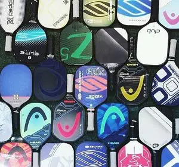

# Background Knowledge

Pickleball, as an emerging sport born in the 1960s, has swept North America and attracted more and more interests among people worldwide.

Pickleball combines the skills of tennis, badminton, table tennis and other sports. It is fun to play, easy to learn, and moderate in intensity, and it is not easy to be injured. It can be described as suitable for all ages. Anyone in their 70s or 80s, or children in their teens, can participate.

## The Origin of Pickleball

In the summer of 1965, the pickleball was invented by Congressman **Joel Pritchard** and his neighbors **Barney McCallum** and **Bill Bell** while vacationing on Bainbridge Island in Seattle, USA.

It is said that they both like to play tennis and badminton, but because of the high learning difficulty, their families can not join easily. So, they wanted to invent a sport that the seniors and youths can also participate in. After a comprehensive study of tennis, badminton, table tennis and other sports, the three inventors chose a moderate court size, used a wooden racket, and designed a slow-flying plastic ball, which greatly lowered the learning bar for getting started. Everyone fell in love with the new sport all at once, and it spread soon.
 
When playing the new sport, a pet dog named "Pickle" likes to run after the ball, so the inventor named it Pickleball.
 
To commemorate the invention of the pickleball, the World Pickleball Championship since 2017 named its trophy the "Bainbridge Cup". The first three championships were won by its country of origin, the United States.

## Basic Rules

The court size is 44x20 feet (about 13.4x6.1 meters), and the net height is 34 inches and 36 inches at the center and side (about 88.36 cm and 91.44 cm), which is the same size as the badminton court. Therefore, it is very convenient to raise the net to play badminton and lower it to play pickleball on the same field.

Pickleballs used in official competitions are slightly larger than tennis balls. They are made of hard plastic and are mostly yellow or orange. There are balls for outdoor playing and indoor playing. The indoor balls are slightly softer and have fewer holes. The holes are with a diameter of less than 1cm, which makes the rotation not too quick, and the flying speed not too fast. Therefore, people sometimes jokingly call the pickleball as seniors' tennis. But in fact, professional pickleball games are often more intense than tennis.

The paddle of the Pickleball is like a large table tennis paddle without rubber, with a length of 15.5 ~ 17 inches (39.37 ~ 43.18 cm) and a width of 7 ~ 8.25 inches (17.78 ~ 20.96 cm). It was originally made of wood, and later glass fiber and carbon fiber were used, and other new materials too. The paddle has little elasticity and a smooth surface. Pickleball is easy to start, but getting advanced requires lots of skills, strength and strategies.

Pickleball scoring is similar to badminton, but only the serving team can score points during their round.

Taking doubles as an example, each game has 11 points, and each player on the serving side has one chance to serve (In total two chances for each side). After serving, the opponent receives the serve and returns, and the serving party hits the ball to the opposite side. From the fourth shot,  players can either hit groundstroke or volley the ball that has not landed. If the serving team scores in this round, then switch sides with teammates and continue serving, otherwise the teammate will continue to serve. Only serving team can score points if they win the round, and the receiving team will not get points even win.

In addition, the area near the net is called the "Non-Volley Zone (NVZ)" or "Kitchen". Competitors are not allowed to step into this area before and after a volley.

## Pickleball Features

Pickleball incorporates elements of badminton, table tennis and tennis. A group of four players in a regular double game are playing in a not very large court, making it easier to run and play.

Pickleball is quick to start, easy to control, moderate to run (not as high as tennis and badminton for jumping and running), etc. The reasons are: a) the court of pickleball is not large (smaller than tennis court); b) the weight of pickleball is relatively light (only more than 20 grams) and the ball does not bounce a lot; c) the racket is light in weight and has a large hitting area. Therefore, pickleballs can be played in singles or doubles, indoor and outdoor venues, and are loved by people of different ages.

The overall amount of activity in pickleball is moderate, but it has rich skills. In addition to drive, smash, drop, and slices, there are also volleys and lobs. The competition between the two sides is not only about strength or speed, but also about the control of the ball (which is often more important). In doubles, teamwork is especially critical. In pickleball games, one rally can last to tens of hits, which is quite ornamental.

## Pickleball Tournaments

According to the USA Pickleball Association (USAPA), there are currently more than 5 million pickleball enthusiasts in the United States, and the number is growing at a rate of more than 20% per year. The nation organizes 4 national championships and dozens of local events each year.

In addition to North America, the pickleball has also become very popular in Europe. Asian regions including China, Japan, India, Philippines, Singapore, Indonesia, Thailand, Malaysia, Bangladesh, Pakistan, have also begun to popularize and hold big tournaments. As of September 2022, over 50 countries around the world have joined the International Federation of Pickleball (IFP), hosting 12 international competitions. It is believed that in the near future, the Pickleball will become an official event in the Olympic Games and other international events.

In addition, more and more schools have made it a physical education program, with more than 500 schools in New York State alone. In other countries, more and more schools are setting it up as a new course.