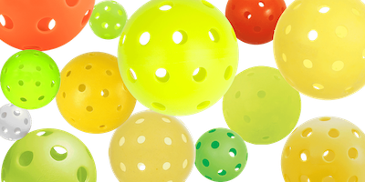
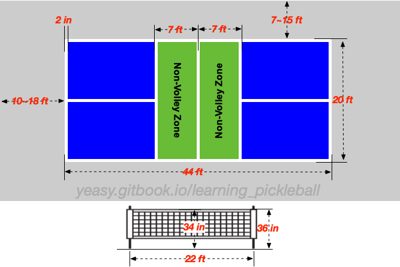
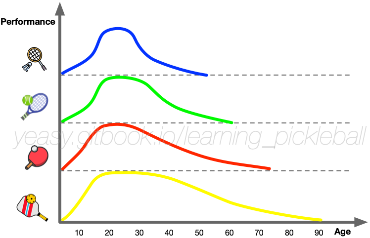

# Background Knowledge

Pickleball, as an emerging sport born in the 1960s, has swept North America and attracted more and more interests among people worldwide.

Pickleball combines the skills of tennis, badminton, table tennis and other sports. It is fun to play, easy to learn, and moderate in intensity, and it is not easy to be injured. It can be described as suitable for all ages. Anyone in their 70s or 80s, or children in their teens, can participate.

## Origin and Development

In the summer of 1965, the pickleball was invented by Congressman Joel Pritchard (1925 ~ 1997) and his friends Bill Bell (1923 ~ 2006) and Barney McCallum (1926 ~ 2019) while vacationing on Bainbridge Island in Seattle, USA.

The inventors of the Pickleball are keen on playing badminton and tennis, but due to the high entry threshold, their families cannot enjoy sports with them together. So they want to create a sport for all ages. On a summer Saturday, Joel Pritchard and his friend Bill Bell returned home from a round of golf to find that their family had nothing to do. There was an abandoned badminton court in the community, but they didn't have all the badminton equipment, so they improvised and hit a plastic ball with a hole in it with a table tennis racket. At first they played with a badminton net, but soon found that the net was lowered and played as a tennis ball. The plastic ball bounced very well on the asphalt. Later, Barney McCallum was also invited to join the game. The three refer to the badminton game at that time, and considering the convenience of family members who have no sports foundation to participate together, they formulated the earliest game rules of pickleball. Interestingly, the name "pickleball" comes from a local rowing term. A "Pickle Boat" refers to a boat made up of rowers who were not selected by any team, usually finishing last in the race.

Over time, more and more people began to enjoy the sport. In 1967, the first dedicated pickleball court was built in Bob O’Brien’s backyard, marking the transition of pickleball from makeshift court markings to an independent sport.

In 1968, Pritchard's son, David Pritchard, and a few friends recognized the commercial potential of the sport. They founded "Pickle-Ball Inc." and began manufacturing wooden paddles and complete pickleball equipment sets. In 1972, they successfully trademarked the name "Pickleball," officially transitioning it from a casual family game to a commercialized sport.

In the spring of 1976, the first known pickleball tournament was held at the South Center Athletic Club in Tukwila, Washington. Many participants were college tennis enthusiasts, and they used wooden paddles for the competition.

By the 1980s, pickleball had gradually gained popularity across the United States. In 1984, the United States Amateur Pickleball Association (USAPA, now known as USA Pickleball) was established. That same year, the first official rulebook was published, further standardizing the sport.

At the same time, paddle technology continued to evolve. In 1984, Arlen Paranto, a Boeing engineer, developed the first high-performance pickleball paddle using composite materials (fiberglass and a honeycomb core). The introduction of these materials made pickleball more professional and accelerated its development.

By 1990, pickleball had spread to all 50 states in the U.S. Around 2000, the sport was introduced into school physical education programs, further expanding its audience.

The real explosion in pickleball's growth began in the 2010s. As the baby boomer generation entered retirement, they sought a low-impact, easy-to-learn, and socially engaging sport—pickleball perfectly met these needs. Retirement communities in states like Florida and Arizona became the first core hubs for promoting pickleball.

In 2010, with the support of USA Pickleball, the International Federation of Pickleball (IFP) was founded to promote the sport globally. It was later renamed the International Pickleball Federation (IPF).

In 2016, the first U.S. Open Pickleball Championships were held in Naples, Florida, attracting around 800 professional players and 2,000 spectators, further pushing pickleball toward professionalization.

In 2017, the first international pickleball tournament was held in Madrid, Spain. To honor the sport’s origins, the tournament’s trophy was named the "Bainbridge Cup." The event has since been hosted in Spain (2017), Italy (2018), Germany (2019), the U.S. (2021), and India (2022).

Meanwhile, professional tournaments have been emerging rapidly. The Professional Pickleball Association (PPA) was established in 2017, followed by the Association of Pickleball Professionals (APP) in 2019 and Major League Pickleball (MLP) in 2021. These organizations have attracted numerous professional athletes and investors, including sports icons like LeBron James and Tom Brady, who have invested in pickleball clubs.

In 2018, the World Pickleball Federation (WPF) was officially established, aiming to further promote the sport globally.

In 2020, the COVID-19 pandemic halted most global sporting events, leading people to seek safe outdoor activities. With its small court size, low physical impact, and ease of maintaining social distance, pickleball quickly became one of the most popular sports during the pandemic. Data shows that the number of core pickleball players grew from 2.5 million in 2019 to over 13 million in 2023, with an annual growth rate of over 50%.

In October 2023, the International Olympic Committee announced nine new sports for the 2028 Olympics, but pickleball was not included. However, in November 2023, the Global Pickleball Federation (GPF) was established as a unified international governing body to promote pickleball worldwide and ensure its inclusion in the 2032 Olympics.

In November 2024, according to a report by the Sports & Fitness Industry Association, the U.S. had approximately 13 million pickleball enthusiasts, with the majority of players aged between 25 and 34.

## Ball and Paddle

A pickleball ball is a hard plastic ball, slightly larger than a tennis ball, and is usually colored like yellow or orange. The diameter is usually 2.87~2.97 inches and the weight is 0.78~0.935 ounces. There are 26 ~ 40 circular holes with a diameter of around 1 cm on the spherical surface (there are differences between indoor and outdoor balls, the softer and lighter indoor ball has 26 holes, the hole diameter is larger and fly more slowly). The rotation of the ball is not too violent, and at the same time the elasticity is not great, making it fly relatively slowly in the air.

The paddle of the Pickleball is like a large table tennis paddle without rubber, the sum of whose length and width cannot exceed 24 inches, where the length cannot exceed 17 inches. Usually the paddle has a length of 15.5 ~ 17 inches (39.37 ~ 43.18 cm) and a width of 7 ~ 8.25 inches (17.78 ~ 20.96 cm), and the handler length is 4~5.5 inches. At first, the rackets were mostly made of wood, but later they were also made of new materials such as glass fiber and carbon fiber. The racket is not very elastic and has a relatively smooth surface. Pickleball is very easy to play, but it takes a certain amount of time and energy to learn skills, improve physical fitness and master appropriate strategies to play well.

## Basic Rules

The pickleball field measures 44x20 feet and the net is 34 inches high in the middle and 36 inches high on the side. At least 10 feet (approximately 3 meters) of distance should remain after the baseline, and at least 7 feet of distance should be remained from the sideline. The line width is 2 inches. For indoor courts, there must be at least 20 feet (approximately 6.1 meters) height from the ceiling.

The ground area within 7 feet (approximately 2.13 meters) on both sides of the net is called the "Non-Volley Zone (NVZ)" or "Kitchen (Kitchen)". Before, during and after the volley, no part of the player's body (including the paddle and accessories) may touch the Non-Volley Zone.

A pickleball court is the same size as a badminton court. Therefore, it is very convenient to raise the net to play badminton and lower it to play pickleball in the same field.

Pickleball scoring is similar to the old rules in badminton, and only the serving team can score points if they win their round.

Taking doubles as an example, each game has 11 points, and each player on the serving side has one chance to serve (In total two chances for each side). After serving, the opponent receives the serve and returns, and the serving party hits the ball to the opposite side. From the fourth shot,  players can either hit groundstroke or volley the ball that has not landed. If the serving team scores in this round, then switch sides with teammates and continue serving, otherwise the teammate will continue to serve. Only serving team can score points if they win the round, and the receiving team will not get points even win.

## Pickleball Features

Pickleball combines elements of badminton, table tennis and tennis and is a comprehensive sport. In a common doubles match, four players are divided into two teams, and because the court is relatively small, the requirements for running are not high. Sometimes people jokingly refer to Pickleball as seniors' tennis. But in fact, the intensity of professional games is often more than tennis, requiring superb skills and strategies.

Pickleball is quick to start, easy to control, moderate to run (not as high as tennis and badminton for jumping and running), etc. The reasons include: a) the court of pickleball is not large (smaller than tennis court); b) the weight of pickleball is relatively light (only more than 20 grams) and the ball does not bounce a lot; c) the paddle is light in weight and has a large hitting area. Therefore, pickleballs can be played in singles or doubles, indoor and outdoor venues, and are loved by people of different ages.

The overall amount of activity in pickleball is moderate, but it has rich skills. In addition to drive, smash, drop, and slices, there are also volleys and lobs. The competition between the two sides is not only about strength or speed, but also about the control of the ball (which is often more important). In doubles, teamwork is especially critical. In pickleball games, one rally can last to tens of hits, there are not only the extremely fast attack like a storm, but also the softness with strength like Tai Chi, which is quite entertaining.

## Status and Future

It is estimated that there are already 50 million pickleball enthusiasts in the United States (compared to fewer than 20 million for tennis, fewer than 1.5 million for badminton, and close to 1 million for table tennis), and the sport is growing at an annual rate of over 20%. Projections indicate that by 2030, the global pickleball player base will exceed 100 million. Additionally, the average age of players is rapidly decreasing, with most professional tournament participants now ranging from 14 to 35 years old.

Beyond North America, pickleball has also gained significant popularity in Europe. In Asia, the sport is becoming increasingly widespread, with countries such as China, Japan, India, the Philippines, Singapore, Indonesia, Thailand, Malaysia, Bangladesh, and Pakistan actively adopting and organizing tournaments.

As of the end of 2022, more than 60 countries had joined the International Pickleball Federation, and 12 international tournaments had been held. It is widely believed that in the near future, pickleball will become an official event in the Olympics and other international competitions.

In addition, as a sport suitable for all ages, pickleball has been increasingly valued by educational institutions, and more and more schools have set it up as a physical education course, with more than 500 schools in New York State alone. related courses. In other countries, more and more schools have set it as a curriculum. Pickleball helps to improve students' physical fitness, coordination and responsiveness. At the same time, the sense of teamwork and competition of pickleball can also cultivate students' social skills and team spirit.