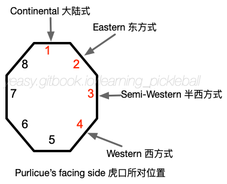

# 持拍与击球发力

正确的握拍和施力技巧是学习打匹克球的基础。球员应该能够使用正确的技巧来打出不同力量、速度、落点和旋转的球。

不正确的握拍或施力方式可能会限制球员的技术水平提高，并可能导致受伤。

## 持拍手法

匹克球拍柄可以划分为8个部分，如下图所示。按照虎口所对拍柄不同位置，大致可以分为 4 种持拍方式：**大陆式**（中性）、**东方式**、**半西方式**、**西方式**持拍。

各种持拍方式的特点总结如下：

* **大陆式**：虎口面向 1 号位置，即类似握手或握锤子的姿势。右手持拍时，伸直手臂后正手拍面正对左侧。大陆式持拍无论正手还是反手击球都很容易发力，可以快速进行正反手转换，但不利于制造摩擦。大陆式持拍可以用在大部分场景中。
* **东方式**：虎口面向 2 号位置。右手持拍时，伸直手臂后正手拍面略向左下方倾斜。相对大陆式持拍，东方式握拍正手可以打出更多的上旋动作，往往用在正手抽球或吊球中。
* **半西方式**：虎口面向 3 号位置。右手持拍时，伸直手臂后正手拍面向左下方倾斜。相对东方式握拍，半西方式持拍正手可以打出更多的上旋动作和击球角度，但很难打出下旋球。半西方式持拍可以用在正手位的后场抽球或前场截击中。
* **西方式**：虎口面向 4 号位置，即所谓的招财猫握拍。右手持拍时，伸直手臂后正手拍面朝向地面。西方式握拍是一种极端的握拍方式，完全放弃了反手位。因此，除了偶尔用于正手位网前高球扣杀，很少在正式比赛中出现。

推荐球员采用**大陆式握拍**和**东方式握拍**方法为主，并在比赛中根据具体情况随时进行调整。

球员击球后应立刻恢复到准备姿势，保持球拍位于身前。持拍手握住球拍，非持拍手手指应轻触球拍表面。

持拍时手掌应该适当放松，手心留空。如果 10 分为满分，准备时 3 分即可。要做到松而不散，稳而不僵。击打到球的瞬间，要适当用力抓紧球拍，以保持拍面稳定。

正手抽球或吊球时，可以采用东方式持拍。食指可以轻搭在拍面上，以辅助感觉拍面角度。

反手击球时，可以采用大陆式握拍。拇指可以抵在 7 号位置，以辅助发力和保持拍面稳定。

## 如何击球

球员需要时刻保持身体朝向球，并将球拍放在胸前，拍头可以指向正前方或略微偏向反手位置，以随时准备击球。由于匹克球和球拍表面相对光滑，难以通过摩擦来控制球的飞行轨迹，因此稳定地击球至关重要。

首先，要使用球拍的甜区来击球。在甜区击球可以确保球的飞行方向与拍面方向一致，并且使击打的力量充分传递到球上。非甜区击球会导致球的角度不稳定和击打力量的非线性损失。其次，在击球瞬间，手指要握紧球拍，以确保力量稳定地传递到球上。此外，在击打球后，胳膊要沿着球的飞行方向持续发力，以确保球稳定地飞出去。

初学者应时刻关注来球，眼睛跟随球的运动。熟练掌握后，注意力应该分别放在对手当前位置和球上，并预测对手可能的回球和移动。通过练习击球，球员应逐渐感受和掌握匹克球不同的力量、速度、落点和旋转。

## 如何发力

球类运动的力量的根源在于腿部，而非胳膊，这可能有些出人意料。但是如果你曾经尝试在冰场上打球，你就会感受到很难发力。

以右手正手抽球为例，准备击球前，身体转向右侧，重心位于右脚。右腿用力蹬地，髋部向前，顺势转动腰部，并带动胳膊收起。此时，蹬地转腰的力量通过胳膊传递到球拍上。在击球瞬间，收小臂，手指抓紧球拍，进一步增加击球力量，并稳定拍面的方向。最终，整个身体产生的力量击打到球上，将球送出。在这个过程中，身体前移，重心从右脚转移到左脚。

从顺序上看，你需要依次转动脚、腿、腰、躯干、肩膀、上臂、前臂、手，逐级加力，并最终将合力传递到球拍上。

注意在转腰挥动胳膊的过程中，身体各部分（特别是胳膊和手指）在击球前保持放松，击球时瞬间收紧发力，击球后再自然放松。通过由松到紧的过程，你可以使用较小的动作产生很大的力量。

在诸如吊球或截击等场景下，运动员不需要进行蹬地、转腰、挥拍的完整发力过程，但其核心仍然一致，需要使用源自身体的力量，并通过由松到紧的过程发力。

## 击球训练

以下是一些针对增强击球能力的训练：

* 蹬地转腰练习：每组20个，每天3组。这个练习是为了锻炼腿部和腰部力量，以便更好地发挥球类运动的力量来源。建议逐渐增加练习的次数和组数，但要注意适度，以免造成过度疲劳或受伤。
* 颠球体会手指发力：正手、反手、正反手各100个。颠球是提高手部协调能力和手指力量的有效练习方法。建议逐渐增加颠球次数和练习难度，例如采用不同节奏和速度颠球。
* 正手/反手多球击球训练：每组20个，每天3组。这种练习可以提高手臂和肩膀的力量和协调性，以及对球的控制能力。

以上练习需要坚持长期训练才能够取得显著的效果，同时要注意保护身体和适度休息，以免因过度疲劳或不正确的练习姿势造成伤痛。
