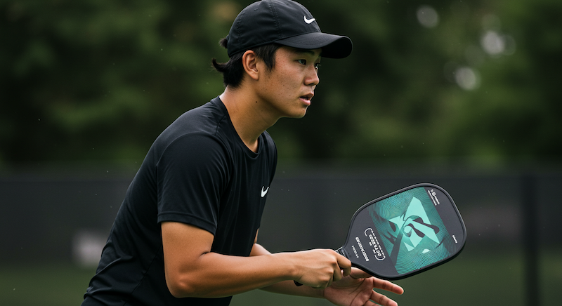

# Hold Paddle and Hit the Ball

Holding the paddle to hit the ball with power correctly is the most fundamental skill of learning to play pickleball. Players should be able to hit the ball with different power, speed, placement and spin in the correct way.

Using a wrong way of holding paddle or generating force will restrict the improvement of the player's level and easily bring injuries.

## Hold Paddle

The pickleball paddle handle can divide into 8 side faces, as shown in the figure below. According to the position that the purlicue (the area between the thumb and index finger) touches the paddle handle, there are four major paddle holding styles: **Continental style** (also called neutral style), **Eastern style**, **Semi-western style**, and **Western style**.

The characteristics of the various styles are summarized as follows:

* **Continental Style**: The purlicue is facing position 1, which is similar to a handshake or hammer-holding position. When holding with the right hand, the paddle's forehand surface will face to the left after straightening the arm. Continental style makes it easy to hit the ball with either forehand or backhand, and switch quickly between them. But it is not conducive to creating strong friction. This style can be adopted in most situations in the game.
* **Eastern Style**: The purlicue faces position 2. When holding with the right hand, the paddle's forehand surface will face slightly to the lower left after straightening the arm. Compared with the continental grip, the eastern style can generate more topspin movements by the forehand, which can be used in the drive or drop by forehand.
* **Semi-Western Style**: The purlicue faces the position 3. When holding with the right hand, the paddle's forehand surface will face to the lower left after straightening the arm. The semi-western grip can produce more topspin with larger hitting range by the forehand than the eastern grip, but it is difficult to hit the ball from backhand or generate backspin. This style can be used in the drive from backcourt or volley in the front-court by the forehand.
* **Western Style**: The purlicue faces position 4, the so-called lucky cat grip. When holding with the right hand, the paddle's forehand surface will face towards the ground after straightening the arm. The Western grip is an extreme grip that gives up the backhand, and is rarely used in pickleball games except occasional usage in smash in the front-court by forehand.

Generally, the continental grip is recommended to use as a base, and fine-tuning can be made according to the specific situation.

After hitting the ball, the player should return to the ready position immediately, with the paddle in front of the body, the main hand holding the paddle, and the fingers of the other hand should lightly touch the surface of the paddle.

When holding the paddle, the hand should be properly relaxed, and the palm should be left empty. If the most tightening holding is 10 points, it is enough to achieve 3 points.

When using the forehand to do drive or drop, you can switch to Eastern style by little adjustment, and the index finger can be placed on the paddle surface to assist in feeling the angle of the paddle surface.

When using the backhand, the thumb can be placed on the position 7 to assist with more power and to keep the paddle stable.

## Hit the Ball

Players should keep their body facing the incoming ball at all times, and place the paddle in front of their chest (the head of the paddle can be pointed straight up ahead or slightly to the backhand), be ready to hit the ball.

The surface of the pickleball and paddle is relatively smooth, which makes it difficult to control the ball's trajectory by spins. Hence it is important to hit the ball consistently and adequately.

First, hit the ball with the sweet spot of the paddle, which guarantees the ball's flight direction is the same with paddle surface, and the power will be transferred to the ball efficiently. Hitting the ball from the non-sweet spot will cause the reduction of power and the instability of the ball; secondly, the paddle should be held tightly when the ball is hit, to make sure that the power is stably transmitted to the ball. In addition, after hitting the ball, your arm should continue to follow through in the direction of the ball's flying to ensure that the ball can be sent stably.

In order to learn how to hit the ball accurately, always pay attention to the incoming ball and track the ball with your eyes. Once mastered, you can focus partly on the opposing player's  position, and partly on hitting the ball.  At the same time, you can anticipate the opponent's possible return and moves.

From practices, the players should be able to feel and understand how to use appropriate power, speed, placement and spin when hitting the ball.

## Use Power

The source of power in pickleball comes from the legs rather than the arms, which may seem surprising. However, if you have ever tried playing on an ice rink, you would realize how difficult it is to generate power.

Take a forehand stroke as an example, assuming a right-handed grip. When preparing to hit the ball, the body turns to the right, with the weight centered on the right foot. The right leg pushes off the ground forcefully, the hips move forward, and the waist rotates accordingly, driving the arm to retract. At this moment, the power generated by pushing off the ground and rotating the waist is transmitted through the arm to the paddle. Upon contact with the ball, the forearm tightens, and the fingers grip the paddle firmly, further enhancing the striking force and stabilizing the paddle 's direction. Ultimately, the power generated by the entire body is transferred to the ball, sending it forward. During this process, the body moves forward, shifting the weight from the right foot to the left foot.

In terms of sequence, you need to engage the feet, legs, waist, torso, shoulders, upper arm, forearm, and hand in turn, progressively adding force and ultimately transmitting the combined power to the paddle.

It is important to keep all parts of the body (especially the arms and fingers) relaxed before hitting the ball, tightening explosively at the moment of impact, and then naturally relaxing again after the hit. By transitioning from relaxation to tension, you can generate significant power with minimal movement.

In situations such as dink or volley, you do not need to use the motions from legs or body, but the principle is the same. You still need to generate the power by tightening your fingers, and the power comes from the body.

## Daily Trainings

Here are some training exercises aimed at enhancing your hitting ability:

* Waist turning exercise: 20 reps per set, 3 sets per day. This exercise is meant to build leg and waist strength to better utilize the power source of ball sports. It is recommended to gradually increase the frequency and number of sets of this exercise, but be sure to exercise in moderation to avoid excessive fatigue or injury.
* Bouncing balls to improve finger strength: 100 reps each of forehand, backhand, and forehand-backhand. Bouncing ball is an effective way to improve hand coordination and finger strength. It is recommended to gradually increase the number of bouncing repetitions and difficulty, such as using different rhythms and speeds.
* Forehand/Backhand multi-ball hitting training: 20 reps per set, 3 sets per day. This type of exercise can improve the strength and coordination of your arms and shoulders, as well as your ability to control the ball.

These exercises require long-term training to achieve significant results, and it is important to protect your body and take adequate rest to avoid pain or injury caused by excessive fatigue or incorrect training postures.

