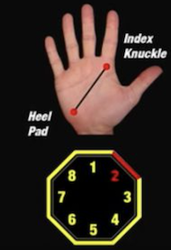
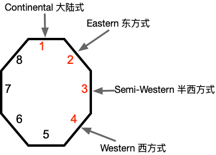

# 发球与接发球

发球和接发球的目的是为下一拍击球做好准备，避免造成对方好的进攻或上网机会。

在高水平比赛中，除非双方水平差距悬殊，否则通常较难通过发球或接发球直接得分。

单打比赛中，由于球员要覆盖范围更大，对发球和接发球的质量要求往往更高。

## 站位

与其它球类运动类似，球员发球或接发球时要保持稳定舒适的站位。通常双腿比肩略宽，膝盖微弯，随时准备跑动。

注意力部分放在对方球员的当前位置和可能的移动上，部分放在球上。

## 握拍与击球

一般应采用中式握拍方法，即类似握手或握锤子的姿势。

握拍手应该适当放松，手心留空，同时，食指可以轻轻搭在球拍上。如果 10 分为满分，做到 3 分即可。

击打到球时要瞬间握紧球拍，将力量稳定的传递到球上，同时注意要用球拍甜区击球。

在不击球时，要保持身体面向来球，时刻准备球拍放到身前击球。

## 发球

匹克球发球要通过下手位发到对角区域。为增加回球难度，要尽量落在底线附近。

发球时可以通过不同位置（如对方偏正手位、反手位或中间位）和不同速度的方式来试探对方回球质量。通常，快速球比慢速球具备更多威胁。

当对手站位较偏，或跑动较慢时，可以通过变化发球来调动对手取得主动。

单打时发球可以结合长短球和多角度球来调动对方站位。

双打时可多发中路长球，以迫使对方回球质量不高，无法及时上网。

## 掌握发球

发球的力量来自蹬地转腰。

通过蹬地转腰，力量从腿部传递到躯干，之后躯干带动胳膊挥动，将力量经由手指传递到球拍，最终平稳击打到球。

在击打到匹克球前，身体应当处于放松状态。在击打到球瞬间，手指抓紧球拍，将身体力量鞭打释放到球上。

由于匹克球较为光滑，发球应以击打球为主，可配合适量旋转。选手至少应当掌握上旋发球与不转球。

可以通过多球练习来训练发球。以能连续发球到指定区域内为准，一组 50 个，每天不少于 10 组练习。

熟练后可以练习发出不同旋转的发球。

## 接发球

准备接球时，要预留接球空间，以底线往后再退一步左右为宜。拍面要正对来球方向击球。

接发球时，拍面要正对来球方向击球，同时己方应及时随球上网（回球落地之前己方须跑到网前）。接发球要尽量落在对方底线附近，以迫使对方留在后场。。

接发球可以平击回球，也可以通过削球或上旋动作回球。当希望留给自己更多跑动时间时，可将球高抛，使其慢慢落到对方底线附近。

单打时，应多回球到对方空档处，造成对手跑动。

双打时，应多回球到对手两名球员之间的空档处（可略偏反手位），造成对方接球时的困扰。如果对方两名球员水平差异较大，可回球给水平较弱者。

## 掌握接发球

可以通过多球练习来训练接发球。以能连续回球到指定区域内为准，一组 50 个，每天不少于 10 组练习。

熟练后可以练习接不同旋转的发球。
