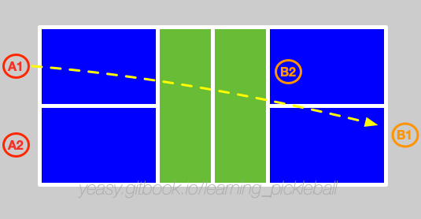

# Serve and Return

The purpose of serving and receiving is to prepare for the next shot, and to avoid giving the opponent a good attacking or approaching net opportunity.

In high-level games, it is generally difficult to score directly by serving or receiving, unless there is a huge gap between the players.

In singles games, because players have to cover the entire court, the quality requirements for serving and receiving are often higher.

## Position

Similar to other ball games, players need to maintain a stable and comfortable stance, usually with legs slightly wider than shoulders, knees slightly bent, and stand in a neutral position, ready to run at all times. 

Focus is partly on the opposing player's position and movement, and partly on the ball.

## Grip the Paddle and Hit the Ball

The continental grip method should generally be used, that is, a posture similar to shaking hands or holding a hammer.

The clapping hand should be properly relaxed, the palm of the hand should be left empty, and at the same time, the index finger can lightly touch or place on the racket. If the full firmly holding score is 10 points, it is enough to achieve 3 points at most time.

When hitting the ball, hold the racket tightly to transfer the power to the ball stably. And always to hit the ball with the sweet spot of the racket.

When not hitting the ball, keep your body facing the ball and always prepare the racket in front of the body to hit the ball.

## Serve

The ball should be served to the diagonal court with an underhand motion. 

Usually serve the ball as far as possible to let it land near the baseline (but not out), in order to hamper the opponent's return.

When serving, you can probe the opponent's return by serving to various places (e.g., the opponent's forehand position, backhand position or middle position) and with different speed. Generally, fast serving is more threatening than slow serving.

If the opponent's position is not neutral, or cannot run quickly, you can mobilize the opponent proactively by changing serving.

In single games, the long serve can be combined with long, short and multiple angles' serves to mobilize the opponent.

In double games, usually serve long balls near the middle to force the opponent to return the ball with low quality and not be able to quickly go to the net.

## Master the Serve

The power to serve comes from kicking the ground and turning the waist.

By kicking the ground and turning the waist, the power is transferred from the legs to the torso, and then the torso drives the arms to swing, transferring the power to the racket through the fingers, and finally hits the ball smoothly.

Before hitting the pickleball, the body should be in a relaxed state. At the moment of hitting the ball, fingers grip the racket tightly, and release your body power to the ball through the clap hand by whipping.

Because the pickleball is relatively smooth, the serve should generally use more hit with some spin. Players should at least master no-spin serve and topspin serve.

You can train your serve quickly with multiple balls. Subject to being able to serve continuously to the designated area, a group of 50, no less than 10 groups of practice every day.

Once you are proficient, you can practice serving with different spins.

## Return
When preparing to return the ball, keep enough space for hitting the ball. It is advisable to stay at a step back from the bottom line. The racquet should face the direction of the coming ball.

When returning the serve, players should follows the ball to go to the net (reach the NVZ line before the ball's landing), which forces the opponent to stay in the backcourt. Therefore, the returning ball should also land as close as possible to the baseline. 

The return ball can be returned by a hitting action, or a chopping action. When you want to have more time to run to the net, you can return the ball high and let it fall to the opponent's backcourt.

In single games, you can return the ball to the area far from the opponent more often, in order to let the opponent move more.

In double games, the ball can be returned to the space between the opponent's two players (may be slightly biased to the backhand position), causing trouble when the opponent receives the ball. If the level of the opponent's two players is quite different, you can return the ball to the weaker player.

## Master the Return

You can train your return quickly with multiple balls. Subject to the ability to continuously return the ball to the designated area, a group of 50, no less than 10 groups of practice every day.

After you are proficient, you can practice returning the serve with different spins.