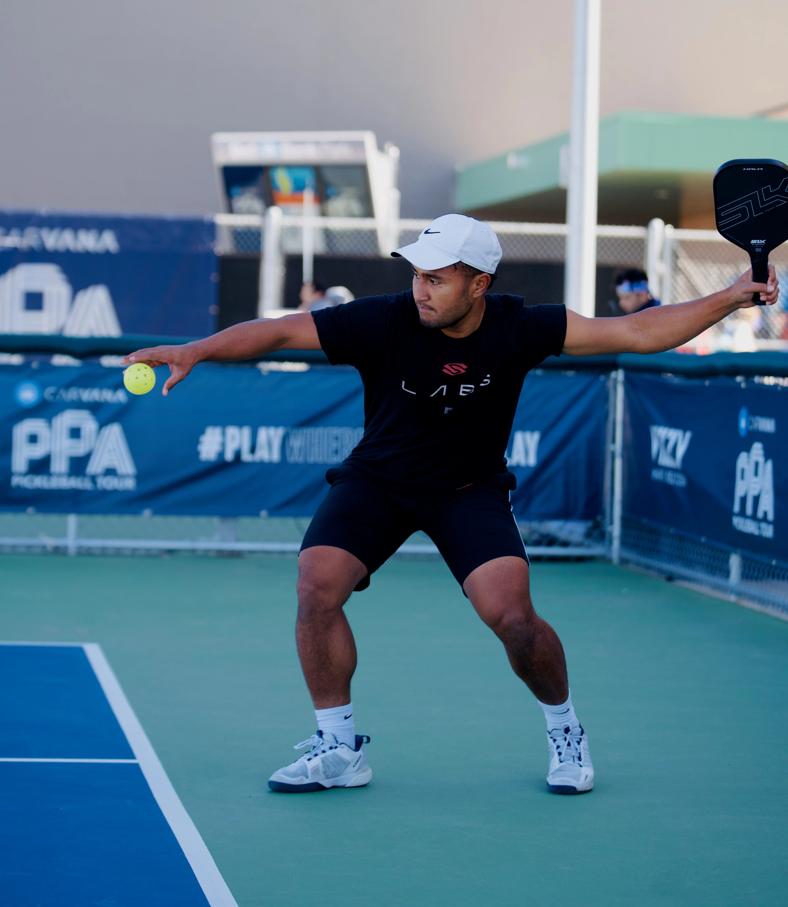

# Serve and Return

The purpose of serving and receiving is to prepare for the next shot, and to avoid giving the opponent a good opportunity to attack or approach the net.

In advanced-level games, it is generally difficult to score directly by serving or receiving, unless there is a large skill gap between the players.

Singles game players have to cover the entire court, hence will require more skills in serving and returning.

## Serve the Ball

When serving the ball, the player should stand behind the baseline, and the ball should be served to the diagonal half court, a.k.a, from the NVZ line (Not included) to the baseline. Once the score has been called, the player must serve the ball within 10 seconds.

There are two kinds of servings: **Volley serve** and **Drop serve**. The volley serve is to throw the ball up and hit the ball to serve directly, and it is required to swing in an upward arc motion with a low hand (the contacting point of the paddle cannot be higher than the waist, and the paddle top cannot be above the wrist). The drop serve is to let the ball drop freely and hit the ball after it bounces from the ground. There is no restriction on the hitting position or swing direction with drop serve.

> Note: Starting in 2025, the rules allow players to release the ball with their paddle (instead of only by hand), but imparting spin during the release is still prohibited. **The 2026 rules reinforce and emphasize that at the moment of impact, the hand must be below the waist, and the paddle head must be swung in an obvious upward arc (visibly moving upward), with the highest point of the paddle head not above the wrist.**

Usually serve the ball as far as possible to let it land near the baseline (but not out), in order to hamper the opponent's return and slow down the moving to net.

When serving, you can probe the opponent's return skills by serving to various targets (e.g., the opponent's forehand position, backhand position or middle position) with different height and speed. Generally, fast, low and backhand-targeted ball is more threatening than slow, high and forehand-targeted ball.

If the opponent's position is not neutral, or the player cannot run quickly, you can mobilize the opponent proactively by using different serving methods.

In singles' serving, the player can take advantage of various spins and placement to mobilize the opponent. For example, you can combine the left-spin long serve to the backhand and the right-spin short serve to the forehand; Or using top-spin serve or non-spin to the middle path.

In doubles, usually serve long balls to the middle between opponents to force them to return the ball not well and not be able to follow the ball to go to the net in time.

## Master the Serve

The power of a serve comes from the legs. By pushing off the ground and rotating the waist, the force is transferred from the legs to the torso, which then drives the arm to swing. This power is further transmitted through the fingers to the paddle, ultimately whipping the ball with the full force of the body. 

Before striking the pickleball, the body should remain relaxed. At the moment of impact, the fingers grip the paddle firmly, and after hitting the ball, the follow-through ensures that the body's power is released in a controlled and stable manner. Additionally, footwork and shifting body weight forward can be used to enhance the power of the serve. 

Since pickleballs have a smooth surface, the serve should primarily focus on striking the ball while incorporating a moderate amount of spin. Players should at least master topspin serves and flat (non-spinning) serves. 

The key to serving effectively is consistency to avoid errors. The next priority is to aim for deep placement to make it difficult for the opponent to return. Finally, incorporating power and spin—mainly topspin and sidespin—can further improve the effectiveness of the serve.

## Return the Ball
When preparing to return the ball, keep enough space for hitting the ball. It is advisable to stay at a step back from the bottom line. The body and the racquet should face the direction of the coming ball.

When returning the serve, players should follow the flying ball to go to the net (stay near the NVZ line before the ball's landing), which forces the opponent to stay in the backcourt. Therefore, the returning ball should also land as close as possible to the baseline.

In singles, you can return the ball to the area far from the opponent's feet more often, in order to let the opponent move more in distance.

In doubles, the ball can be returned to the space between the two opponent players (may be slightly near to the receiver's backhand), to increase the difficulty to return the ball. If the skill level of the opponent's two players is quite different, you can choose to return the ball to the weaker player.

## Master the Return

The key to returning the ball is to try to make it difficult for the opponent to hit the third shot, and at the same time to provide enough time to run to the net. Therefore, pay attention to returning the ball to the base line as much as possible, but not out of bounds.

The return can use a hitting action, or a slicing action. When you want to have more time to run to the net, you can return the ball high and let it fall to the opponent's backcourt.

## Training Methods
The serve and return skill can be trained with multiple balls practice. Try to continuously return the ball to the designated area. Practice no less than 10 groups with 50 balls per group every day.

After you are proficient, you can practice serving different spins with the same movement, and returning the ball of different spins.
