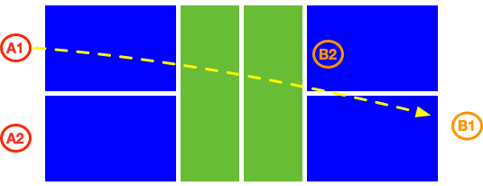
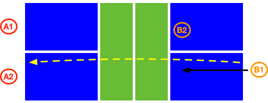

# Serve and Return

The purpose of serving and receiving is to prepare for the next shot, and to avoid giving the opponent a good opportunity to attack or approach the net.

In advanced-level games, it is generally difficult to score directly by serving or receiving, unless there is a large skill gap between the players.

Singles game players have to cover the entire court, hence will require more skills in serving and returning.

## Serve the Ball

The ball should be served to the diagonal half court with an underhand motion (paddle cannot be higher than the waist), from the NVZ line (Not included) to the baseline. Once the score has been called, the player must serve the ball within 10 seconds.

Usually serve the ball as far as possible to let it land near the baseline (but not out), in order to hamper the opponent's return and slow down the moving to net.

When serving, you can probe the opponent's return skills by serving to various places (e.g., the opponent's forehand position, backhand position or middle position) with different height and speed. Generally, fast, low and backhand ball is more threatening than slow, high and forehand ball.

If the opponent's position is not neutral, or the player cannot run quickly, you can mobilize the opponent proactively by using different serving methods.

In single games' serving, the player can take advantage of various spins and placement to mobilize the opponent.

In double games, usually serve long balls to the middle between opponents to force them to return the ball not well and not be able to go to the net in time.

## Master the Serve

By kicking the ground and turning the waist, the power is transferred from the legs to the torso, and then the torso drives the arms to swing, transferring the power to the paddle through the fingers, and finally the paddle hits the ball smoothly and stably.

Before hitting the pickleball, the body should be in a relax. At the moment of hitting the ball, use fingers to grip the paddle tightly, and release your body power to the ball through the holding hand by whipping.

Because the surface of pickleball is smooth, the serve should generally use more hit with less spin. Players should at least master no-spin serve and topspin serve.

You can learn how to master serve quickly with multiple balls training. The goal is to serve continuously to the designated location. Practice no less than 10 groups with 50 balls per group every day.

Once you are proficient with no-spin serving, you can practice serving with different spins.

## Return the Ball
When preparing to return the ball, keep enough space for hitting the ball. It is advisable to stay at a step back from the bottom line. The racquet should face the direction of the coming ball.

When returning the serve, players should follow the flying ball to go to the net (stay near the NVZ line before the ball's landing), which forces the opponent to stay in the backcourt. Therefore, the returning ball should also land as close as possible to the baseline. 

The return can use a hitting action, or a chopping action. When you want to have more time to run to the net, you can return the ball high and let it fall to the opponent's backcourt.

In single games, you can return the ball to the area far from the opponent's feet more often, in order to let the opponent move more in distance.

In double games, the ball can be returned to the space between the two opponent players (may be slightly near to the receiver's backhand), to increase the difficulty to return the ball. If the skill level of the opponent's two players is quite different, you can choose to return the ball to the weaker player.

## Master the Return

The return skill can be learned with multiple balls training. Try to continuously return the ball to the designated area. Practice no less than 10 groups with 50 balls per group every day.

After you are proficient, you can practice returning the serve with different spins.