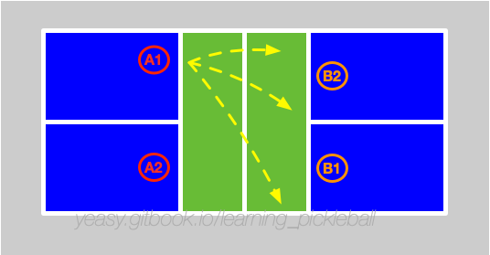
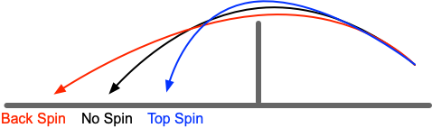

# Dink 技术

Dink 技术是匹克球比赛中最常见的技术，也是其他技术的前提。如果不掌握 Dink 技术，很难进阶较高水平。

## 什么是 Dink

Dink 是指在网前将球放入对方非截击区内的动作。通常其弧线较平，过网不高（一个球高度为佳），落入对方非截击区内的前半区或区域线附近。

Dink 在双打项目中经常使用，按照目标区域，大致可以分为如下三种：

* 直线球：直线球是指将球放入自己所面向的对手区域。例如，自己站位在左半球，将球放入对方的右半区内。直线球通常更容易控制，但容易出现轨迹较高或落点较远情况，容易被对方进攻；
* 斜线球：斜线球是指将球放入交叉的对手区域。例如，自己站位在左半球，将球放入对方的左半区内。斜线球距离更长，由于从球网中部过网，不容易拦截，并且落地后有一定角度，使得对方更难处理。如果球落地弹起后超出场地边线较多，要注意防护对方可能的 ATP 攻击。
* 中间球：中间球是指将球放入对方两名球员中间空档。由于两人皆可以接球，会对及时判断造成一定的困扰。

## 何时使用 Dink

当对方回球不太长或不太高时，此时己方没有较好的截击机会，可以等球触地弹起后使用 Dink。

Dink 主要目的是在没有好的进攻机会时，通过防守来避免对方有较好的进攻机会，同时调动对方，在相持中找寻己方进攻机会。

## 如何掌握 Dink

好的 Dink 要避免回球过远过高，使得对方可以形成截击下压。

因此，站位应当尽量靠近非截击区线，降低身体重心，控制球轨迹过网不高，使球过网后向下运动。

有多种方法可以达到 Dink 的效果，最简单高效的方法是推球。

推球时，应注意手腕相对固定，控制球拍角度稳定指向网袋上侧，无需引拍，通过前臂发力送出球，使球到达目的落点。为了保证出球轨迹稳定，在击球后胳膊推动球拍继续跟随 30 cm 左右。防守为目的时，球的落点尽量在非截击区的前半区，以避免对方进攻；为了调动对方，当对方站位不稳时，可以将球打到非截击区线附近（如两侧外角附近）或对手脚下。

掌握推球 Dink 后，可以配合旋转，给对方回球增加难度，包括：

* 上旋：下坠较快，同时造成对方回球过长过高。上旋球轨迹较高，一般应以对角回球为主；
* 下旋：落点较长，挤压对方接球空间，同时球弹跳较低，回球不易借力，容易下网；
* 侧旋：轨迹偏向侧方，回球不易控制路线，容易出界或被预判。

进行 Dink 训练时要注意：

* 保持耐心；
* 身体随球移动，跑到球前进方向，但击球时重心要保持稳定；
* 在身前击球，在球前击球，在呼气时击球；
* 手腕和肘部要固定，用身体和肩膀带动胳膊发力。

Dink 球对手感依赖较多，因此，需要先进行专门的手感练习。

* 颠球练习：使用球拍连续颠球，可以控制球的高度，控制球旋转或不旋转，并且可以采用正反拍面交替颠球。每次连续颠球应不少于 100 个，每天进行不少于 5 组练习。
* 多球练习：陪练人员将球打到非截击区内，选手将球 Dink 到指定目标区域内，球过网不高。每次连续 Dink 应不少于 50 个，每天进行不少于 10 组练习。先练习直线球，稳定后再练习斜线球。
* 动态练习：陪练人员和选手在网前水平移动，同时进行 Dink 训练。

