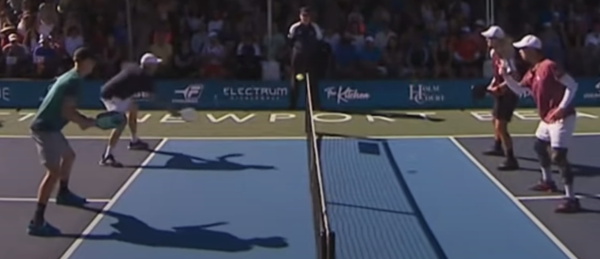
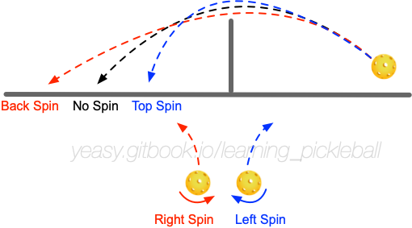

# 网前吊球技术

网前吊球技术是匹克球比赛中最常见的相持技术，也是后场吊球技术的前提。如果不掌握 网前吊球技术，很难进阶较高水平。

## 什么是网前吊球

网前吊球是指在网前将球打到对方非截击区内的动作。通常其弧线较平，过网不高（一个球高度以内为佳），落入对方非截击区的前半区或区域线附近。

网前吊球在双打项目中经常使用。按照目标区域，大致可以分为如下三种：

* 直线球：直线球是指将球打到自己所面向的对手区域。例如，自己站位在左半球，将球放入对方的右半区内。直线球通常更容易控制，但可能出现轨迹较高或落点较远情况，容易被对方进攻；
* 斜线球：斜线球是指将球打到交叉的对手区域。例如，自己站位在左半球，将球打到对方的左半区内。斜线球距离更长，由于从球网中部过网，不容易被拦截，并且落地后有一定角度，使得对方更难处理。但是如果球落地弹起后超出场地边线较多，对方很容易进行绕过网柱进攻（ATP），要注意防护。
* 中间球：中间球多用于双打比赛，是指将球放入对方两名球员中间空档。由于此时两人皆可以回球，会对及时判断造成一定的困扰。

## 何时使用网前吊球

当对方网前回球不太长或不太高时，此时己方没有较好的截击机会，可以等球触地弹起后使用网前吊球。当对方回球较长但不容易进攻时，可以在球落地前以拦截方式进行网前吊球。

网前吊球首要目的是在没有好的进攻机会时，通过防守来避免对方有较好的进攻机会；同时调动对方，在相持中创造己方进攻机会。当对方回球过高、过长时，可以通过截击来进攻。

## 掌握网前吊球

好的网前吊球要避免回球过远过高，使得对方可以形成截击或下压。

击球前站位应当尽量靠近非截击区线，注意降低身体重心柔和击球，控制球轨迹过网不高，使球过网后下坠。

有多种方法可以打出 网前吊球，最简单、高效的方法是推球。

推球时，应注意手腕要固定，控制球拍角度稳定指向网袋上侧。击球时无需引拍，直接通过前臂发力送出球，使球到达目的落点。为了保证出球轨迹稳定，在击球后胳膊继续推动球拍跟随 30 cm 左右。推球时注意以击打为主，不要刻意制造旋转。

防守为目的时，球的落点尽量在非截击区的前半区，以避免对方进攻；主动调动对方时，可以将球打到非截击区线附近（如两侧外角附近）或对手脚下，迫使对方移动。

掌握基础的推球式吊球后，可以结合旋转，给对方回球增加难度，包括：

* 上旋：下坠较快，落地后向前窜，同时会造成对方回球过长过高。上旋球轨迹较高，一般应以对角回球为主；
* 下旋：落点较长，挤压对方接球空间，同时球弹跳较低，回球不易借力，容易下网；
* 侧旋：轨迹偏向侧方，回球不易控制路线，容易出界或被预判。

球员在掌握旋转后，可以练习使用同一动作打出带有不同旋转的网前吊球。

## 训练方法

网前吊球对手感要求较高。要适应不同节奏下对球的控制，可以通过如下训练提高网前吊球质量。

* 颠球练习：使用球拍连续颠球，可以控制球的高度，控制球旋转或不旋转，并且可以采用正反拍面交替颠球。每次连续颠球应不少于 100 个，每天进行不少于 5 组练习。
* 多球练习：陪练人员将球打到非截击区内，学员将球打到指定目标区域内，球过网不高。每次连续网前吊球应不少于 50 个，每天进行不少于 10 组练习。先练习直线球，稳定后再练习斜线球。
* 动态练习：陪练人员和学员在网前水平移动，同时进行网前吊球训练。
*网前吊球中进攻练习：在网前吊球中找寻机会主动进攻，同时将对方的进攻球转为网前球。

进行网前吊球训练时要注意：

* 当没有好的进攻机会时，保持耐心，时刻观察对方站位和意图；
* 身体随球移动，跑到球前进方向，但击球时重心要保持稳定；
* 在身前击球，在球前击球，在呼气时击球；
* 手腕和肘部要固定，用身体和肩膀带动胳膊发力。