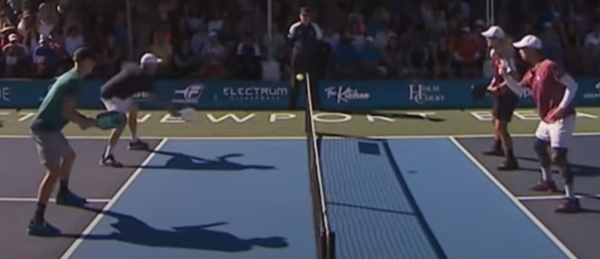

# How to Dink

The **Dink** is the most common engagement shot in pickleball and serves as the foundation for the drop shot. Mastering the dink is essential for high-level play.

## What is a Dink?

A dink is a soft shot hit into the opponent's Non-Volley Zone (NVZ). The ball should travel in a low, flat trajectory over the net (ideally clearing it by just a ball's height) and land in the front half of the opponent's NVZ or near the kitchen line.

Dinking is crucial in doubles. Based on placement, it falls into three categories:

*   **Straight Dink**: Hitting the ball directly in front of you (e.g., from your left court to the opponent's right). While easier to execute, straight dinks often have a higher or deeper trajectory, making them easier for the opponent to attack.
*   **Cross-court (Diagonal) Dink**: Hitting the ball diagonally to the opposite court (e.g., left court to left court). This is the preferred shot because:
    *   The court is longer diagonally, offering a larger margin for error.
    *   The net is lower in the middle (34 inches vs. 36 inches at the posts).
    *   It enters the opponent's court at an angle, making it harder to attack.
    *   *Note*: If the bounce goes wide of the sideline, be alert for an Around-The-Post (ATP) counter-attack.
*   **Middle Dink**: Placing the ball between the two opponents. This can cause confusion about who should take the shot, potentially forcing a weak return.

**Strategy Tip**: Generally, favor the cross-court dink. It minimizes unforced errors and limits the opponent's ability to volley. For example, to attack a straight dink, your return speed needs to be precise (5.0–6.8 m/s), whereas a cross-court dink allows for more speed (6.4–9.2 m/s). When scrambling or off-balance, aim for the middle to buy time and safely clear the low part of the net.

## When to Use the Dink

Use a dink when:
*   The opponent is at the net and you want to neutralize their attack.
*   The opponent hits a long ball that isn't high enough to drive.
*   You need to reset the point from a defensive position.

The primary goal of dinking is patience: keep the ball low to prevent the opponent from attacking (volleying/smashing) while waiting for them to make a mistake or pop the ball up.

## Mastering the Dink

A good dink is unattackable—it stays low and lands shallow. If it's too high or deep, the opponent can slam it.

**Technique**:
1.  **Stance**: Stand close to the NVZ line with knees bent (athletic stance).
2.  **Motion**: Use a simple lifting motion from the shoulder (pendulum swing). Keep the wrist firm and the paddle face stable, pointing slightly up.
3.  **Contact**: Push the ball gently; avoid a large backswing. Meet the ball in front of your body.
4.  **Follow-through**: Guide the paddle forward slightly toward the target. Recover quickly to the "paddle up" ready position.

**Advanced Dinking (Spins)**:
Once consistent, add spin to pressure the opponent:
*   **Topspin**: The ball drops sharply after crossing the net and kicks forward upon landing, forcing a difficult half-volley or retreating shot. Best used on cross-court dinks.
*   **Backspin (Slice)**: The ball floats further and skids low upon landing, limiting the opponent's reaction time.
*   **Sidespin**: Creates unpredictable bounces, complicating the return.

**Placement Strategy**:
*   **Defensive**: Aim for the center of the NVZ to stay safe.
*   **Offensive**: Push the ball intothe corners or at the opponent's feet to force movement. A "dead dink" deep in the kitchen can also freeze the opponent, forcing a decision between volleying or letting it bounce.

## Speeding Up (The Attack)

When dinking, watch for a ball that floats too high. This is your cue to "speed up" or attack.

### When to Attack
1.  **The "Pop-Up"**: If the ball clears the net with too much height, attack it downward towards the opponent's feet or open court.
2.  **Off-Balance Opponent**: If the opponent is reaching or stumbling, speed up the ball to their body or open space.
3.  **Surprise**: Occasionally flick a speed-up shot directly at the opponent's chest (the "chicken wing" area) to jam them.

### Target Selection
*   **Green Zone (Target)**: Aim for the feet, the backhand hip, or low open spaces.
*   **Red Zone (Avoid)**: Avoid hitting to the opponent's forehand strike zone or high near their head/shoulders, as they can easily counter-attack.
*   **Yellow Zone**: The body/chest area can be a target but be ready for a block.

### Defending the Attack
When the opponent speeds up:
*   **Counter-Attack**: If the ball is high/slow enough, slap it back.
*   **Reset**: If the shot is good (fast/low), soft-block it back into the kitchen (drop volley) to neutralize the rally back to a dinking game.

## Training Methods

1.  **Wall Dinks**: Stand 7 feet from a wall. Volley or bounce-hit continuously to a target mark 34 inches high. Aim for 100 consecutive hits.
2.  **Multi-Ball Drills**: Have a partner feed balls to your feet; practice lifting them gently into the NVZ target zones.
3.  **Shadow Dinking**: Move laterally along the NVZ line with a partner, maintaining a cross-court dink rally.
4.  **"Dink or Drive" Game**: Rally only in the kitchen. If a player pops it up, the other can attack. If the attack is defended, reset to dinking.

**Key Reminders**:
*   Be patient. Don't force an attack on a good dink.
*   Move your feet. Get behind the ball; don't just reach with your arm.
*   Breathe. Exhale on contact to stay relaxed.
*   **Soft hands, strong legs.** Power comes from stability, finesse comes from a loose grip.
