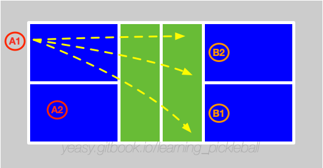

# 后场吊球技术

后场吊球（Drop）是匹克球最核心的技术之一，能让选手从后场移动到网前。若不掌握后场吊球，难进阶高水平。

## 什么是后场吊球

后场吊球是指在中后场，将球回到对方非截击区域内的动作（尽量靠近前半区），同时自己要在对方回球前跑到前场或网前。

可以简单理解后场吊球即为从中后场打出的吊球。

从方向和落点上可将后场吊球分为**直线球**、**斜线球**和**中路球**三种：

* **直线球**：直线球轨迹较短，通常更容易控制过网，但容易出现轨迹较高或落点较远情况。同时，球落地比较早，留给自己的上网时间较短；
* **斜线球**：斜线球是指将球回到交叉的对手区域。斜线球距离更长，球落地比较晚，留给自己的上网时间更充分。
* **中路球**：中路球是指双打比赛中将球打到对方两名球员中间位置。由于两人皆可以接球，会对及时判断造成一定的困扰。

从旋转上，可以分为**不转球**、**下旋球**和**上旋球**三种：

* **不转球**：用推球动作将球回到对方网前，要求过网不高，落点要尽量短。当击球空间不足时，多采用借力方式打出不转球；
* **下旋球**：用切球下部的方式将球回到网前。下旋球轨迹会偏高，因此击球位置要低一些。当来球较低、较快时，多采用下旋球方式；
* **上旋球**：用抽球方式回球。上旋球过网后急坠，容易造成对方回球过高，具备一定的进攻性。当击球时间和空间都比较充分时，可以采用上旋球方式主动击球。

## 何时使用后场吊球

当己方处于中后场，对方等在网前时，可以通过后场吊球控制对方无法进攻，进而让己方快速跑到网前，形成相持。

专业比赛中，经常会在第三拍中使用后场吊球，实现从后场被动到网前主动的转换。

## 滴球技术（Drip Shot）

滴球（Drip）是介于抽球和后场吊球之间的一种过渡技术，近年来在专业比赛中越来越常见。

### 什么是滴球

滴球比普通抽球慢，比后场吊球快，通常带有较强的上旋。球过网后急剧下坠，落入对方非截击区内，迫使对方在低手位接球。

### 何时使用滴球

滴球适合在以下场景使用：

* **第三拍过渡**：当对方接发球质量较高、不适合直接抽球，但又有足够时间和空间时，可以使用滴球；
* **中场过渡**：当被压制在中场、无法安全吊球时，滴球可以作为过渡手段；
* **节奏变化**：在相持中突然使用滴球，可以打乱对方的防守节奏。

### 掌握滴球

打出高质量滴球的要点：

* **击球位置**：在身前较高位置击球，便于向下发力；
* **上旋控制**：通过向上摩擦球制造上旋，使球过网后快速下坠；
* **力量控制**：力量介于抽球和吊球之间，约为抽球力量的 60% ~ 70%；
* **落点选择**：首选对方非截击区中后部，迫使对方在不舒服位置接球。

滴球与后场吊球的主要区别在于速度和攻击性。后场吊球偏防守，目标是安全过渡到网前；滴球则兼具过渡和进攻性，可以直接造成对方回球困难。

## 掌握后场吊球

后场吊球要避免回球过远、过高，使得对方可以截击球或持续回球到后场。

相对于前场吊球，后场吊球击球点更为靠前，向前发力更多。后场吊球采用从低向高挥拍，保持手腕固定，尽量多触球，利用胳膊来控制方向。击打到球的瞬间，身体要处于稳定状态，避免重心不稳定造成击球动作晃动。击球结束后，身体顺势向前，准备跟随到网前。

为了避免下网，球飞行轨迹的高点应该在网袋附近。

当打出的后场吊球质量不高时，不能着急向前跑，而要要在中后场等待，准备再次回球。

## 训练方法

首先练习不带旋转的推球式后场吊球，然后练习带有旋转的后场吊球。注意要配合步法，击球后随球跑到网前。

* 定点练习：从非截击区线向后退一步，进行定点后场吊球训练。掌握后，再后退一步进行训练，直到退到后场线的后方。
* 跑动练习：掌握定点后场吊球训练后，可以进行跑动中后场吊球训练。陪练将球打到后场，学员后场吊球并跟随球跑动到网前形成相持。
