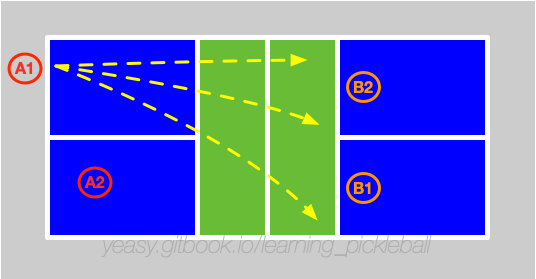

# How to Drop

Drop is the core technique to allow players to go to the net from backcourt. If you don't master the drop technique, you can't improve to an advanced level.

## What is Drop

Drop refers to the action of placing the ball into the opponent's NVZ area (as close as possible to the front half) from the middle court or back court. At the same time, players need to run to the net before the opponent hits the ball.

It can be simply understood that Drop ball is the Dink ball from the middle or back court.

Similarly, the Drops can also be divided into three types in terms of direction: **Straight drop**, **Cross-court (diagonal) drop**, and **Middle drop**:

* **Straight Drop**: The straight drop has a shorter trajectory and is usually easier to achieve, but it is prone to a higher or farther trajectory. At the same time, the ball lands quicker to leave a shorter time window to go to the net;
* **Cross-court Drop**: A cross-court drop is when the ball is dropped into the opposing opponent's area. The distance is longer, the ball lands later, and you have more time to go to the net.
* **Middle Drop**: The middle ball refers to placing the ball in the space between the two opponents, which is often used in doubles. Since both of them can catch the ball, it will cause some trouble to make decision immediately.

From the perspective of spin, there are three types of Drops too: **Non-spin**, **Backspin** and **Topspin**:

* **Non-spin**: Hit the ball over the net with a pushing action. It is required that the ball will not pass the net too highly, and the landing distance should be short. This way is safe as a good defense. When the space for hitting the ball is insufficient, use this way to hit the ball without a big movement;
* **Backspin**: Return the ball to the net by slicing the bottom the ball. The backspin trajectory will be longer than non-spin one, so keep hitting the ball from a low position. When the incoming ball is low or quick, you can use the backspin Drop;
* **Topspin**: Return the ball with a drive. The topspin trajectory falls sharply after passing the net, which is more offensive. When the hitting time and space are sufficient, you can use this way.

## When to Use Drop

When you are at the middle court or back court and the opponent side is waiting in front of the net, at this time, you can use drop to prevent the opponents to attack and let your team run to the front of the net in time.

For example, advanced players often use drop in the third shot, in order to transit to the near net rallies from the back court.

## Master Drop

When executing a drop shot, it is important to avoid returning the ball too far or too high, as this could allow the opponent to intercept or continuously return deep shots.

Compared to a dink shot, the contact point for a drop shot is farther in front, with more forward force applied. The arm swing should be a low-to-high motion with a fixed wrist, ensuring maximum ball contact and using the arm to control direction. At the moment of touching the ball, the body should be in a stable position to prevent balance issues that could lead to shaky shots. After hitting the ball, the body naturally moves forward, preparing to follow up at the net.

To avoid hitting the ball into the net, the highest point of its trajectory should be near the top of the net.

If the quality of the drop shot is not high, do not rush forward. Instead, stay in the mid-to-backcourt, prepared to return the next shot.

## Training Methods

First practice defensive non-spin Drop, and then practice Drop with spins. Pay attention to run to the net with the ball.

* Fixed-position training: take a step back from the NVZ line, and do Drop training. After mastering it, take one more step back for training until you retreat to the backcourt line.
* Moving training: After mastering the fixed position Drop training, you can carry out the Drop training while moving. The assistant player can hit the ball to the backcourt, and you drop the ball and follow the ball to run to the net to form a near net battle.
