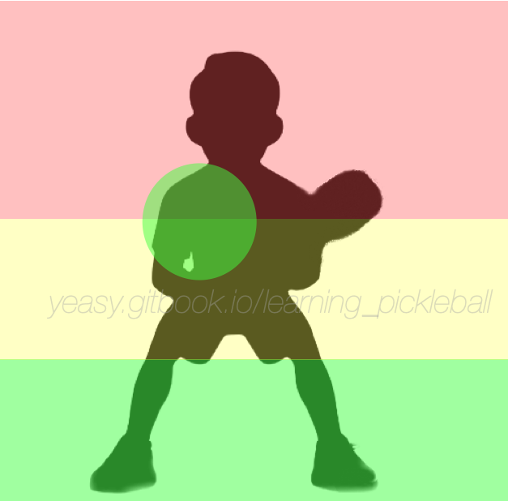

# 抽球技术

抽球（Drive）技术是匹克球最常用的进攻技术之一。尤其是单打比赛中，掌握抽球技术是赢得比赛的关键。

在单打比赛中经常通过抽球来调动对手，双打比赛中可以使用抽球来进攻或过渡下一拍。高质量的抽球甚至可以直接得分。

## 什么是抽球

抽球是指当球从地面弹起后，通过用力击打球，使球快速向前飞行，以迫使对方在较短时间内回球。

类似发球动作，抽球需要通过蹬地转腰，挥动大臂，带动小臂，最后抓紧手指将力量鞭打到球上，让球产生很高速度。

从击球位置分，可以大致分为**后场抽球**、**中场抽球**、**近网抽球**。

* **后场抽球**：后场抽球是从离网较远的后场处击球，通常为下一拍过渡或调动对方站位。注意要控制球的飞行轨迹不要过网太高，避免对方截击。
* **中场抽球**：中场抽球是当对方回球到中场，球弹跳起较高时，通过抽球进行主动进攻或调动。
* **近网抽球**：近网抽球是当对方回球较短，跳起较高时，通过抽球形成进攻。注意不要让球出界。

## 何时使用抽球

当球落地后跳起较高，并且对方并未形成有效的网前封锁时，可以尝试进行抽球。

抽球的主要目的是为了调动对方跑位而得分，或使对方回球质量不高，形成下一拍进攻机会。

## 选择进攻目标

球进攻到不同位置，对防守球员来说处理的难易程度差异较大，如下图所示。

* 红色区域：对方容易防守甚至可以反击的位置，包括正手位大部分位置和头顶区域；
* 绿色区域：对方较难防守或形成高质量回球的位置，包括低于网袋位置、正手位肩部和反手位较远位置；
* 黄色区域：介于两者之间，对方可能形成有效防守。

进攻时，应当尽量选择绿色区域，并跟进准备对方回球质量较差时再次进攻。

## 如何掌握抽球

抽球最关键的是要做到在身前击球，在身体稳定时击球，在球的轨迹高点附近击球。另外掌握鞭打发力，将蹬地转腰产生的身体力量通过持拍手形成的稳定击打面释放出去。

需要注意，匹克球和球拍表面比较光滑，大部分情况下的抽球应当以击打为主，旋转为辅。抽球时应注意保持拍面角度稳定，击球后跟随送出，不要采用网球的“刷球”动作。另外，球过网时不要过高，最好过网后迅速向下坠落，造成对方下手位接球，同时限制对方回球路线。

反手球基本与正手球对称，尽量单手持拍，以获得更多的发力距离和更大的回球角度。如果单手力量不足或者为了稳定的出球角度，也可以采用双手反拍击球，此时要适当减少动作幅度。

双打中，抽球目标落点一般可以为对方两名球员之间，或防守的空档处。当对方防守能力较弱时，也可以故意打出近身球（如持拍手肩部等），造成对方失误。

单打中，抽球应当主要瞄准对方空档，并且抽球动作要小，造成对方难以预判。

训练抽球可以通过如下环节：

* 多球练习：陪练人员将球抛给运动员，落地弹起后运动员将球打到指定目标区域内，球过网不高。每次连续抽球应不少于 50 个，每天进行不少于 10 组练习。可以练习将球打到场地不同位置。
* 回球练习：陪练人员和选手练习抽球，首先通过定点练习，之后自由落点练习。每次连续抽球应不少于 50 个，每天进行不少于 10 组练习。