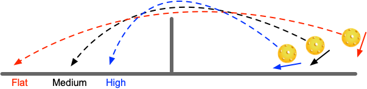

# 削球技术

削球技术，是匹克球常见的防守技术。

## 什么是削球

削球是指通过切球的中下部，使球产生向下的旋转，飞行到对方场地。

削球按照轨迹高度，大致可以分为如下三种：

* 高球：主要切球的底部，造成球的飞行轨迹是较高的抛物线。高球旋转较快，速度较慢，可以有更多回球时间。一般应当落入 NVZ 区域内，避免对方下压进攻；
* 中高球：主要切球的中后部，造成球的飞行轨迹是不太高的抛物线。中高球使用最多，具备一定的进攻性。一般应当落入 NVZ 区域内，避免对方下压进攻；
* 平球：主要切球的中部，造成球的飞行轨迹是较平的抛物线。平球速度较快，具备较强的进攻性。

## 何时使用削球

当对方打过来的球带有较强的下旋，或者击球点较低时，可以使用削球。

相对抽球，削球动作较小，球路控制容易，用于放网，可以给己方带来较多的回球时间。

另外一种情况是对方网前回球较高时，可以在常见的截击中配合削球来改变节奏和落点，造成对方失误。

削球球的主要目的是为了过渡，为下一拍找寻机会。

## 如何掌握削球

削球要尽量多包裹球，对球持续作用，使球产生较多的旋转。

削球时，身体应处于放松状态，提前移动到球前进方向，通过蹬地转腰，迎球加速发力，将球送出。

削球对手感依赖较多，因此，需要进行专门的手感练习。

* 削球练习：使用球拍连续削球，落入指定区域内，注意控制轨迹高度。每次连续削球应不少于 50 个，每天进行不少于 10 组练习。
* 多球练习：陪练人员将球以不同速度和高度发球，选手将球削到指定目标区域内。每次连续削球应不少于 50 个，每天进行不少于 10 组练习。

