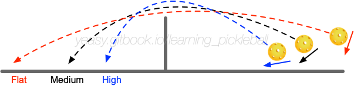

# How to Slice

The Slice technique is a common transition technique in Pickleball, which can be used to defend well, and can attack in certain case.

## What is Slice

Slice refers to sliding the middle and lower part of the ball to let the ball spin backward and fly to the opponent's court with a floating trajectory.

According to the trajectory height, the Slice can be roughly divided into the following three types:

* **High Ball**: Slice the bottom of the ball, causing it to travel a high trajectory. The high ball is landing slowly with strong spin, and the opponent needs to wait to return the ball. Generally, let the ball land into the NVZ area to prevent the opponent from volley attacking;
* **Medium Ball**: Slice the ball from the middle and bottom part, which causes the ball's trajectory path to be a parabolic curve that is not too high. The medium balls are used the most and have both good offensiveness and good defensiveness. Generally, let the ball land into the NVZ area or where is far from the opponent, to prevent the opponent from volley attacking;
* **Flat Ball**: Slice the ball from the middle part, causing the ball's to fly quickly with a flat trajectory. The ball more aggressive and difficult to return in a short time.

## When to Use Slice

When the opponent hits the ball with strong backspin, or when your hitting point is low, you can use the slice.

Compared with driving the ball, the slice is small in action, the ball's trajectory is easy to control, and the ball flies slowly. It is very use in setup, which can bring more time for going to the net. For example, professional players usually use slice in their second or third shot.

Another situation is that when the opponent's return is high in front of the net, players can use slice in cooperation with other shots such as drive or volley to change the rhythm and placement, to cause the opponent to make mistakes.

The main purpose of slicing the ball is to transition, to slow down the rhythm, or to find opportunities for the next shot.

## Master Slice

To slice the ball, use the paddle to wrap as much as possible around the ball, and continue to act on the ball to produce more spin.

When slicing the ball, move to the forward direction of the ball in advance, and the body should be in a relaxed state. Open the paddle surface (about 45%), push the ground and turn the waist to exert force with the arms, actively rub against the ball, and send the ball.

To ensure a quality, keep the stability from the shoulders to the wrists. After hitting the ball, the paddle continues to follow through with the ball. During the whole movement, the force should be used softly and smoothly, and the ball should not be sliced suddenly.

After mastering the basic slice, you can also slice the ball with side spin by rubbing the side of the ball.

## Defend a Sliced Ball

The slicing can generate strong backspin, which makes a long flight path, and the ball’s forward force is small after landing.

Therefore, in order to defend the sliced ball well, it is necessary to reserve more space for hitting the ball compared to the other ways. At the same time, it is necessary to actively use more upward force to avoid dropping the ball to the net.

The simplest way to defend a sliced ball is to return the ball with the same slicing method. You can also return the ball by driving with topspin. In this case, you should pay attention to hitting the ball on a higher trajectory to avoid drop the ball to the net.

## Training Methods

Slicing has a high requirement for hand sensitivity and can be trained through the following steps.

* Slicing training: Use the paddle to slice the ball continuously, fall into the designated area, and pay attention to control the height of the trajectory. There should be no less than 50 consecutive slices each time, and no less than 10 sets of exercises should be performed every day.
* Multi-ball training: The assistant staff will serve the ball at different speeds and heights, and the players will slice the ball to the designated target area. There should be no less than 50 consecutive slices each time, and no less than 10 sets of exercises should be performed every day.
