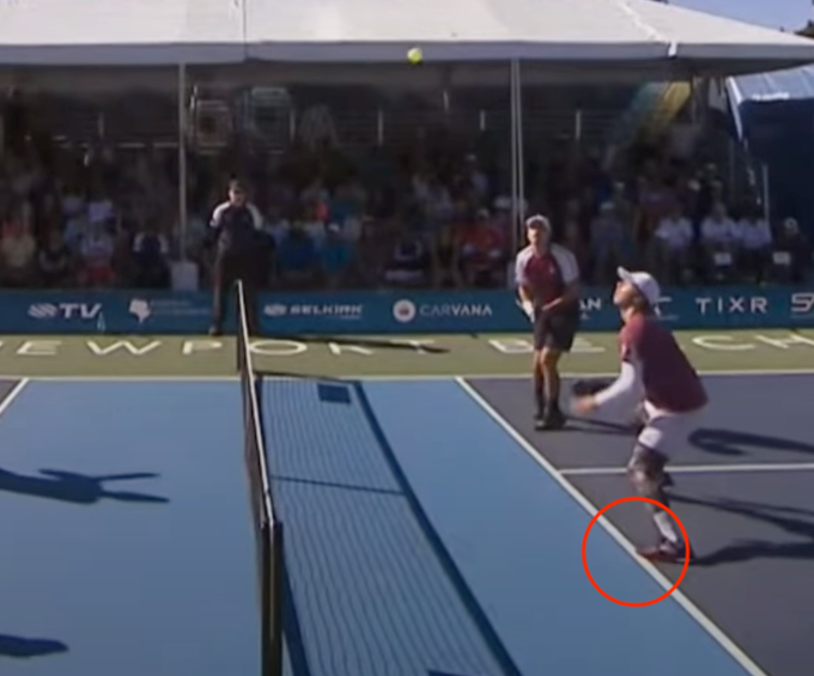

# 挑球技术

挑球（Lob）技术，十分接近羽毛球的挑后场技术。

该项技术容易被人忽略，但在实战中应用得当，可以有效改变节奏，打开新的局面。

## 什么是挑球

挑球技术也叫挑后场技术，主要是指将球挑高，使其落到对方后场的技术。适当使用挑球技术可以调动对手跑位，改变比赛节奏，为进攻创造机会。

根据挑球位置，可以分为三类：

* **后场挑球**：从后场位置将球挑到对方后场，多用于过渡来调节比赛节奏。为避免挑球出界，可以加适当上旋；
* **中场挑球**：在中场位置将球挑到对方后场，具有较大的攻击性。例如当对方正快速跑到网前时，可以有效破坏对方的上网节奏；
* **近网挑球**：当对方在网前回球较高时，或当对方前场吊球回球质量不高时，前场挑球可以迫使对方退到后场。往往会产生较好的下一拍进攻机会。

## 何时使用挑球

当对方站位或注意力在前场时，并且起跳或后退步法不够好时，可以使用挑球技术来迫使对方回到后场击球。

挑球可以变被动为主动，也可以在前场吊球、抽球等环节使用，以主动创造进攻机会。

挑球后要及时移动到网前，准备待对方回球过高时进攻。

## 战术性挑球

近年来，战术性挑球在专业比赛中得到更多重视。挑球不仅是被动防守的手段，更是主动改变比赛节奏、创造进攻机会的战术武器。

### 进攻性挑球

进攻性挑球的目标不是简单地将球挑到后场，而是通过精准的落点和时机迫使对方陷入被动。

**特点**：
* **落点精准**：瞄准对方底线角落，尤其是反手位后场角落；
* **时机选择**：当对方重心靠前、准备截击时突然挑球；
* **配合上旋**：适当的上旋可以让球落地后继续向后跑，增加对方处理难度。

### 节奏变化挑球

在网前吊球相持中，双方可能都在寻找进攻机会。此时一个出其不意的挑球可以打破僵局：

* **打断对方进攻准备**：当对方准备加速进攻时，挑球可以让对方失去进攻机会；
* **争取喘息时间**：当己方处于被动或体力消耗较大时，挑球可以争取恢复时间；
* **变换比赛格局**：从网前相持转为后场对抗，适合体力和后场能力较强的球员。

### 战术性挑球的注意事项

* **不要过度使用**：挑球过多容易被对方预判，变成送分球；
* **注意隐蔽性**：挑球动作应与吊球动作尽量一致，避免被提前识破；
* **跟进上网**：挑球后要迅速向前移动到网前，准备拦截对方的回球。

## 掌握挑球

挑球的核心要点在于要让球的飞行轨迹高于对方起跳后的位置，避免对方在半空截击。因此，挑球的抛物线高点应该在接近对方中场位置，使球在底线附近垂直下落，并且不出界。

进行挑球时要注意：

* 网前挑球时，动作要尽量与前场吊球一致，避免对方预判截击。
* 控制球的飞行高度，刚好过对方头顶截击为佳。
* 控制球的落点，尽量接近底线附近。通常可以偏反手位，对方更难处理。

当对方挑球时，应当首先快速判断是否能直接跳杀截击。如果不能，应当随球迅速跑向后场球飞行的前方，如果球不出界，等球落地再弹起后击打球。回球应当以后场吊球为主。

## 应对挑球
当对方挑球时，应当首先快速判断是否能直接跳杀截击。如能截杀，应当快速跳起，利用手腕转动和手指抓紧的力量将球下压，目标可为对方脚下位置或空挡处。

如果不能，应当快速侧身，随球迅速跑向球落地位置的前方，等球落地弹起后击打球。回球应当以后场吊球为主，并且及时随球跑到网前。

注意侧身时要直接蹬地，不要将非持拍侧脚先向前一步，否则很容易造成触碰非截击区而失分。这在专业比赛中也屡见不鲜。如下图所示。

## 训练方法

挑球和防守可以通过如下方法进行练习：

* 多球练习：重复挑球来掌握控制球的轨迹和落点；
* 喂球练习：一方挑球，另一方后退回击。
