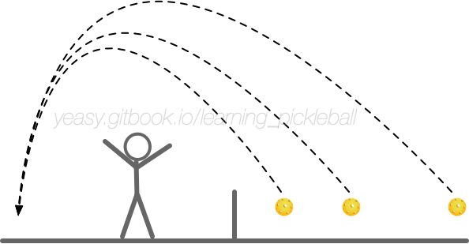

# How to Lob

The Lob technique is close to the badminton technique of pushing the ball high and let it land to the backcourt.

This technology is easily overlooked, but it is very useful in actual combat, which can change the pace and create new competition situation.

## What is Lob

Lobing the ball mainly refers to the technique of lifting the ball into the opponent's backcourt. Proper use of the Lob technique can mobilize the opponent's movement, change the rhythm of the game, and create opportunities for attack.

Based on the position of lob, there are majorly three types:

* **Backcourt Lob**: Lobing the ball from the backcourt to the opponent's backcourt, in order to change the game pace. In order to avoid hitting the ball out, you can use top spin appropriately;
* **Mid-court Lob**: Lob the ball to the opponent's backcourt from the mid-court position, which is more offensive. For example, if the opponents are running to the net, a lob can prevents them and disorder the pace;
* **Near-net Lob**: when the opponent's return is high or far in front of the net, the lob can force the opponents to go to the back court, which can create a good attack opportunity for next shot.

## When to Use Lob

When the opponent's position or attention is in the frontcourt, and the jump or retreat footwork is not good, you can use the Lob to force the opponent to stay at the backcourt.

Lobing the ball can save you from passive to proactive. At the same time, it can be used when you want to create opportunities from a dink or drive rally.

After lobing the ball, move to the net in time and prepare to attack when the opponent returns the ball too high.

## Master the Lob

The core point of lobing the ball is to keep the ball’s trajectory higher than the opponent's top after jump to avoid the opponent volleying in the air. Therefore, the parabolic high point of the Lob ball should be close to the opponent's middle court, so that the ball falls vertically near the baseline and does not go out.

When lobbing the ball, keep in mind:

* Keep a similar action as Dink or Drive, to avoid the opponent's prejudgment.
* Control the trajectory's height, let it stay just above the opponent's volley top.
* Control the ball's landing point, let it land as close to the baseline as possible. Usually let it land near opponent's backhand side, which is harder to handle.

When the opponent lobs the ball, you should first quickly judge whether you can jump and volley the ball back. If not, you should quickly run to the position the ball is flying to. Wait for the ball to land and bounce, and then hit it back. Usually use Drop or Lob to return the ball in this situation.

## Defend a Lob
When the opponent lobs the ball, you should first quickly judge whether you can jump and volley the ball back. If you can, use the power from wrist turning and finger tightening to press the ball down, targeting the opponent feet or far space.

If not, you should quickly turn to the forehand side, and run back to the position the ball is flying to. Wait for the ball to land and bounce, and then hit it back. Usually you can use Drop to return the ball in this situation, and run to the net following the ball.

## Training Methods

Lobing the ball and its defense can be trained in following ways:

* Multi-ball practice: Repeatedly Lob the ball to correct the trajectory and landing point;
* Ball feeding practice: One party does the lobing training and the other party does the return training.

