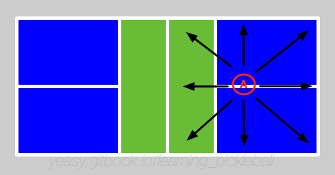

# 步法训练

步法，是球类运动的灵魂所在。优秀的步法可以让球员始终在合适的位置击球；反之，球员会在跑动中击球，容易造成失误。

使用步法的目的，是给身体击打球留出合适的时间和空间，从而可以比较舒适地击球。

## 常见步法类型

常见步法包括**跨步、交叉步、跳步、垫步**。

**跨步**是指将腿沿运动方向用力跨出的动作。跨步的步伐较大，一般用于快速跑动中的最后一步，可以起到稳定重心的作用。

**交叉步**是指快速交叉移动双腿运动的动作。碎步的步伐较小，一般用于快速移动或微调身体位置。

**跳步**是指通过跳跃快速移动的动作。跳步速度最快，移动范围最大，一般用于需要在很短时间内击球的情况。需要注意落地后尽快稳定重心并回位。

**垫步**是指通过小跳来快速调整身体到准备击球或准备移动状态。

单打比赛需要移动范围较大，可在跑动中结合交叉步、跨步动作。双打步法多为局部步法，可多采用交叉步、垫步，注意适当降低重心，以提高击球稳定性。

## 何时使用

双打中典型使用步法场景包括：

* 网前吊球时随球左右前后跑动；
* 放网之后随球快速跑到网前；
* 对方挑球时快速后退跳杀，或跑到后场；
* 己方回球质量不高时，主动后退防守对方截击。

单打中典型使用步法场景包括：

* 有较好的进攻机会时，主动跑到网前准备进攻；
* 对方回球角度很大时，快速随球跑动准备回球；
* 对方挑球时快速后退跳杀，或跑到后场；
* 己方回球质量不高时，主动后退防守对方截击。

## 掌握步法
首先要理解不同步法的特点和适宜的场景，做到自然反应。

其次，要想步法移动的快，必须学会控制和调整身体重心高度。重心高时身体移动快，但不稳定。因此，在进行较长距离移动时，要先通过启动步快速提高重心。等到准备击球时调整重心，保持稳定击球姿势。

最后，要加强腿部力量和躯干核心力量的训练。

## 训练步法

步法训练主要包括两部分，一个是腿部和核心力量练习，一个是脚步灵活度练习。

* 支撑练习：平板支撑应能持续 5 分钟以上。俯卧撑能连续做 20 个以上。
* 马步练习：靠墙蹲马步，逐渐增加时间，应能持续 10 分钟以上。蹲马步应能持续到 3 分钟以上；
* 下蹲跳起训练：下蹲跳起训练每组 50 个，每天练习 3 组；
* 跑步练习：前后左右方向慢跑，体会不同方向时如何快速移动，注意身体要放松。每个方向 1 分钟；
* 往返交叉步练习：左右来回交叉步跑动，体会如何快速转身。每组跑动10次，每天训练3组；
* 米字跑动练习：按照米字依次跑动场地 8 个点，每组跑动 10 次，每天训练 3 组，如下图所示。

