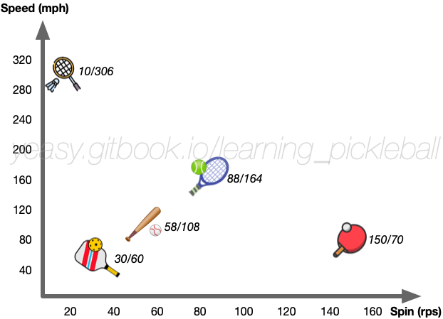

# Master Spin

Spin is an important charm of ball games. Reasonable adoption of spin can allow to control the ball’s flight path and landing position in a better way.

## Spin types

Different spins can cause different offset of the ball’s flight path. According to the direction of Spin, it can be divided into the following categories:

* **Topspin**: The ball rolls forward rapidly, causing the trajectory to fall sharply. The ball path is shorter than that of non-spinning balls, and will move forward quickly after bounce up;
* **Backspin**: The ball rolls back quickly, resulting in a flatter trajectory and a longer ball path than a non-spinning ball. The ball will move forward slowly after bounce, even move backward;
* **Sidespin**: Including left-spin or right-spin, the ball will deviate in the direction of Spin.

## When to Use Spin

Consider using Spin in the following scenarios:

* Serve: Use spins to cause the opponent's prediction error on the ball's trajectory;
* Dink or Drop: Use spins to cause the opponent to hit the ball at a discomfortable position, forcing the return ball too high or too low;
* Drive or lob: Use topspin to avoid letting the ball go out;
* Volley: Use spins to cause the opponent to fail to return the ball;
* ATP: Use side spin to let the ball land into the court from outside.

Pay attention that when adding spin to the ball, because part of the energy turns into the rotation instead of flight speed, the ball usually flies slower than normal. And it will take longer time to swing the paddle. Therefore, when you want to let the ball fly very fast or return quickly, try to use as little spin as possible.

## Understand Spin

The spin of the pickle ball is not generated by simply rubbing the ball using the paddle surface, but by hitting different positions of the ball with the paddle and wrapping the ball at the same time. Therefore, when using the spin, it is necessary to focus on hitting the ball mainly, and cooperate with the following wrapping and pushing of the ball. Remember to "first hit and then rotate".

In general, a paddle with a rough surface increases the friction against the ball, which helps create more spin.

The spin of the pickleball is not very fast, usually below 20 revolutions per second (tennis can exceed 50 rps, and table tennis can exceed 100 rps), and the flight of the ball is not quick. Spin has little effect on the ball's flight path, but it changes the direction of the ball's motion after bouncing from the ground. The graph below compares the fastest spin and flight speeds for popular ball games.

## Handle Spinning Balls

To handle the spinning ball well, you must first understand the impact of different spins on the ball's flight path and behavior after landing, and move proactively to have a solid hit. For example, if the opponent hits a topspin ball, the return position should be more forward, and at the same time, the surface of the paddle should not be too high. Conversely, you can also consider taking the initiative to use the power of the opponent's topspin to hit the ball.

In addition, to weaken the effect of spin, the simplest principle is to hit the ball in the same way as the player that creates the spin. For example, try to hit the bottom of the ball to catch a back spinning ball, and hit the ball up to avoid drop down to the net. If you use the drive to return the backs spinning ball, the pushing up more sufficiently than returning a non-spinning ball.

Finally, you can hit the ball faster, to reduce the contact time between the ball and the paddle, which also reduces the impact of spin.

## Training Methods

There are several ways to practice to master and handle spin, and pay attention to understand the different spins caused by hitting different positions of the ball:

* Bounce the ball to create Spin: let the ball bounce on the paddle, and make different spins when cutting the ball in different directions;
* Serve to create Spin: hit different positions of the ball, send the ball with different spins, and observe the trajectory after it bounces from the ground;
* Return to create Spin: hit the coming ball at different positions, return the ball with different spins, and observe its flight trajectory;
* Multi-ball training: one player sends out the ball with a specific spin, and the other player returns it to the designated position.
