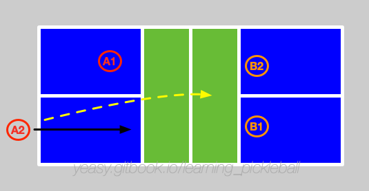

# 双打策略

双打，是匹克球运动中常见的类型，核心在于球员之间的密切配合。如无好机会，则应以防守为先，避免无谓失误。

## 基本过程

主要过程分为**从后场来到网前**，和**网前相持**两个阶段。

假设两队分别为 A、B，分别包括两名球员 A1、A2，B1、B2。A 队为发球方。

A1 将球发给对方 B1（此时 B2 站在网前），B1 要尽量将球回给 A 队底线位置，同时，跟随来到网前。

此时，B 队两名队员位于网前，A 队两名队员位于后场。

假设球打给 A2，则 A1 上前一步，准备上网。A2 接球，选择放网，同时跟随球来到网前。

此时，A、B 队队员均位于网前，进入到网前相持过程。通常双方会采用 Dink 球调动对方。假设 A1 回球过高，B1 拿到机会，主动进行抽球。双方进入快速截击球环节。一方可以通过主动 Dink 再次回到网前相持环节。

假设 A 方回球质量不高，被 B 方压到后场，此时，A 方应当通过放网来争取再次上网。B 方则通过连续给出长球压制 A 方球员在后场。

可以看出，双打过程中，有两个环节十分重要。

首先是第三拍击球。对于发球方来说，如果没有高质量的第三拍回球，往往会进入持续被动。第三拍可以通过抽球（偏进攻）或放网（偏防守）来进行。

另外就是网前的相持环节。双方通过网前相持寻找进攻机会，试图持续压制对方到后场。一旦有一方被压制到后场，则处于劣势地位。此时若回球过高，则容易被对方杀球得分。

需要注意，网前 Dink 时应以斜线或中路为主。当球落点靠近边线时候注意防守对方的 ATP 线路。当球过网较高时注意防护对方的 Erne 进攻。

## 要点

* 站位：尽量在网前击球，并试图保持对方球员在后场；
* 中间部位的防护：两人中间的位置要提前协商，当都可以回球时，应优先正手一方或者水平较高一方接球。
* 后场球的防护：后场球应当靠近后场一方或者步法较快者接球。