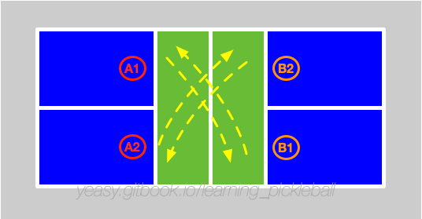

# Double Game Strategy

Double games are common in pickleball, and its core lies in the close cooperation between players. If there is no good opportunity, reducing unforced error should be the first.

## Basic Process

The main process is divided into two stages: a) move from the backcourt to the NVZ, and b) the battle near the net.

Suppose the two teams are A and B, respectively, including two players A1, A2, B1, B2. Team A is the serving team.

A1 serves the ball to the opponent B1 (B2 is standing in front of the net at this time), B1 tries to return the ball to the baseline of team A, and at the same time, follows the ball to run to the net.

At this moment, two players of team B are in front of the net, and two players of team A are in the backcourt.

Assuming the ball goes to A2, A1 takes a step forward and prepares to net. A2 waits the ball to bounce, and chooses to drop the ball, and A2 follows the ball to go to the net at the same time.

Now, the players of team A and B are both in front of the net.

Then the game enters the most critical near-net process, usually players use the Dink technique to mobilize the opponents. Assuming that A1 returns the ball too high, B1 gets the opportunity and takes the initiative to drive the ball. The two sides entered the fast volley phase. One party can return to the battle in front of the net again by taking the initiative to Dink.

Assuming that the return quality by the team A is not good and the ball is pushed to the backcourt by the team B, at this time, the team A should try to go back to the net again by dropping the ball. The team B suppresses the team A players in the backcourt by giving long balls in succession.

It can be seen that there are two important steps in the doubles process.

One is the third shot. For the serving side, if there is no high-quality third shot, it will be difficult to have a chance to earn score in the following rounds. The third shot can be driving the ball (more offensive) or dropping to the net (more defensive).

The other is the battle in front of the network. The two sides look for attack opportunities through the competition in front of the net and then try to force the opponent to the backcourt. Any side will be at a big disadvantage when suppressed to the backcourt. If the ball is returned too high from back court, it is easy for the opponent to smash the ball from near the net and score directly.

It should be noted that the Dinking in front of the net usually is using the diagonal direction or to the middle. Watch out for the opposing ATP attack when the ball lands close to the sideline. Be careful to defend the opponent's Erne attack when the ball is passing the net near its side.

## Key Points

* Positioning: try to stay near the net to hit the ball, and try to keep the opponents in the back court;
* Protection of the middle ball: The middle position protection between the two players should be negotiated in time. When both of them can return the ball well, the forehand player or the higher skill level player should have the priority to return.
* Protection of the backcourt ball: The backcourt ball should be handled by the one close to the backcourt or the one with faster footwork to catch the ball.
