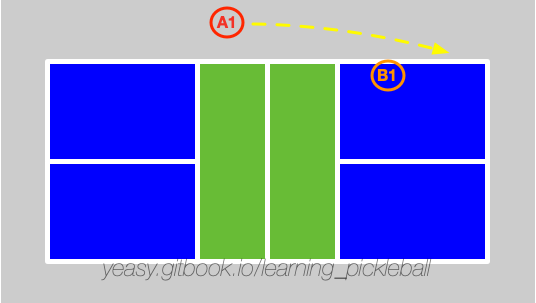

# 绕网柱回球

## 什么是绕网柱回球

绕网柱回球（Around The Post，ATP）是专业比赛中的常见技巧，指得是从场地侧边之外击球，绕过网柱回球到对方场地内。

## 何时使用

当对方球员打出角度很大的网前球时，己方很难回击出高质量的网前球。此时，可以考虑将球绕过网柱，打到对方场内。

如下图所示，球员打出绕网柱进攻球。

## 击球要点

绕网柱回球的关键是移动到位，并且掌握击球的最佳时机。

打出较高质量的绕网柱进攻球的要点包括：

* 击球时一定要在场地外侧，越靠外，可回球的角度范围越大，越容易打到场内；
* 击球时机要晚，要等球快落地时再回击，避免在高点击球。这与常规击球不同。越低的击球，让球的飞行轨迹越低，对方越难防守；
* 击球目标应以对方后场为主要目标，这样可以尽量绕开对方身体，避免对方防守；
* 击球完成后，要尽快回到场地内。

## 防守方法

当对方打出绕网柱回球时，其站位通常位于场地外侧，击球目标为同侧场地边缘部分。此时，己方要尽快调整站位准备防守。要点包括：

* 面向对方球员站位，准确判断其击球意图；
* 跟随对方击球节奏，等对方击球瞬间最大程度拦截对方击球角度；
* 尽量截击拦截，根据来球高度调整拍面。特别当对方来球较低时，主动迎前以削球方式拦截，但过网不要过高；
* 回击球的落点首选对方球员跑到场外后造成的空挡处，尽量回击到后场。如观察发现其队友有补位意图，可以考虑打到补位后的空挡处。

## 训练方法

* 多球练习：一方球员站在场外，重复练习绕网柱回球。另一球员练习防守；
* 交互练习：双方模拟比赛场景，练习绕网柱回球和防守。