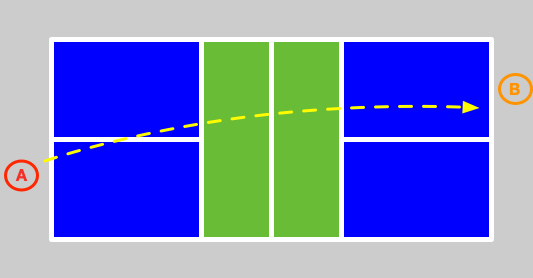
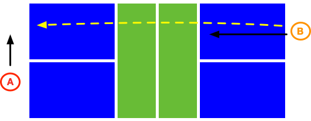
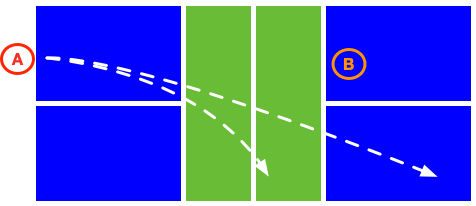

# Single Games strategy

The core of singles is to control the rhythm, try to let the opponent run as much as possible, and avoid losing your balance. 

In addition, you should take the initiative to more attacks when you have an opportunity.

## Basic Process

Suppose the two players are A and B. A is serving.

A serves the ball to B, and B tries to return the ball to near A's baseline position, and try to let it land far from A's prepared position.

At the same time, B tried to follow the ball to go to the net to prepare volleying the ball.

A tries to let B run by driving the ball or dropping the ball.

B successfully block the ball in front of the net, pushes the ball to A's backcourt or mobilizes A's angle near the net.

At this time, A and B enter the mutual position mobilizing phase. If one player has a gap, or the return quality is not good, it will be attacked and enter the stage of offense and defense. Unlike doubles, players in the backcourt often do not have to use the drop technique to return to the net, but can flexibly combine driving, dropping or lobbing to let the opponent run.

In single games, it is generally necessary to find offensive opportunities by mobilizing the opponent's position, or to suppress the opponent to the backcourt.

Once the player is suppressed to the backcourt, it is at a big disadvantage. At this situation, if the player returns the ball too high, the opponent can volley the ball to earn the score.

## Key Points

* Drive Usage: In singles, there are many usages of driving the ball, and it is necessary to precisely control the landing point of the ball. It must not be intercepted comfortably by the opponent in front of the net, otherwise it is easy to become passive;
* Angle control: Use a wide angle to let the opponent move, and at the same time avoid pushing the ball too long to be out.
