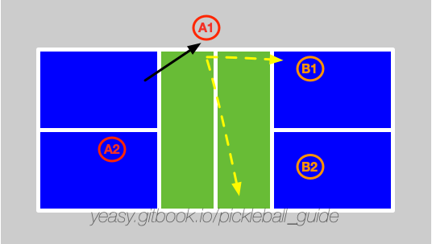

# 跨非截击区击球

## 什么是跨非截击区击球

按照规则，球员在截击前后，不能触碰非截击区。但是球员在截击前后，可以从非截击区上空跨过。这种跨越非截击区的截击球（Erne），在专业比赛中屡见不鲜。

## 何时使用

当对方球员在打网前球时，如果球过网较高且靠近边线。此时，可以考虑进行跨非截击区拦截，快速打到对方场内。

如下图所示，球员A1打出绕网柱进攻球。

## 击球要点

跨非截击区击球的节奏一定要突然，这样才能给对方造成较大威胁。

打出较高质量的跨非截击区击球的要点包括：

* 准确判断对方网前球的位置，靠近边线且较高时再尝试截击；
* 站位要适当靠近场地边线。越靠近越容易从非截击区上空跳过；
* 跳到球场左侧时应当右脚先落地。跳到球场右侧时应当左脚先落地；
* 击球目标首选直线打到对面球员脚下，其次可以打出大角度斜线球；
* 截击完成后，球员要尽快回到场地内；
* 己方球员击球时，队友应当往中间移动，补充截击队员留出的空挡或进攻对方的防守球。

## 防守方法

截击球速度较快，需要尽快移动到适当位置拦截。要点包括：

* 尽量通过截击进行拦截；
* 如果可以，控制回球高度，过网不要过高。否则可以跳高到后场；
* 回击球尽量靠近跑到场外球员一侧，首选打到后场；

## 训练方法

* 多球练习：一方球员站在非截击区内，重复给出截击球。另一球员练习防守；
* 交互练习：双方模拟比赛场景，练习跨非截击区击球和防守。