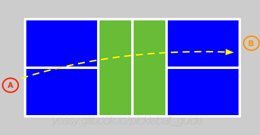
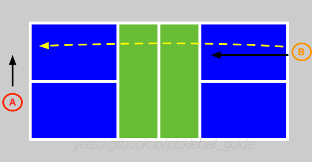
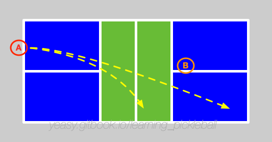

# 单打策略

单打是匹克球运动中对综合能力要求最高的项目。

不光考察球员的移动能力和击球技巧，更重要的是看心理素质和对比赛节奏的把握能力。

## 基本过程

假设两名球员分别为 A、B。A 先发球。

A 将球发给 B，B 要尽量将球回给 A 底线位置，并且尽量落入 A 的空当位置。

同时，B 试图跟随来到网前截击。

A 接球后，通过抽球或吊球让 B 跑动。

假设 B 网前拦截回球，将球推到 A 后场或调动 A 的网前。

此时，A、B 进入相互调动位置环节。若有一方出现空当，或回球质量不高，则会受到对方攻击，进入攻守相持阶段。与双打不同，在后场时，单打球员往往不必采用吊球技术回到网前，而是可以灵活结合抽球或挑球来调动对手。

单打中，由于球员要防守全场区域，一般要通过调动对方位置来找到进攻机会，或者尝试压制对方到后场。

一旦有一方被压制到后场，则处于劣势地位。此时若回球过高，则容易被对方杀球得分。

## 要点总结

单打比赛的关键是控制节奏，因此要尽量让对方多跑动，己方则尽量保持稳定站位。另外，有机会时应当尽快上网，同时限制对方在后场。

* 网前防守：接发球后一定要尽快上网，拦截对方的击球。注意防守两边的大角度球；
* 控制落点：单打中使用抽球较多，需要精确控制抽球的落点，一定要过网前对方的拦截区，否则很容易陷入被动；
* 使用角度：进攻要多打出角度，例如反手位，同时调动对方跑动，注意避免回球过长出界。