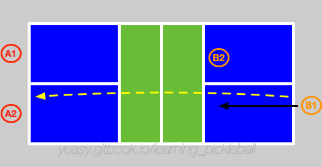
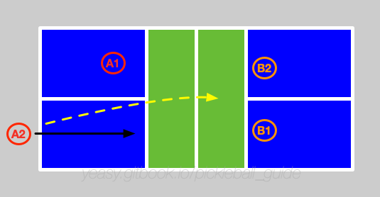
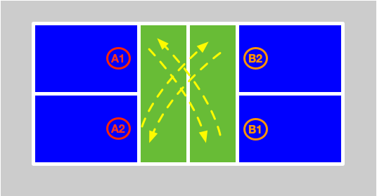

# 双打策略

双打，是匹克球运动中最常见的比赛类型。其关键在于两位球员之间的密切配合。

## 基本过程

双打比赛主要过程分为**从后场到网前**，和**网前相持**两个阶段。

假设两队分别为 A、B，分别包括两名球员 A1、A2，B1、B2。

A1 先发球，此时 B2 站在网前，如图所示。

A1 将球发给对角区域的 B1。B1 作为接球方，第二拍要尽量将球回给 A 队底线位置，同时，B1 跟随球来到网前。

此时，B 队两名队员位于网前准备截击，A 队两名队员位于后场。

假设 A2 准备打第三拍，则 A1 向前一步，准备上网，同时观察第三拍情况。A2 打出第三拍，选择后场吊球，同时跟随球来到网前。**上网阶段**完成。

此时，双方队员均位于网前，进入到**网前相持阶段**。

通常双方会主要采用前场吊球调动对方，并寻找进攻机会。由于只有发球方可以得分，因此，发球方往往要更为主动尝试进攻。

假设 A1 回球过高，B1 拿到机会，主动进攻。双方可能进入快速截击环节，此时一方可以通过主动吊球再次回到网前相持环节。

假设 A 方回球质量不高，被 B 方压制退到后场，此时，A 方应当通过后场吊球来争取再次上网。B 方则通过连续给出长球压制 A 方球员在后场，并找机会通过截击等来得分。

可以看出，双打过程中，有两个环节十分重要。

首先是第三拍击球，决定发球方能否安全来到网前。对于发球方来说，如果没有高质量的第三拍回球，会被持续压制在后场，往往会进入被动。第三拍可以通过抽球（偏进攻）或后场吊球（偏防守）来进行。

另外就是网前的相持环节。双方在网前相持中寻找进攻机会，或迫使对方退到后场。一旦有一方被压制到后场，则处于劣势地位。此时若回球过高，则容易被对方杀球得分。

需要注意，前场吊球时应以斜线或中路为主。当球落点靠近边线时候注意防守对方的 绕网柱进攻（ATP）线路。当球过网较高时注意防护对方的 Erne 进攻。

## 要点总结

双打比赛中球员的配合往往比个人能力更重要，两人应当作为一个整体进行战术训练，而不是简单的每个人负责半场。

通常情况下，两名球员中应有一人为主导者（通常为能力较强者，例如混双中的男球员），负责进行大部分的进攻，另一人为控局者，负责进行补位，并帮忙制造进攻机会。主导者应当主动处理大部分来球，控局者应当将对方的进攻尝试进行重置，并坚决不给对方好的进攻机会。

此外，双方都要尽量让对方球员中控局者接球。如无好的进攻机会时，注意回球质量，避免给对方造成好的进攻机会。

* 站位：尽量在网前击球，并试图压制对方球员在后场。主导者要占据2/3甚至更多的位置，控局者要注意防守自己一侧的边线；
* 中间位的防护：两人中间的位置要提前协商谁来处理。通常应优先正手一方或者水平较高者接球。
* 后场球的防护：后场球应当由靠近后场一方或者步法较快者接球。