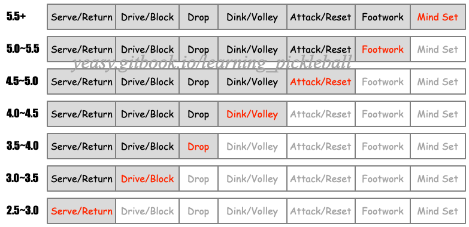

# Frequent Questions and Answers

## [Q1] How to handle lob?

**Answer**: For amateur players, it is often difficult to deal with lob shots (Lifting the ball to the backcourt) in the backcourt. To successfully receive a lob, the key is to have quick footwork. When the opponent's lob shot is not of high quality, one should quickly sidestep and retreat to hit a smash, forcing the opponent not to easily attempt lob shots.

If the opponent's lob shot is of higher quality and not easily intercepted, one should promptly run to the side and back of the ball, wait for it to bounce off the ground before hitting it back. After the opponent's lob shot, their attention is often focused on the net to wait for interception. Therefore, the best way to hit the ball back is to use a drop shot or return to the opponent's open space, and avoid directly hitting the ball too high.

Finally, when playing at the net, attention should be paid to the quality of the Dink. It is best to dink the ball with a wide angle, making it difficult for the opponent to return it comfortably, so that the opponent finds it difficult to hit a high-quality lob shot.

## [Q2] When the teammate hits the third shot in doubles, should I run forward or wait in the backcourt?

**Answer**: There is no fixed answer to this question, it depends on the quality of your teammate's third shot.

If the quality of the teammate's third shot is very high, i.e., a very short and low Drop, or a very fast and low Drive, then you both should go to the net in time. Especially when the opponent’s return is high, you should prepare to poach the ball; on the contrary, if the teammate's third shot is too high or too long , then don't rush forward.

Usually, you can try to take a step forward from the backcourt, while observing the quality of the shot by your teammates and adjust the movement accordingly.

## [Q3] I have used a lot of strength, but my shot is still not fast.

**Answer**: A very typical question.

It is quite popular to see that a very strong amateur player hits the ball with a big movements, but the returned ball is still not fast. But some professional player can hit a very quick ball with a small action.

The reason here is the "effective force", that is, how much of the power from the body is transmitted to the ball.

Human body strength comes from muscle contraction from relax status, and the direction of power transmission is determined by joints. If the muscles are constantly tense or relax, force can no longer be generated; if the joints are constantly under stress, the transmission of force is hindered.

Therefore, in order to generate effective force, the muscles must be tightened quickly from loosened, and the joints must be loosened first and then tightened. Of course, it requires a lot of scientific training to allow the body to become familiar with this process in a natural way.

## [Q4] Some players don't run too much, but they can move the opponents to run around. Why?

**Answer**: It is often seen in the tournaments that some athletes do not seem to move very much, but can always return the ball comfortably; Some others are always running with lots of turning around, but lose a lot.

In track and field competitions, everyone compares the speed by counting the time it takes to finish the same distance, which is the absolute speed.

In ball games, athletes' "fast" and "slow" speeds are relative instead.

First, look at the needed distance of movement, that is, the distance the player needs to move to do the shot. My absolute speed may be slower than yours, but I can predict and restrict your return path. In this case, I always hit the ball in front of the body; and you always have to run a few steps to catch the ball, then even if you move faster than me, it looks too slow.

Second, look at the completion time window, i.e., how long time the player can use to complete the return. Good players can hit the ball when it's high, but the top players can sometimes wait for the ball to drop down and hit the ball at the end of the shot, and often with multiple possible paths to choose. This means that opponents cannot predict in advance, and there is much less time to reflect and move.

Lastly is the acceleration. Top athletes can control the tempo of the game. When you just get used to his "slow" batting rhythm, he can suddenly accelerate, and if you can't keep up, he will naturally feel faster.

To sum up, the most important thing is to be able to control the opponent's return path and the rhythm of the game, and these require solid skills and excellent physical quality.

## [Q5] It is often heard that pickleball has some features of tennis, badminton and table tennis. What are them?

**Answer**: Sports are essentially similar with each other. Ball games are all about power (both explosive and stamina), speed, spin and placement. However, different sports differ in form and focus.

Tennis has the highest requirements for strength, just like the broadsword, emphasizing wide opening and closing, and beating the opponents like breaking a bamboo; badminton has the highest requirements for speed and placement control, just like swordsmanship, pays attention to agility and elegance, and strikes back; table tennis has not only the quickest rhythm, but also the strongest rotation. Like a dagger, its shot is often unexpected and unpredictable; while the pickleball is like a nunchaku, both soft and firm, with the drive skills from tennis, the smash, lob and control from badminton, and the quick rhythm and dink from table tennis. It can be said that pickleball is based on tennis technique as its body, badminton technique as its spirit, and table tennis technique as its soul. It is easy to get started, but it takes hard work to master it.

## [Q6] What are the key differences between amateur players and professional players?

**Answer**: There are several key differences.

The first is **consistency**. Professional players can control the ball more stably. For the same drop shot, an amateur player may make one mistake every ten times, while a professional player may make one mistake every one hundred times. Overall, the unforced error rate of amateur players is much higher.

Second is the **speed**. When the pace of the game is slow, amateurs and professional players seem to perform similar; but when the pace increases, amateurs often can't keep up, and turnovers increase.

Another is the **ball control-ability**. Professional players have more precise control over the trajectory, landing point and rhythm of the ball, and often return a ball that is more difficult for opponents to handle. Amateur players often return the ball too high or too long, or even go out of bounds.

The last one is the **gaming consciousness**. How to deal with the opponent's ball? Should I return a long ball or a short ball? Speed up or slow down? Where should I run after returning the ball? What is the other party's next intention? Amateur players usually don't think about these during the playing, while for professional players, these are as natural as breath. They will always choose the most favorable strategy for their own team and the most uncomfortable for the opponents.

## [Q7] How to choose a suitable paddle?
**Answer**: According to the rules, the combined length and width of a pickleball paddle cannot exceed 24 inches (60.96 cm), of which the length cannot exceed 17 inches (43.18 cm). There is no limit to the thickness and weight of the paddle, but the common thickness range is 10 \~ 16 mm, and weight range is 7\~9 oz.

Typically, a pickleball paddle consists of several main components: paddle body (core, surface, and edge guard), handle, base grip, and overgrip.
* **Paddle Core**: The core of the paddle plays a crucial role in the paddle's stability. Modern paddle materials usually feature a honeycomb structure made of high polymer compounds, including Polymer (soft and flexible) and Nomex (rigid nylon, somewhat hard). Earlier paddles were made from materials such as wood or aluminum alloy.
* **Paddle Surface**: The surface of the paddle affects its power and friction. Surface materials include fiberglass (Soft, with a typically smaller sweet spot), graphite, and carbon fiber (Hard, with a larger sweet spot. Typical model is Toray T700). Currently, professional paddles often use carbon fiber surfaces.
* **Paddle Edge Guard**: The edge guard influences the sweet spot of the paddle. It is usually made of hard plastic materials.
* **Handle**: The handle is crucial for the paddle's control. It typically consists of an extension of the paddle core, wrapped with cushioning materials such as foam or rubber. The bottom of the handle often has a branded end cap.
* **Base grip and Overgrip**: The base grip and overgrip directly affect the feel of the paddle. Choosing the right overgrip can better enhance the paddle's performance. Overgrips are usually made of synthetic materials, such as polyurethane or synthetic fibers.

**Modern Paddle Technologies**

In recent years, paddle manufacturing technology has evolved rapidly. Professional paddles have entered the era of "Thermoforming + Carbon Fiber":

* **Thermoforming Technology**: Uses high heat and pressure to mold carbon fiber, edge walls, and core into a single integrated piece. Compared to traditional manufacturing, thermoformed paddles offer a larger sweet spot, improved durability, and more stable feel. The downsides include higher cost and potentially increased vibration.
* **Raw Carbon Fiber Surface**: Features an unmilled, textured carbon fiber surface that significantly increases friction with the ball, making it easier to generate spin. Common types include T700 carbon fiber (balancing power and feel) and textured carbon fiber (enhanced spin capability).
* **Foam Edge Wall Technology**: Foam material is injected into the edges, increasing the sweet spot area and stability while reducing vibration.
* **Paddle Generations**: Professional paddles are roughly categorized into generations—Generation 2 (thermoformed + foam edge walls + carbon surface), Generation 3 (adds EVA foam ring around the core), and Generation 4 (full foam core, eliminating traditional honeycomb structure).

When purchasing professional paddles, note that some "power" paddles may not comply with tournament regulations. Always confirm USA Pickleball certification before purchase.

In general, no paddle fits everyone. The following parameters can be considered based on your level:

* **Weight**: The heavier the paddle, the more it can avoid the vibration caused by hitting the ball, but the swing will be harder, which requires a better power. For beginners, it is recommended to consider paddles up to 8 oz (227 g) unless you have a very strong strength. In addition, pay attention to the difference between swing weight and twist weight. Generally, a lighter swing weight (100 \~120 $kg*cm^2$) makes the swing more flexible, while a heavier twist weight (>6.0 $kg*cm^2$) makes the shot more stable.
* **Center of Mass**: The more forward the center of mass is, the more powerful the shot is, but it will be harder to control the paddle, which requires better hand sensitivity and higher power. Beginners are advised to consider a moderate paddle.
* **Handle Length**: A longer handle usually means a larger hitting range, but it is more difficult to adjust the paddle, which requires better hand sensitivity and higher power. Beginners are advised to choose a handle with a moderate length.
* **Handle Thickness**: A thicker handle handle is easier to exert force, but it is inconvenient to adjust the holding. For beginners, unless you have large hands, it is recommended to choose a thinner handle.
* **Face Size**: The larger the face, usually the larger the sweet spot, and the better the fault tolerance, but it often means that the swing is slower. The ratio of the sweet spot to the paddle face is an important indicator to the paddle’s technical quality. Beginners are recommended to choose a paddle with a large face.
* **Face Thickness**: The thicker the paddle face, the better the vibration absorption when hitting the ball, and the sweet spot is often larger. Beginners are advised to consider a paddle with a thickness of at least 14 mm.
* **Surface Roughness**: The rougher the paddle surface, the easier it is to create spin, but in turn, the more likely it is affected by the ball’s rotation. Beginners are advised to consider a paddle surface that does not have too much friction.

Top paddle brands in market include Franklin, Joola, Onix, Engage and Selkirk.

## [Q7.5] How much does paddle surface roughness affect spin?

**Answer**: Paddle surface roughness directly impacts spin generation capability and has become a critical factor in paddle selection since 2025.

* **Smooth Surface**: Suitable for beginners, less affected by opponent's spin, but limited ability to generate spin;
* **Medium Roughness Surface**: Such as standard carbon fiber surface, balances spin capability and control, suitable for most intermediate players;
* **High Roughness Surface**: Such as Raw Carbon or textured surfaces, can significantly increase spin. Professional players can generate over 30 revolutions per second. However, requires stronger technique to control and is more susceptible to opponent's spin.

Since 2025, more and more professional players have switched to high roughness surface paddles to gain stronger spin advantage. Note that some "ultra-spin" paddles may not comply with tournament regulations. Always confirm USA Pickleball certification before purchase.

## [Q8] How to deal with the ball between two players in doubles?

**Answer**: In doubless, there are often situations where two players rush to hit the ball in the middle position together, or let the other side deal with it, resulting in loss of points.

The handling of the middle-position ball requires players to negotiate the principles in advance. Generally speaking, here are some common principles:

* Let **forehand position player** handle: The power and angle of the forehand shots tend to be better;
* Let **higher level player** handle: Higher level player usually has better stability and force;
* Let **male player** handle (in mixed doubles): Male player is usually better in strength and speed, and is usually responsible for 2/3 or more of the courts in mixed doubles;
* Let **diagonal player** handle: Usually the diagonal player has a better angle to return the ball, hence players can take this principle if the two players are of the same level.

You can also use shouting to do a quick communication. For example, a more confident player can call out “Me” to return the ball.

## [Q9] I play pickleball 3 hours a day, why my skill does not improve a lot?
**Answer**: The problem that amateur players often encounter is that they play every day, but their skills don't improve, and sometimes they even go backwards.

This situation may be mainly due to the following reasons.

The first is the **lack of effective training**. It seems to be playing every day, but there is very little time for scientific training, and even the wrong movements and skills are constantly repeated, resulting in stagnation of the level. Once bad habits are established, it will be difficult to correct.

The second is the **lack of systematic training**. When players are at different levels, the focus of training is different. For example, basic skills should be emphasized at the beginner level, strategies should be mastered at the intermediate level, and rhythm should be learned to control at the advanced level. In addition, different players have different characteristics and weaknesses. If the training is not systematic, it often seems that you practice hard, but in fact, you will get half the result with twice the effort.

In addition, the **intensity of training is not properly arranged**. The essence of efficiency is to alternate training with rest properly. Excessive training may result in decreased physical fitness and even lead to injury. Therefore, scientific training and physical strengthening, relaxation and recovery outside of training are very important.

Finally, the **lack of training the IQ of playing**. Practicing hard may build up a good strength and solid skills, but when to use what tricks, when to speed up, and when to slow down, these are the places for your IQ of playing. In addition to training, strengthening theoretical study must be taken to achieve a comprehensive improvement.

## [Q10] The ball should be hit to the gaps, but where are the gaps?

**Answer**: High-level athletes often force the opponent to make mistakes by returning the ball to the gap. Specifically, there are the following types of gaps.

* **Court Gap**: Commonly used in singles. It refers to the area far away from the opponent, which can force the opponent to run to return the ball;
* **Technical Gap**: Refers to the technical weakness of the opponent. For example, most people are weak in returning the ball from the backhand position or the shoulder position of the forehand;
* **Awareness Gap**: Refers to the area where the opponent's awareness cannot cover. For example, the opponent predicts in advance that the return mostly goes to the backhand and prepare to move to the backhand position. At this moment, there is an awareness gap in the forehand position;
* **Cooperation Gap**: Commonly used in doubles. It refers to the difficult decision-making area by the opponent's two players, such as the area between the two players, or the area where both players can return the ball;
* **Rhythm Gap**: This refers to the interval between the rhythms of returning the ball. For example, when the opponent intends to hit the ball, it does not come; but when they are not ready to hit, the ball suddenly arrives. Rhythm gaps can make it difficult for the opponent to return the ball consecutively, thereby increasing the likelihood of errors.
* **Tactical Gap**: Refers to the area to move the opponents to achieve tactical goals. For example, return the ball to a position just out of reach of the opponent, or the opponent's return can be predicted easily, in order to create an attack opportunity.

## [Q11] Where should I look when hitting the ball?

**Answer**: This question is very critical and needs to be analyzed in detail.

For amateur players whose basic skills are not solid enough, the problem that often occurs is that the hitting position is not correct, causing the ball to deviate from the expected point. Therefore, during the entire stroke, most of the eye's attention should be placed on the ball to ensure that the ball is hit on the sweet spot.

For players of advanced level, they don't need to concentrate on the hitting position, and can pay more attention to controlling the entire situation of the. Specifically, when the opponent returns the ball, in addition to observing the flight path of the ball to predict the landing point, it is also necessary to observe the opponent's movement trend, judge the tactical intention, and calculate to choose the best way to return the ball. This process is dynamic and needs to be optimized and adjusted in a very short time. For the final shot moment, most of the attention should be on your opponent's stance.

## [Q12] Should my backhand be two-handed or one-handed?

**Answer**: Whether it is a one-handed backhand (single backhand) or a two-handed backhand (double backhand), you can make high-quality returns. But both have their own pros and cons.

* **Single Backhand**: More flexible to hold the paddle, a wide range of receiving the ball, and a large return angle, making it more difficult to be predicted by the opponent. The disadvantage is that it requires higher strength and often requires more back swing. At the same time, the hitting stability is poor and it is easy to make mistakes.
* **Double Backhand**: Can generate more power and higher stability with shorter back swing. However, there are fewer variation potentials in hitting. The receiving range is smaller, and the returning angle is relatively limited.

Players should choose an appropriate backhand according to their own preference. Usually, when to seek better power or stability, you can use double backhand. Otherwise, you can use single backhand to achieve better flexibility.

## [Q13] Why does the pickleball look slow but feels fast when played?
**Answer**: The speed of the pickle ball is usually only between 40\~60 km/h (i.e., 10\~16 m/s), much lower than that of badminton, tennis, and even table tennis. But in fact, when playing pickleball, you will find that the speed of the ball is very fast, and sometimes there is no time to react.

The occurrence of this phenomenon is mainly due to the fact that players often need to counterattack quickly in front of the net in the pickleball game. Due to the relatively short distance and the fact that the pickleball basically does not slow down during its flight, players need to react in a very short time.

The distance of about 2 meters on both sides of the pickleball net is the non-volley area. Players usually return the ball near the non-volley zone, and the actual hitting point is often above the non-volley zone, which makes the ball fly about 3 meters. If calculated at a speed of 15 m/s, it takes only 0.2 seconds from the opponent's shot to the time you need to hit the ball.

In this extremely short 0.2 seconds, you need to judge the direction of the ball, move the position and swing the paddle, which is almost an impossible task for ordinary people. Therefore, although the speed of the pickleball is not high, the reaction time required is extremely short, making the game even more intense than tennis, comparable to the intensity of badminton.

## [Q14] How can I avoid being shot through by the opponent from the back court while I am defending near the net in singles?

**Answer**: The key to avoid being penetrated by the opponent's ball is to improve the quality of your return.

First, make sure your return is deep enough, as close to the baseline as possible. The deeper the return, the harder it will be for the opponent to hit the ball aggressively, and the slower the ball will travel to the net. Secondly, try to reduce the height of the returned ball as much as possible. The lower the ball is, the opponent needs to hit it upwards, and the harder it is to attack. In addition, if the consistency of the opponent's stroke is very good, e.g., he can use similar movements to hit the ball in a straight line and diagonally, then you can consider return the ball to the middle of the court, which can effectively limit the opponent's hitting angle scope. Finally, from a defensive point of view, if the quality of the opponent's ball is high and the ball is fast, you can consider slightly adjusting your position, such as standing half a step away from the non-volley area, to increase reaction time and the flexibility of handling of the ball.

## [Q15] Can you summarize the usage scenarios for various pickleball techniques?

**Answer**: Based on the player's positioning, pickleball techniques can generally be categorized into three types: front court, mid-court, and back court techniques.

**Front court** techniques are the relevant skills for net play and confrontation. This includes dink, volley, speed-up and reset, lob, smash, ATP, Bert, Erne, etc. These are the main elements in doubles play.

**Mid-court** techniques occur as players move from the back court to the front court, and are the techniques to counter when being restricted to the mid-court by the opponent. This includes mid-to-back court drop, drive, volley, reset, etc. Mid-court play is often the most challenging.

**Back court** techniques are related to playing near the baseline and include serve and return, drive, back court drop, defense, etc. Back court play is the foundation of good pickleball play.

## [Q16] How to improve the pickleball skills at different levels?

**Answer**: Pickleball is a sport that pays great attention to skills and strategies. At different levels, players face different situations, and the key skills that need to be focused to train are different.

Level 2.5-3.0 should focus on training serving and returning; level 3.0-3.5 should learn volleying and defense; level 3.5-4.0 should begin to master the drop; level 4.0-4.5 should focus on improving the dink and volley in front of the net; level 4.5-5.0 requires the ability to attack and reset in the near net battle; level 5.0-5.5 requires mastering efficient footwork; level 5.5 and above requires a strong mentality, reading the game and being able to adjust strategies in the tournaments.

## [Q17] How to avoid injuries while playing pickleball?
**Answer**: With the popularity of pickleball, related sports injuries have also increased, especially in joints such as knees, elbows, and wrists. To avoid sports injuries, you must **warm up before playing, relax after playing, standardize your movements, and play within your ability**. Before playing, you should fully warm up to improve joint lubrication; after playing, stretch and relax to restore muscle elasticity; in addition, you should learn the correct swing movements to reduce the risk of injury; finally, you should understand the limits of your body and do not exercise excessively or do movement that exceeds your physical limits.

## [Q18] How do you return a fast, spin-heavy serve?
**Answer**: If you encounter a high-quality serve that is both fast and has strong spin, it can easily lead to mistakes in receiving. To properly return such serves, first, find the right position to receive the ball. For fast serves, you need to leave enough space, which means positioning yourself a bit farther back, possibly one or two steps behind the baseline. Next, once the ball bounces, move actively towards the direction of the incoming ball to strike it, and grip your paddle tightly to control the direction of your return. Additionally, anticipate the direction the spin will cause the ball to deviate after it bounces; for example, a ball with sidespin might deviate to the left or right. Predict this shift early and adjust your position accordingly. Lastly, for high-quality serves, aim your return towards the center of the court as much as possible to minimize the risk of the ball going out.
