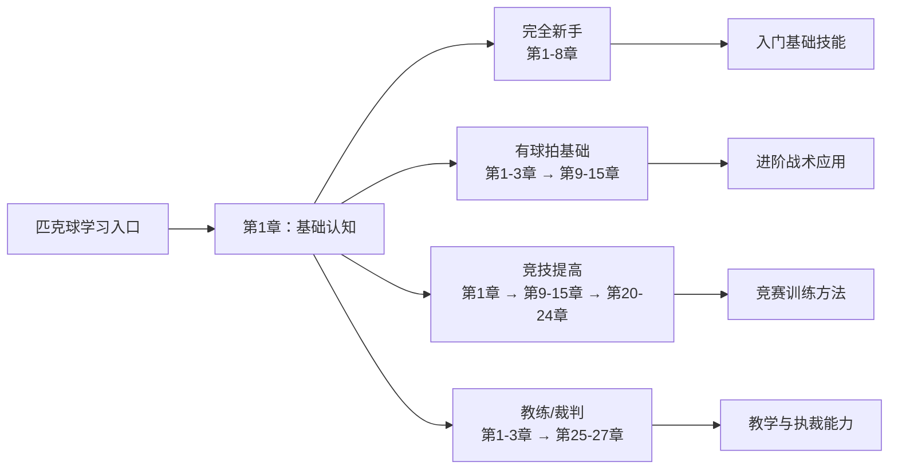

# Learning Pickleball | 学打匹克球

[](https://github.com/yeasy/learning_pickleball)
[](https://github.com/yeasy/learning_pickleball/releases)
[](LICENSE)

<p align="center">
  
</p>

## Introduction | 简介

**Pickleball** is an emerging sport combining features from tennis, badminton, and table tennis. It's easy to start, moderate in intensity, and highly entertaining. This book systematically introduces techniques from beginner to advanced levels to help you enjoy the sport safely.

**匹克球** 是一项风靡全球的新兴运动，融合了网球、羽毛球和乒乓球的特点。它上手容易、运动量适中且趣味性强。本书结合北美教学实践，系统讲解匹克球技术，帮助读者科学训练，避免伤痛，享受运动乐趣。

> 本书支持多语言版本。 This book supports multiple languages.
> - 🇨🇳 **[阅读中文版 (Read in Chinese)](cn/README.md)** [下载 pdf](https://github.com/yeasy/learning_pickleball/releases/download/v2.6.0/learning_pickleball-v2.6.0-cn.pdf)
> - 🇺🇸 **[Read in English (阅读英文版)](en/README.md)** [Download pdf](https://github.com/yeasy/learning_pickleball/releases/download/v2.6.0/learning_pickleball-v2.6.0-en.pdf)

## Online Reading | 在线阅读

Hosted on GitBook / 托管于 GitBook:
👉 **[yeasy.gitbook.io/learning_pickleball](https://yeasy.gitbook.io/learning_pickleball/)**

**💡 Tip for GitBook Users | GitBook 读者提示：**
When reading on GitBook, you can seamlessly switch between English and Chinese by clicking the **Language Globe Icon (🌐)** or dropdown at the top of the navigation bar.
在 GitBook 网站上阅读时，您可以通过点击页面上方导航栏的 **语言下拉菜单 (🌐 图标)** 随时在中文和英文之间进行无缝切换。

## Local Build | 本地阅读

This project uses [HonKit](https://github.com/honkit/honkit) to build the book locally.
本项目使用 HonKit 进行本地构建。

```bash
npm install        # Install dependencies / 安装依赖
npx honkit serve   # Start local server / 启动本地服
```

## 五分钟快速上手

"5分钟了解匹克球"——跟随以下步骤快速掌握基础：

1. **什么是匹克球**（第1章）：了解匹克球的来源、基本规则和与其他球拍运动的区别
2. **基本规则**（第2-3章）：掌握计分制、发球规则、边界判定和基本得分情形
3. **首次发球**（第5章）：学习正确的发球技术、握拍方式和发球的常见错误
4. **基础击球**（第6-8章）：练习前场和后场的基本击球技术，建立运动感觉
5. **开始实战**：在球场上应用学到的知识，逐步提升水平

## 学习路线图


```mermaid
graph LR
    Start[匹克球学习入口] --> Ch1[第1章：基础认知]

    Ch1 --> Role1["完全新手<br/>第1-8章"]
    Ch1 --> Role2["有球拍基础<br/>第1-3章 → 第9-15章"]
    Ch1 --> Role3["竞技提高<br/>第1章 → 第9-15章 → 第20-24章"]
    Ch1 --> Role4["教练/裁判<br/>第1-3章 → 第25-27章"]

    Role1 --> End1["入门基础技能"]
    Role2 --> End2["进阶战术应用"]
    Role3 --> End3["竞赛训练方法"]
    Role4 --> End4["教学与执裁能力"]
```

| 读者角色 | 学习重点 | 核心成果 |
|---------|---------|---------|
| **完全新手** | 第1-8章 | 掌握匹克球基础技能与规则 |
| **有基础** | 第1-3章 → 第9-15章 | 快速迁移经验、学习进阶战术 |
| **竞技提高** | 第1章 → 第9-15章 → 第20-24章 | 系统训练与比赛策略 |
| **教练/裁判** | 第1-3章 → 第25-27章 | 教学执裁与运动科学知识 |

## License & Authorization | 授权与版权

This book is authorized for educational use by [numerous clubs and schools](https://github.com/yeasy/learning_pickleball/wiki/). **Commercial use is prohibited without authorization.**
本书已授权 [全球多家俱乐部和学校](https://github.com/yeasy/learning_pickleball/wiki/) 用于公益培训。**未经授权，禁止用于商业用途。**

## Contributing | 贡献

Pull requests are welcome! If you find any issues or have suggestions, please feel free to contribute.
欢迎提交 PR 修复错误或完善内容。
