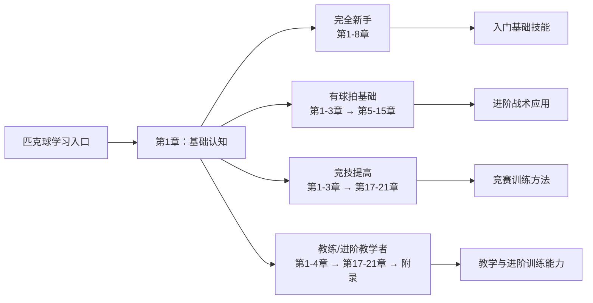

# Learning Pickleball | 学打匹克球

[](https://github.com/yeasy/learning_pickleball)
[](https://github.com/yeasy/learning_pickleball/releases)
[](https://github.com/yeasy/learning_pickleball/releases/latest)
[](LICENSE)

<p align="center">
  
</p>

## Introduction | 简介

**Pickleball** is an emerging sport combining features from tennis, badminton, and table tennis. It's easy to start, moderate in intensity, and highly entertaining. This book systematically introduces techniques from beginner to advanced levels to help you enjoy the sport safely.

**匹克球** 是一项风靡全球的新兴运动，融合了网球、羽毛球和乒乓球的特点。它上手容易、运动量适中且趣味性强。本书结合北美教学实践，系统讲解匹克球技术，帮助读者科学训练，避免伤痛，享受运动乐趣。

> 本书支持多语言版本。 This book supports multiple languages.
> - 🇨🇳 **[阅读中文版 (Read in Chinese)](cn/README.md)** [下载 pdf](https://github.com/yeasy/learning_pickleball/releases/latest)
> - 🇺🇸 **[Read in English (阅读英文版)](en/README.md)** [Download pdf](https://github.com/yeasy/learning_pickleball/releases/latest)
> - 📚 **[语言入口 / Language Index](LANGS.md)**：进入单语言版本的独立首页

## Online Reading | 在线阅读

Hosted on GitBook / 托管于 GitBook:
👉 **[yeasy.gitbook.io/learning_pickleball](https://yeasy.gitbook.io/learning_pickleball/)**

**💡 Tip for GitBook Users | GitBook 读者提示：**
When reading on GitBook, you can seamlessly switch between English and Chinese by clicking the **Language Globe Icon (🌐)** or dropdown at the top of the navigation bar.
在 GitBook 网站上阅读时，您可以通过点击页面上方导航栏的 **语言下拉菜单 (🌐 图标)** 随时在中文和英文之间进行无缝切换。

## Download PDF | 下载 PDF

PDF versions are available at [GitHub Releases](https://github.com/yeasy/learning_pickleball/releases/latest) for offline reading.
PDF 版本可在 [GitHub Releases](https://github.com/yeasy/learning_pickleball/releases/latest) 下载以供离线阅读。

Latest preview PDFs are updated from the default branch:
[learning_pickleball-cn.pdf](https://github.com/yeasy/learning_pickleball/releases/download/preview-pdf/learning_pickleball-cn.pdf) |
[learning_pickleball-en.pdf](https://github.com/yeasy/learning_pickleball/releases/download/preview-pdf/learning_pickleball-en.pdf)

默认分支的最新预览 PDF 可直接下载：
[learning_pickleball-cn.pdf](https://github.com/yeasy/learning_pickleball/releases/download/preview-pdf/learning_pickleball-cn.pdf) |
[learning_pickleball-en.pdf](https://github.com/yeasy/learning_pickleball/releases/download/preview-pdf/learning_pickleball-en.pdf)

These preview files may include unpublished edits and are not formal release artifacts.
这些预览文件会随主线覆盖更新，不代表正式发布版本。

## Local Build | 本地阅读

Install [mdPress](https://github.com/yeasy/mdpress) first, then preview from the repository root / 先安装 [mdPress](https://github.com/yeasy/mdpress)，再在仓库根目录预览：

```bash
brew tap yeasy/tap && brew install mdpress
mdpress serve
```

## 五分钟快速上手

“5分钟了解匹克球”——跟随以下步骤快速掌握基础：

1. **什么是匹克球**（第1章）：了解匹克球的来源、特点和与其他球拍运动的区别
2. **热身与持拍发力**（第3-4章）：先完成身体准备和基础发力训练
3. **首次发球**（第5章）：学习发球与接发球的基本要求和常见错误
4. **基础击球**（第6-11章）：练习 Dink、Drop、Drive、Volley、Slice 和 Lob，建立稳定球感
5. **开始实战**（第17-18章）：带着单打和双打策略上场，边打边查阅第19-21章与附录

> **导航说明**：仓库根目录的目录页会同时展示中文与英文两套章节；如果你希望连续阅读单一语言版本，请直接进入 [cn/README.md](cn/README.md) 或 [en/README.md](en/README.md)。

## 学习路线图


```mermaid
graph LR
    Start[匹克球学习入口] --> Ch1[第1章：基础认知]

    Ch1 --> Role1["完全新手<br/>第1-8章"]
    Ch1 --> Role2["有球拍基础<br/>第1-3章 → 第5-15章"]
    Ch1 --> Role3["竞技提高<br/>第1-3章 → 第17-21章"]
    Ch1 --> Role4["教练/进阶教学者<br/>第1-4章 → 第17-21章 → 附录"]

    Role1 --> End1["入门基础技能"]
    Role2 --> End2["进阶战术应用"]
    Role3 --> End3["竞赛训练方法"]
    Role4 --> End4["教学与进阶训练能力"]
```

| 读者角色 | 学习重点 | 核心成果 |
|---------|---------|---------|
| **完全新手** | 第1-8章 | 掌握匹克球基础技能与规则 |
| **有基础** | 第1-3章 → 第5-15章 | 快速迁移经验、学习核心技术与进阶战术 |
| **竞技提高** | 第1-3章 → 第17-21章 | 系统训练、比赛策略与运动科学理解 |
| **教练/进阶教学者** | 第1-4章 → 第17-21章 → 附录 | 教学设计、进阶训练与装备决策支持 |

## Recommended Reading | 推荐阅读

本书是技术丛书的一部分。以下书籍与本书形成互补：

| 书名 | 与本书的关系 |
|------|------------|
| [《零基础学 AI》](https://yeasy.gitbook.io/ai_beginner_guide) | 了解 AI 基础概念，探索 AI 在体育训练中的应用 |
| [《大模型提示词工程指南》](https://yeasy.gitbook.io/prompt_engineering_guide) | 利用 AI 辅助训练计划制定与技术分析 |

## License & Authorization | 授权与版权

This book is authorized for educational use by [numerous clubs and schools](https://github.com/yeasy/learning_pickleball/wiki/). **Commercial use is prohibited without authorization.**
本书已授权 [全球多家俱乐部和学校](https://github.com/yeasy/learning_pickleball/wiki/) 用于公益培训。**未经授权，禁止用于商业用途。**

## Contributing | 贡献

Pull requests are welcome! If you find any issues or have suggestions, please feel free to contribute.
欢迎提交 PR 修复错误或完善内容。
