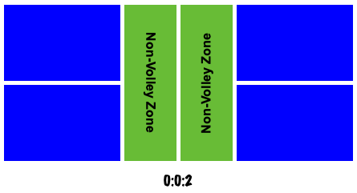

# 打好匹克球 Pickleball Guide

**v0.2.3**

匹克球是一项正在风靡的新兴运动，其技术和诀窍仍在探索发展中。本书将介绍如何掌握匹克球，并快速提高竞技水平，从而领略更多运动带来的乐趣。

每一章侧重一项特定技术，学习者可以按照顺序依次训练，每项技术分配一到两周时间。

* [在线阅读 1](https://yeasy.gitbook.io/pickleball_guide/)
* [在线阅读 2](https://github.com/yeasy/pickleball_guide/blob/main/SUMMARY.md)
* [快速查看要点总结](https://yeasy.gitbook.io/pickleball_guide/14_key_tips_cn)

Pickleball is an emerging sport that is becoming more and more popular today, and its technology and know-how are still being explored and developed. This book will introduce how to master pickleball, and help you improve the competition skill quickly, so as to enjoy the fun from the pickleball.

Each chapter is focused on a specific skill, beginners can learn them by order, while spending 1 or 2 weeks on each skill.

* [Read on Gitbook](https://yeasy.gitbook.io/pickleball_guide/)
* [Read on Github](https://github.com/yeasy/pickleball_guide/blob/main/SUMMARY.md)
* [Show the Key Tips directly](https://github.com/yeasy/pickleball_guide/blob/main/14_key_tips_en.md)
