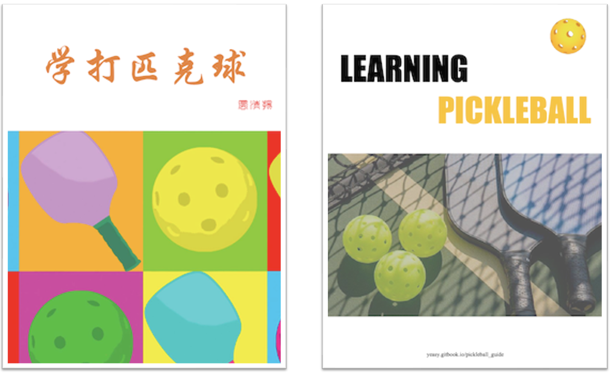

# Learning Pickleball | 学打匹克球

**v1.9.7**

This book has bilingual versions of [English](https://github.com/yeasy/learning_pickleball/releases/download/v1.9.0/learning_pickleball-v1.9.0-en.pdf) and [Chinese](https://github.com/yeasy/learning_pickleball/releases/download/v1.9.0/learning_pickleball-v1.9.0-cn.pdf). 本书提供 [中文版本](https://github.com/yeasy/learning_pickleball/releases/download/v1.9.0/learning_pickleball-v1.9.0-cn.pdf) 和 [英文版本](https://github.com/yeasy/learning_pickleball/releases/download/v1.9.0/learning_pickleball-v1.9.0-en.pdf)。

Pickleball is an emerging sport that is becoming more and more popular all over the world. It combines many appealing features from tennis, badminton, table tennis and other sports. It has the advantages of easy to begin, moderate in movement and interesting for entertainment, which attract more and more enthusiasts.

The technology and playing style of pickleball are still being explored and developed. Some players got injuries due to wrong movements. Based on the teaching practice in the North America, this book will systematically introduce how to learn Pickleball efficiently and help you improve the competition skills to an advanced level, so that you can strengthen your body, avoid injuries, and enjoy more fun from the sport.

Each chapter is focused on a specific topic, players can learn them in order. Each skill may need several weeks' training to master. And here is a quick list of [Frequent Questions and Answers](19_faq_en.md). 

The book is NOT for explaining the game rules, and you may refer to the [official rules](https://usapickleball.org/what-is-pickleball/how-to-play/basics/rules-summary/).

The book has been authorized to numbers of pickleball clubs and schools to use for education. No commercial usage without authorization.

* [Read on Gitbook](https://yeasy.gitbook.io/learning_pickleball/01_background_en)
* [Read on Github](https://github.com/yeasy/learning_pickleball/blob/main/SUMMARY.md)
* [Download PDF Version](https://github.com/yeasy/learning_pickleball/releases/)

匹克球是一项正在风靡全球的新兴运动，它融合了网球、羽毛球、乒乓球等运动的众多特点，具有上手容易、运动量适中、娱乐性强等优势，吸引了越来越多的爱好者。

匹克球的技术和打法仍在探索发展。部分爱好者由于动作不规范，容易造成身体伤痛。结合北美匹克球的教学实践，本书系统讲解如何科学地学习匹克球，最终进阶到高级竞技水平。希望每位读者都可以强健体魄，避免伤痛，从运动中领略更多的乐趣。

每章围绕一项特定技术，学习者可以按照顺序依次训练。掌握每项技术可能需要几周时间。[常见问题解答](19_faq_cn.md)

本书不侧重介绍匹克球的具体比赛规则，读者可以另行参考相关规则手册。

本书已经授权全球多家俱乐部和学校培训匹克球使用。未经授权，禁止用于商业场景。

* [在线阅读一](https://yeasy.gitbook.io/learning_pickleball/01_background_cn)
* [在线阅读二](https://github.com/yeasy/learning_pickleball/blob/main/SUMMARY.md)
* [下载 PDF 版本](https://github.com/yeasy/learning_pickleball/releases/)
