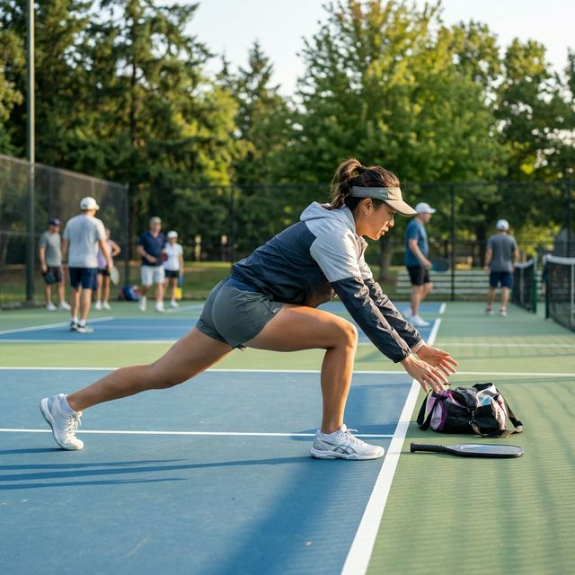

# 第 3 章 热身、放松、体能训练与伤害预防

充分热身与合理放松，是避免伤痛、保持健康的关键。同时，充足的体能也是进行高水平竞技的前提。匹克球虽然被誉为低冲击、易于上手的运动，但如果不注意科学训练和身体保护，仍然可能导致运动损伤。

因此，无论业余爱好者还是职业运动员，都应高度重视热身、放松、体能训练以及伤害预防。

充分热身与合理放松，是避免伤痛、保持健康的关键。同时，充足的体能也是进行高水平竞技的前提。

因此，无论业余爱好者还是职业运动员，都应高度重视热身、放松及体能训练。

## 3.1 充分热身

热身分为两个阶段：**动态热身**和**动态拉伸**。

**动态热身** 通过低强度的有氧运动（如慢跑、跳绳）提升心率和体温，为身体做好准备。

**动态拉伸** 通过活动关节来激活身体关节和相关肌肉，以提高关节活动范围，同时避免受伤。关节决定动作的角度和范围，而肌肉可以保护关节。热身应该按照从整体到局部、从大关节到小关节的顺序进行。

以下是常见的动态拉伸动作：

* 腰部：前屈（10 次）、后屈（10 次）和侧屈（每侧 10 次）；
* 肩膀和胳膊：肩膀的前后转动（每个方向 10 次）、扩胸（10 次）和上下伸展（每个方向 10 次）；
* 腿部：高抬腿（每侧 10 次）、侧向跨步（每侧 10 次）和跨步拉伸转体（每侧 10 次）；
* 腕关节和踝关节：正反向转动（每个方向 10 次）；
* 综合活动：慢跑 1-2 分钟，进行 10-20 个小跳跃。

热身应该有针对性、全面性，总耗时 5-10 分钟，以达到有效激活身体和预防运动损伤的目的。

## 3.2 合理放松

在激烈运动时，肌肉组织会快速地收缩和放松，这个过程可能导致原本整齐排列的肌肉纤维出现交错、弯曲等情况。如果肌肉长时间处于这种状态，容易受伤。放松主要是通过静态拉伸动作来舒张和松弛肌肉组织，使其纤维恢复到整齐排列的状态，以保持肌肉的延展性和柔韧性。

要实现有效的放松，重要的是首先集中精力放松较大的肌肉群，然后是较小的肌肉群。每个动作保持 15-20 秒，不要弹跳，力度适中感到肌肉轻微拉伸感即可。

* 腰部：向前弯曲，双手触脚尖（保持 15-20 秒）；向后轻轻拱起（保持 15 秒）；向两侧侧屈各一侧（每侧 15 秒）；
* 背部：站直双臂举过头顶，身体向前弯曲（保持 20 秒），轻轻拱起背部释放上背部和肩部紧张感（保持 15 秒）；
* 腿部：一脚交叉放在另一脚前方，缓慢弯腰触脚尖拉伸腘绳肌（保持 20 秒），换脚重复；坐姿鸽式（保持 25-30 秒）；
* 髋部：仰卧，一条腿跨过身体（保持 20 秒），每侧重复；
* 胳膊：一只手臂拉过胸膛拉伸肩部（保持 15 秒），双臂在背后互扣向下拉伸（保持 20 秒）。

放松也可通过自我按摩和压力点疗法等技术实现。泡沫轴可用于放松腿部和背部大肌肉群（每个部位 1-2 分钟）。

## 3.3 体能训练

球类运动需要具备多种身体素质，包括 **力量**（爆发力和耐力）、**速度** 和 **准确性**。以下是常见的体能训练项目，球员可以根据个人身体状况适度调整训练量。

### 力量训练

* 蹬地转腰挥拍，20 次 × 3 组
* 靠墙静蹲，2 分钟 × 3 组
* 屈髋练习，10 次 × 3 组
* 马步静蹲，1 分钟 × 3 组
* 下蹲起身，10 次 × 3 组
* 双腿轮流弓箭步，10 次（每腿）× 3 组
* 下蹲水平快速移动，10 次 × 3 组
* 下蹲起跳弓箭步，20 次 × 3 组
* 平板支撑，1 分钟 × 3 组
* 单腿下蹲起身，10 次（每腿）× 3 组

### 速度训练

* 对墙击球，1 分钟 × 3 组
* 10 米快速前后折返跑，1 分钟 × 3 组
* 10 米快速左右折返跑，1 分钟 × 3 组

### 准度训练

* 持拍绕八字，100 次 × 3 组
* 正确握拍颠球，100 次（正手、反手、混合各一组）× 3 轮
* 抛球入桶，20 次 × 3 组
* 抛球到墙指定位置并接球，20 次 × 3 组

## 3.4 分级训练建议

不同水平的球员，训练侧重点和时长应有所不同。

### 初级球员（2.5-3.0 级）

* **每周训练**：3-4 次，每次 30-60 分钟
* **重点内容**：发球稳定性、接发球、基础步法
* **训练比例**：技术练习 70%，比赛实战 30%
* **特别注意**：建立正确动作习惯，避免养成坏习惯

### 中级球员（3.5-4.0 级）

* **每周训练**：4-5 次，每次 1-2 小时
* **重点内容**：后场吊球、网前吊球、截击、旋转控制
* **训练比例**：技术练习 50%，战术练习 30%，比赛 20%
* **特别注意**：开始系统学习战术配合

### 高级球员（4.5-5.0 级）

* **每周训练**：5-6 次，每次 2-3 小时
* **重点内容**：高级技术（ATP、Erne）、比赛策略、心理训练
* **训练比例**：技术强化 30%，战术演练 40%，比赛模拟 30%
* **特别注意**：针对弱点进行专项强化

### 职业/精英球员（5.5+级）

* **每周训练**：每天 4-6 小时
* **重点内容**：技术微调、体能强化、比赛分析、心理建设
* **训练比例**：根据比赛周期调整
* **特别注意**：科学恢复，预防伤病

### 周训练计划示例（中级球员）

| 周一 | 周二 | 周三 | 周四 | 周五 | 周六 | 周日 |
|------|------|------|------|------|------|------|
| 力量 + 有氧 | 技术训练 | 比赛 | 休息 | 技术 + 战术 | 比赛实战 | 轻度拉伸恢复 |
| 90 分钟 | 60 分钟 | 90 分钟 | - | 90 分钟 | 120 分钟 | 30 分钟 |

## 3.5 匹克球常见运动损伤

### 肩袖损伤（Rotator Cuff Injuries）

肩袖由四块肌肉组成（棘上肌、棘下肌、小圆肌、肩胛下肌），负责维持肩关节的稳定性和进行旋转运动。匹克球中的发球、抽球、截击等动作都涉及大幅度的肩部旋转和加速，容易造成肩袖疲劳和损伤。

**症状表现：**
- 肩部侧面或前面疼痛，特别是在抬起手臂或投掷动作时
- 肩部在夜间疼痛，影响睡眠
- 肩部力量下降，难以完成日常动作

**常见原因：**
- 热身不充分，直接进行高强度击球
- 连续进行重复性肩部运动导致过度劳损
- 肩部核心稳定性不足
- 不正确的握拍姿态或击球姿势

**预防方法：**
- 充分热身肩部关节和旋转肌群，重点包括肩关节绕环、TI-YT-W 系列动作
- 加强肩部稳定性训练，包括肩胛骨稳定性练习（如俯卧撑位的肘部支持、死虫式）
- 增强背部和胸部肌肉的均衡发展，预防前后肌肉失衡
- 每周进行 2-3 次肩部力量训练，如悬挂行、反向飞鸟等
- 在比赛中避免连续高强度发球，给肩部适当休息

### 网球肘与高尔夫球肘

网球肘（Lateral Epicondylitis）是肱骨外上髁炎，主要影响前臂外侧肌肉附着点。高尔夫球肘（Medial Epicondylitis）则是肱骨内上髁炎。这两种损伤都源于重复的握拍挥拍动作和不正确的用力方式。

**症状表现：**
- 肘部外侧（网球肘）或内侧（高尔夫球肘）疼痛，特别是在握拍、挥拍或握力时
- 疼痛可能放射到前臂和手腕
- 握力减弱，难以持拳或紧握物体

**常见原因：**
- 长期的重复击球，前臂肌肉疲劳积累
- 击球时肘部位置过低，造成前臂过度用力
- 不正确的握拍（握拍过紧或握拍方式不当）
- 球拍重量过重、挥重过大或握把尺寸不合适
- 缺乏前臂肌肉力量训练

**预防方法：**
- 定期进行前臂肌肉拉伸，包括屈腕肌和伸腕肌的静态拉伸
- 加强前臂肌肉力量，可使用握力球、弹性带进行练习
- 确保握拍适当放松，避免过度用力，记住“3 分力握拍”的原则
- 使用合适重量的球拍（通常 7-9 盎司）
- 在训练中穿插充分的休息和恢复时间
- 每周进行 2-3 次前臂针对性训练，如腕弯曲/伸展、旋前/旋后练习

### 跟腱炎（Achilles Tendinitis）

跟腱是人体最强的肌腱，连接小腿肌肉和足跟。匹克球中频繁的前后移动、急停急开会对跟腱造成重复性的拉伸和压力。

**症状表现：**
- 足跟后方或小腿下部疼痛，特别是在运动开始或结束时
- 晨起时足跟疼痛，走几步后可能缓解
- 跳跃或快速移动时疼痛加重
- 触摸跟腱时有明显压痛

**常见原因：**
- 训练量增加过快，跟腱适应不足
- 小腿肌肉过度紧张，跟腱张力过高
- 在硬质球场上进行长时间训练
- 热身不充分，直接进行高强度运动
- 鞋底支撑不足或鞋跟高度不合适

**预防方法：**
- 充分拉伸小腿肌肉（腓肠肌和比目鱼肌），每次 30-60 秒，每天 2-3 次
- 使用泡沫轴进行小腿自我按摩，释放肌肉紧张
- 逐步增加训练强度，避免突然增加训练量
- 使用合适的运动鞋，提供足够的足弓支撑和缓冲
- 加强小腿肌肉力量，可进行单脚提踵练习
- 在球场上穿着运动袜，提供额外支撑和缓冲

### 膝关节问题

膝关节承受着身体大部分重量，同时在匹克球运动中需要进行频繁的变向、加速和减速。常见的膝关节问题包括前膝痛综合征（Patellofemoral Pain Syndrome）、膝关节半月板损伤等。

**症状表现：**
- 膝盖前面疼痛，特别是在上下楼梯、蹲坐或长时间跑动后
- 膝盖内侧或外侧疼痛
- 膝关节肿胀或感觉不稳定
- 膝盖发出弹响声或卡顿感

**常见原因：**
- 股四头肌和臀部肌肉不平衡，导致膝盖轨迹偏离
- 着地姿势不正确，膝盖内扣或外翻
- 训练强度过大或增加过快
- 腿部柔韧性和力量不足
- 鞋底磨损，造成着地不稳

**预防方法：**
- 加强股四头肌和臀部肌肉，特别是臀中肌的侧向稳定性
- 进行单腿下蹲、跨步蹲、单腿硬拉等功能性练习
- 改进着地技术，确保膝盖与脚尖对齐，避免膝盖内扣
- 定期进行大腿和膝盖周围肌肉的拉伸和按摩
- 选择支撑性好的运动鞋，定期检查鞋底磨损情况
- 在硬质球场上训练时逐步增加时间和强度

## 3.6 科学热身与拉伸

### 运动前热身（动态拉伸）

动态热身的目的是提高核心体温、激活肌肉、提高神经肌肉协调性和关节活动范围，为高强度运动做准备。研究表明，科学的热身可以显著降低受伤风险。

**科学热身的关键原则：**

1. **循序渐进原则**：从低强度开始，逐步增加运动强度，使身体有时间适应
2. **全面激活原则**：激活所有将参与运动的主要肌肉群和关节
3. **特异性原则**：热身动作应与主要运动相似，激活相同的神经肌肉通路
4. **时间适宜原则**：热身后应立即开始运动，通常间隔不超过 5 分钟

**推荐热身程序（总时长 10-15 分钟）：**

第一阶段：通用有氧热身（3-5 分钟）
- 原地轻跑或快走，逐步提高心率
- 简单跳跃或跳绳，激活下肢肌肉

第二阶段：关节活动（3-4 分钟）
- 肩关节绕环：向前 10 次，向后 10 次
- 腰部旋转：左右各 10 次
- 髋关节绕环：顺时针 10 次，逆时针 10 次
- 膝关节旋转：原地踏步，膝关节向上抬起，做旋转动作

第三阶段：动态拉伸（4-6 分钟）
- 正压腿：每条腿 10-12 次，注意膝盖保持略微弯曲
- 侧压腿：每侧 10-12 次，保持躯干竖直
- 行走弓箭步：每侧 10-12 步，保持膝盖低点不低于地面
- 行走高抬腿：每侧 10-12 步，逐步提高腿的高度
- 臀部绕环：迈出一大步，躯干向前倾，感受臀部拉伸
- 肩部 T-Y-W 动作：在站立或弯腰姿势下进行，激活肩胛骨和肩部稳定肌

第四阶段：运动模拟（2-3 分钟）
- 缓慢挥拍动作：模拟正手和反手击球，逐步增加速度
- 轻松移动：横向侧滑、前后移动，逐步加快速度
- 轻击几个球：以 70-80%强度进行轻松练习

### 运动后拉伸（静态拉伸）

静态拉伸的目的是释放肌肉张力、恢复关节活动范围、促进血液循环和废物代谢。运动后进行 15-30 分钟的静态拉伸可以显著减缓肌肉酸痛。

**科学拉伸的关键原则：**

1. **时机原则**：在充分冷却后进行，心率降至接近静息水平
2. **温和原则**：拉伸至感受到肌肉的温和牵拉，但不应有疼痛感
3. **持时原则**：每个拉伸动作保持 30-60 秒，重复 2-3 次
4. **完整原则**：拉伸所有在运动中使用过的主要肌肉群

**运动后推荐拉伸程序（总时长 15-20 分钟）：**

- **腓肠肌拉伸**（小腿后侧）：踏步状，后脚跟保持接触地面，身体向前倾。每侧保持 45 秒，共 2 组。
- **比目鱼肌拉伸**（小腿深层）：蹲姿，脚跟不抬起，前腿膝盖弯曲。每侧保持 45 秒，共 2 组。
- **股四头肌拉伸**（大腿前侧）：站立，拉起脚跟向臀部，保持膝盖对齐。每侧保持 45 秒，共 2 组。
- **腘绳肌拉伸**（大腿后侧）：坐姿或站姿前屈，感受大腿后侧牵拉。保持 60 秒，共 2 组。
- **臀大肌拉伸**：坐姿，一条腿交叉放在另一条腿上，躯干向前倾。每侧保持 45 秒，共 2 组。
- **髂腰肌拉伸**（髋部前侧）：箭步姿势，后膝着地，髋部向前倾。每侧保持 45 秒，共 2 组。
- **胸部拉伸**：双手背后紧握或扭毛巾两端，平缓抬起双臂。保持 45 秒，共 2 组。
- **肩部拉伸**：一只手越过身体，另一只手轻轻压肘，拉伸肩部外侧。每侧保持 45 秒，共 2 组。
- **脊椎旋转拉伸**：仰卧，一条腿交叉放在另一侧，轻轻转向，拉伸脊椎和臀部。每侧保持 45 秒，共 2 组。

## 3.7 不同年龄段的运动保护建议

### 青少年运动员（12-18 岁）

青少年正处于身体发育阶段，骨骼仍在成长，尤其是长骨两端的生长板特别易受伤。肱骨近端（肩关节处）的生长板在频繁发球训练中容易受损。同时，这个年龄段可能出现肌肉柔韧性下降和力量增长不平衡的问题。

**保护重点：**
- **生长板保护**：避免过度的重复性运动和高冲击运动，特别是发球动作的高频率训练可能影响肱骨近端生长板，建议每周训练不超过 4 次
- **灵活的训练计划**：每种训练方式（发球、吊球、抽球等）每周不超过 2-3 次，避免过度使用单一肌肉
- **力量与柔韧性平衡**：每周进行 2-3 次力量训练，同时保证充足的拉伸时间
- **充分恢复**：确保每周至少有 1-2 天完全休息，每晚 7-9 小时睡眠

**特别注意：**
- 避免成人水平的高强度训练，逐步建立训练基础
- 警惕成长痛的症状（膝盖、跟腱处疼痛），如果持续应停止训练并就医
- 强调技术正确性而非力量，避免为了增加力量而采用不正确的姿势

### 成年运动员（18-40 岁）

成年人的身体已完全发育，具有最强的恢复能力和适应能力。这个年龄段可以进行高强度训练，但仍需注意过度训练和积累性伤害。

**保护重点：**
- **渐进式过载**：每周增加训练量不超过 10%，避免急速增加强度
- **多样性训练**：结合不同类型的训练（有氧、力量、灵活性、技能），预防单一性损伤
- **主动恢复**：在高强度训练后进行轻松训练、拉伸和按摩
- **营养支持**：保证充足的蛋白质、碳水化合物和抗氧化物质摄入

**特别注意：**
- 监测过度训练症状：持续疲劳、心率升高、睡眠障碍、免疫力下降
- 每月进行一次“减量周”，降低训练强度至平时的 50-70%，给身体恢复机会
- 定期进行自我评估，如果连续 2 周感到疲劳或疼痛，应减少训练量

### 中老年运动员（40-65 岁）

中老年人群虽然恢复速度放缓，但只要科学训练，仍然可以维持和提高运动能力。这个年龄段的训练重点应从力量和速度转向力量维持、柔韧性和运动控制。

**保护重点：**
- **力量维持**：每周进行 2-3 次力量训练，重点是大肌肉群，可预防跌倒和损伤
- **柔韧性和活动度**：每周进行 3-4 次拉伸和动态活动练习，保持关节活动范围
- **低冲击运动**：强调吊球、截击等低冲击技术，减少快速跑动和大力击球的频率
- **充分恢复**：安排更长的恢复时间，每周至少 2-3 天轻松训练或完全休息

**特别注意：**
- 定期进行身体检查，监测骨密度、心血管健康和肌肉强度
- 如有既有条件（如关节炎、高血压），应在医生指导下进行训练
- 强调控制和稳定性，避免为了赢球而冒受伤风险

### 老年运动员（65 岁+）

随着年龄增长，肌肉质量和骨密度自然下降，动作的敏捷性和反应速度也会降低。然而，匹克球的低冲击特点使其非常适合这个年龄段的人群。

**保护重点：**
- **跌倒预防**：进行平衡和本体感觉训练，减少跌倒风险
- **骨密度维持**：进行负重训练和适度高冲击活动（如轻跳），减缓骨质流失
- **心血管健康**：进行中等强度的有氧活动，如轻松对打和移动
- **独立性维持**：训练能够支持日常活动的肌肉（起身、走路、上楼梯）

**特别注意：**
- 强调比赛控制而非速度，强调“慢打快”的策略
- 定期检查视力和听力，确保能够正确看到球和听到对手的指令
- 与医生沟通任何疼痛或不适，不要隐忍

## 3.8 运动后恢复策略

### 急性期恢复（运动后 0-48 小时）

**冷疗（Ice）**
冷疗通过降低局部温度，减少血流量和炎症反应，从而减缓疼痛和肿胀。
- 时机：运动结束后越早开始越好，理想情况下在 15 分钟内
- 方法：冰敷包或冰水，用毛巾隔开，避免直接接触皮肤
- 时长：每次 15-20 分钟，可每隔 2-3 小时重复一次，持续 48 小时

**压力（Compression）**
压力包扎通过限制肿胀，维持关节稳定性，减少二次伤害风险。
- 方法：使用弹性绷带或压力袜，从下往上绕缠
- 力度：紧而不痛，能够放入一指为宜
- 时长：可全天穿着，但夜间应缓解压力

**抬高（Elevation）**
抬高受伤肢体利用重力促进血液回流，减少肿胀。
- 高度：抬高至心脏水平以上
- 时长：与冰敷配合，特别是在肿胀阶段

**活动（Activity）**
虽然名为“休息”（Rest），现代运动医学强调适度主动活动的重要性。
- 轻微活动有助于维持血液循环，促进恢复
- 可进行无痛范围内的温和活动
- 避免完全卧床，除非医生建议

### 亚急性期恢复（运动后 2-7 天）

**热疗**
在急性炎症消退后，热疗可以增加血流量，促进组织修复。
- 时机：伤后 48 小时后可开始
- 方法：热敷包、温水浸泡或热浴
- 时长：每次 15-20 分钟，每天 1-2 次

**按摩与泡沫轴**
自我按摩和泡沫轴滚压可以缓解肌肉紧张，改善血液循环。
- 泡沫轴使用：沿肌肉方向缓慢滚动，停留在痛点 15-30 秒
- 手动按摩：用拇指或指节进行深层按摩，避免在受伤部位直接按压

**渐进式康复运动**
逐步恢复正常活动范围和力量。
- 第一周：无痛范围内的被动和主动活动
- 第二周：加入轻阻力练习
- 第三周：逐步增加强度和难度

### 长期恢复与预防（1 周后）

**营养支持**
适当的营养是肌肉和组织修复的基础。
- **蛋白质**：根据训练强度分层补充。低强度训练 1.0-1.2 g/kg，中强度训练 1.2-1.4 g/kg，高强度训练 1.4-1.6 g/kg（每公斤体重/天），支持肌肉修复。优选来源：鸡肉、鱼肉、蛋类、豆类、希腊酸奶
- **碳水化合物**：运动后 30-60 分钟内摄入 20-40 克碳水化合物和蛋白质，最优比例为 3:1，促进肌糖原补充和蛋白质合成
- **抗氧化物质**：樱桃、浆果、绿茶等含有抗氧化剂，可减少运动诱发的炎症
- **水分**：每公斤体重 12-16 毫升，补充运动中的流失

**运动后恢复的“黄金窗口”（30-120 分钟）**

运动结束后 30-120 分钟是肌肉蛋白质合成和肌糖原补充的最佳时期，此时进行适当的营养补充可以显著加快恢复。推荐方案：
- 运动结束后 30 分钟内：摄入碳水化合物和蛋白质的组合（如香蕉配花生酱、运动饮料）
- 运动结束后 1-2 小时内：进行完整的营养均衡餐食

**睡眠的关键作用**
- 目标：每晚 7-9 小时睡眠
- 时间点：避免在睡前 3 小时内进行强度训练或摄入咖啡因
- 质量优化：保持规律睡眠时间，创造黑暗、凉爽、安静的睡眠环境

## 3.9 何时应该就医

以下情况应立即停止训练并寻求医疗帮助：

1. **急性伤害**：明显的扭伤、骨折、关节脱位或肌肉撕裂
   - 症状：突然的剧烈疼痛、肿胀、变形、无法活动

2. **持续性疼痛**（超过 3-5 天）
   - 尤其是运动中疼痛，休息时不缓解
   - 或运动后疼痛逐日加重

3. **神经症状**
   - 肢体麻木或刺痛感
   - 肌肉无力或无法控制
   - 放射痛（疼痛沿神经路线放射）

4. **肿胀和淤青不减轻**
   - 超过 3-5 天仍在增加
   - 伴随明显活动受限

5. **关节不稳定**
   - 关节感觉“滑动”或“错位”
   - 重复性关节不适

6. **全身症状**
   - 伴随发热、寒颤或全身肌肉酸痛
   - 可能指示感染或全身性疾病

**医学评估流程：**

首先应挂号初级保健医生（全科医生）进行初步评估。医生可能会：
- 询问受伤情况和病史
- 进行物理检查
- 根据需要安排影像检查（X 光、超声、MRI 等）
- 根据诊断提供治疗建议或转诊至专科医生

如果涉及关节、肌肉或骨骼伤害，可能需要转诊至：
- 骨科医生（Orthopedic Surgeon）：处理骨骼和关节伤害
- 运动医学医生（Sports Medicine Physician）：专门处理运动相关伤害
- 物理治疗师（Physical Therapist）：协助康复和预防

## 3.10 制定个人化伤害预防计划

有效的伤害预防不是一成不变的，需要根据个人情况制定。

**评估你的风险因素：**

1. **既往伤害史**：曾经受过伤的部位更容易再次受伤，需要特别注意
2. **运动史**：从其他运动转项（如网球、羽毛球）可能带来特定的薄弱环节
3. **训练方式**：某些训练方式可能对特定部位压力更大
4. **身体特征**：柔韧性、力量和稳定性的不足都会增加受伤风险
5. **生活方式因素**：睡眠不足、营养不均衡、工作压力都会影响恢复

**制定预防计划：**

1. **评估**：进行一次体能评估，包括柔韧性测试（坐位体前屈）、单腿站立时间、单腿下蹲能力等
2. **识别**：找出自己的薄弱环节和高风险部位
3. **训练**：针对薄弱环节进行针对性训练，每周 2-3 次
4. **监测**：定期评估进展，至少每 4 周一次
5. **调整**：根据评估结果调整训练计划

**样本个人化计划：**

如果你有跟腱炎的历史，你的计划应包括：
- 每日小腿拉伸：早晚各一次，每次 60 秒
- 每周 2 次小腿力量训练：单腿提踵、阶梯训练
- 运动前额外 10 分钟的小腿热身
- 运动后冷疗：20 分钟冰敷
- 监测训练量：跟踪每周的训练时长和强度
- 穿着支撑性运动鞋和运动袜

遵循这样的个人化计划，可以将伤害风险大幅降低。
