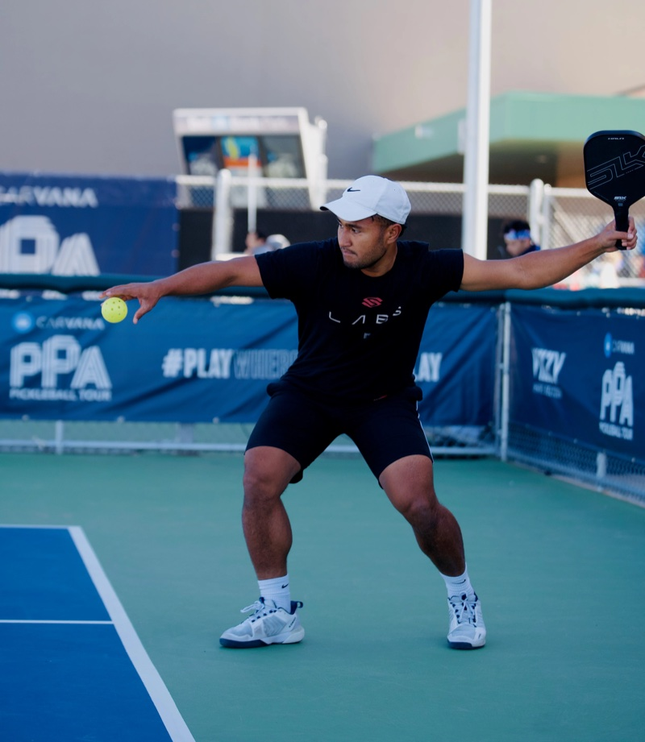
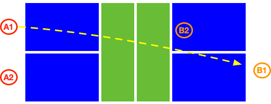
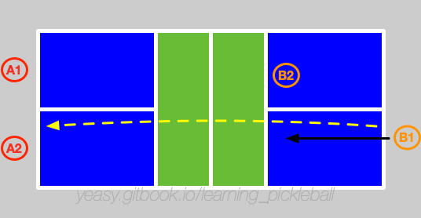

# 第 5 章 发球与接发球

发球和接发球的目的是为下一拍击球做好准备，避免给对方较好的进攻或上网机会。

在高水平比赛中，除非双方水平差距悬殊，否则通常较难通过发球或接发球直接得分。

单打比赛中，由于球员要覆盖范围更大，对发球和接发球的质量要求往往更高。

## 5.1 发球

匹克球发球需站在底线后，发到对角半区，即从非截击区线（不包括）到底线的区域。喊出比分后，须在 10 秒内完成发球。

发球包括 **直击式** 和 **自由落体式** 两种发球。直击式是将球抛起后直接击打发球。要求球拍触球时，手臂必须沿向上弧线挥动，球拍最高处不能高于手腕最高处，且球与球拍的接触点不能高于腰部。自由落体式是让球自由下落，触地弹起后再击打球，此时无挥拍和击球高度限制。

> 注：2025 年起，规则允许使用球拍释放球（而非仅用手），但释放时仍禁止加旋转。**2026 年规则重申并强调：击球瞬间，手必须在腰部以下，拍头必须由下向明显上方挥动（必须有肉眼可见的向上弧线），拍头最高点不得高于手腕。** 关于旋转发球：在球拍击球瞬间通过摩擦产生的旋转是合法的；但在释放球之前（如用手指搓球或用球拍预旋球），对球施加旋转是违规的（即曾风靡一时的"电锯发球"已被禁止）。

为增加回球难度和阻碍对方快速上网，发球要尽量落在底线附近，注意不要出界。

发球时可以通过发到不同位置（如对方偏正手位、反手位或中间位）和不同高度、速度等方式来试探对方回球质量。通常，快球、低球和反手位置的球，比慢球、高球和正手位置的球更难处理。

当对手站位较偏，或跑动较慢时，可以通过变化发球来调动对手取得主动。

单打时发球可以结合变化旋转和落点来调动对方站位，例如反手区底线深球（可加下旋，迫使对手后退）和正手区短球（可加上旋，拉对手前移），或者中路的上旋和不转球。

双打时可多发中路长球，以迫使对方回球质量不高，无法及时随球跑到网前。

## 5.2 掌握发球

### 发球站位与身体姿态
后脚贴底线，身体与底线约 45° 角，前脚距底线 0.3 米左右，肩膀指向目标区域。

### 发力机制
发球的力量来自腿部。通过蹬地转腰，将力量从腿部传递到躯干，之后躯干带动胳膊挥动，将力量经由手指传递到球拍，最终将身体力量鞭打到球。

在击打到匹克球前，身体应当处于放松状态。在击打到球瞬间，手指抓紧球拍，击球后随挥，将身体力量集中稳定地释放到球上。发球时还可以利用步法或身体重心前移来增加击球力量。

### 发球类型与策略
由于匹克球较光滑，发球应以击打为主，配合适量旋转。选手应至少掌握上旋发球与不转发球。

发球首先要保持一致性，避免失误。其次是打好较深的落点让对方难以回球，最后配合力量和旋转，主要是上旋和侧旋。

## 5.3 接发球

准备接球时，要预留足够接球空间，通常以底线往后再退一步左右站位为宜。身体和球拍要正对来球方向。

接发球时，拍面要正对来球方向击球，同时己方应及时随球上网（回球落地之前己方须跑到网前）。接发球要尽量落在对方底线附近，以迫使对方留在后场。这看似与"尽快上网"矛盾，实际上：**深球回击会迫使对手在后场击球，给自己争取更充足的上网时间**。

单打时，应多回球到对方空当处，造成对手跑动。

双打时，应多回球到对手两名球员之间的空当处（可略偏反手位），造成对方接球时的困扰。如果对方两名球员水平差异较大，可多回球给水平较弱者。

## 5.4 掌握接发球

接发球的目标是尽量给对方打第三拍造成困难，同时己方有充足时间跑到网前。因此，回球落点要尽量深，最好落到底线附近，但注意不要出界。

接发球多使用简洁稳定的向前挥拍，可以平击回球，也可以通过削球或上旋动作回球。当希望留给自己更多跑动时间时，可将球击打高抛，使其慢慢落到对方底线附近。

## 5.5 常见错误与纠正

* **挥拍过于仓促**：手臂抬起瞬间立刻挥拍，导致力量传递不足、控制差。纠正：抛球后等待 0.5 秒，确保身体完全转向目标，再用腿部力量带动挥拍。

* **站位过于贴线**：靠得太近导致击球后惯性容易踩线或进入禁区。纠正：保持后脚贴线、前脚距线 30 厘米的标准站位。

* **发球下网或出界**：力量控制不当或拍面角度错误。纠正：初期以稳定为第一目标，落点保守（靠后一点），逐步向底线靠近。

* **接发球反应迟缓**：站位太深或注意力不集中。纠正：靠近底线一步、目光紧跟发球方的手臂，提前预判落点。

* **接发后不及时上网**：回球后迟疑或等待。纠正：回球脱手的同时，立即向网前冲刺，目标是回球触地前到达厨房线附近。

## 5.6 训练方法

通过多球练习来训练发球和接发球，分级进度如下：

### 初级
* 发球到指定区域：20 个连续成功 × 3 组
* 目标区域：对角半区内，允许偏差范围较大

### 中级
* 发球到指定区域：30 个连续成功 × 5 组
* 目标区域：靠近底线附近，偏差不超过 0.5 米
* 掌握 2 种旋转（上旋、不转）

### 进阶
* 发球到指定区域：50 个连续成功 × 10 组
* 目标区域：底线附近，精准控制旋转和速度变化
* 掌握 3 种旋转（上旋、不转、下旋）并能配合移动发球

熟练后可练习同样动作发出不同旋转的发球，并能回击不同旋转发球。
