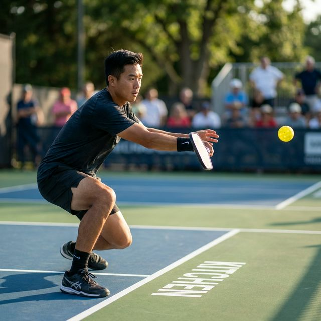
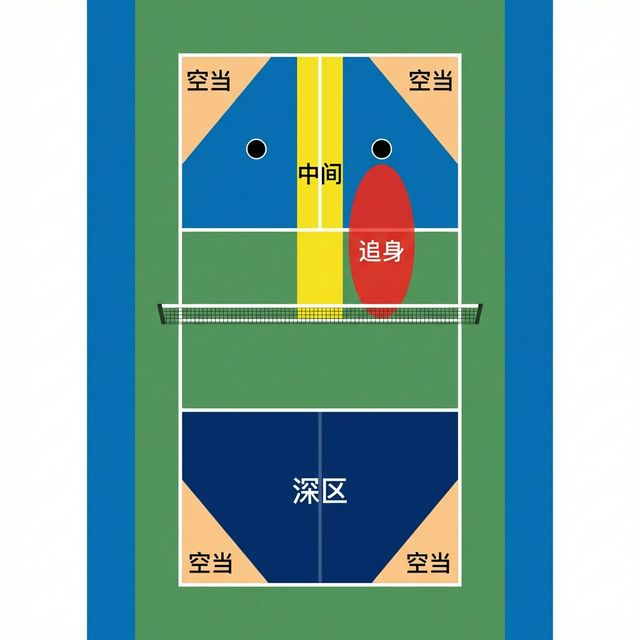

# 第 9 章 截击技术

截击（Volley）是匹克球最常见的得分手段。尤其在双打中，双方往往靠比拼截击技术来赢得比赛。

## 9.1 什么是截击

截击是指在球落地之前，在其飞行过程中击打的动作。截击球给对方回球时间较短，难处理。专业比赛中网前快速截击对攻时，球员需在 0.25 秒内反应并完成击球。

一般根据截击发生的位置，可以分为**后场截击**、**中场截击**、**近网截击**。

* **后场截击**：对方给出后场高球时，可以通过头顶区点杀截击来逼迫对方后退。
* **中场截击**：中场截击多为己方在打出第三拍后场吊球时，对方回出长球。此时可以主动发力进攻或柔和发力过渡。中场截击可以主动发力制造进攻机会，也可以被动吸收力量重置为相持。
* **近网截击**：最常见的截击类型。根据技术动作，又可细分为：
  * **拳击式截击（Punch Volley）**：动作短促、具有攻击性的向前推挡截击。
  * **吊球截击（Dink Volley）**：在空中柔和地将球放回对方非截击区的截击。
  * **头顶扣杀（Overhead Smash）**：对高球（如挑球或过高的起高球）进行向下的强力扣杀。

另外，根据截击时球的高度不同，可以分为平抽截击、高球截击和头顶上方截击。

比赛双方有时会在网前相互平抽截击对方来球，形成较快的回合。

> **NVZ 违规警示**：网前截击要注意避免脚或身体动能带入触碰非截击区（包括边线）。这是常见的犯规，会导致直接失分。击球后身体要及时回到非截击区外。

## 9.2 何时使用截击

当对方未在网前，且回球较高时，容易造成好的进攻机会，此时可以通过截击来压迫对方在后场或直接得分。

当对方在前场吊球，回球较远或较高时，可以通过截击来尝试进攻得分。

## 9.3 掌握截击

首先要做到移动到位。预测球的轨迹，移动到球的前进方向击球。截击球位置应当比非截击球要更早一些。特别当对方给出后场高球时，要快速侧身后退到位。

另外，截击时候架拍要稳定，尽量正拍面击球。

根据具体技术，动作要领如下：
* **拳击式截击（Punch Volley）**：动作要紧凑，向前推挡（类似击掌）。几乎不需要向后引拍，保持手腕固定。
* **重置/挡截击（Reset/Block）**：放松握拍。吸收来球的速度（就像接住一个生鸡蛋一样），将球柔和地送入对方的非截击区。
* **头顶扣杀（Smash）**：侧身，向上伸展，然后手腕和手臂向前甩动，将球向下击打。

截击的落点选择同样关键：
* **深区**：瞄准底线附近的对方脚下。
* **空当**：将球打向远离对手的角度。
* **追身**：瞄准对方持拍手的髋部或肩部（“鸡翅”位置），使其难以发力。
* **中间**：在双打中，两人中间的结合部往往容易造成防守混乱。

注意，除非有很好的机会，一般不建议打得太靠近边线，因为容错率较低。

## 9.4 防守截击

防守截击的关键在于快速移动到合适的位置，并做出正确的预判。特别对方网前有较好截击机会时，要及时后撤，降低重心准备回球。

**预判要点**：

观察对手的身体语言来预判截击方向——对手的肩膀转向会暗示击球方向，拍头的位置决定了球会打向何处，重心的移动反映了对手的发力意图。通过这些信息提前移动到球的落点区域。

当对方向你发起截击进攻时：

1.  **站定或后撤**：根据来球高度和速度判断。如果对方准备重力扣杀，后撤一步并降低重心，减小防守难度。
2.  **准备球拍**：将球拍置于胸前，保护身体。
3.  **重置防守**：不要试图与扣杀硬碰硬。将球柔和地挡回对方的非截击区（即重置），迫使对方重新回到吊球相持，从而化解其攻势。
4.  **防守反击**：如果对方的截击球质量不高（速度不够快），可以迅速向前推挡反击（形成”网前快攻对抗”）。

## 9.5 挡截击技术（Block Volley）

挡截击是应对对方大力进攻时的重要防守技术。当对方打出高质量的截击进攻球时，通过柔和的挡截击可以将球重置到对方非截击区，打断对方的进攻节奏。

### 技术要点

* **放松握拍**：与进攻性截击不同，挡截击需要放松握拍，用“软手”吸收来球的力量；
* **减少动作**：不需要挥拍，只需将球拍稳定地挡在来球路线上；
* **拍面角度**：根据来球高度调整拍面角度。来球较高时，拍面稍微向下；来球较低时，拍面稍微向上；
* **借力卸力**：利用来球的速度，通过拍面角度控制将球送入对方非截击区。

### 何时使用挡截击

* **对方大力进攻**：当对方打出速度很快的截击球，没有时间主动发力时；
* **来球贴身**：当来球直接冲向身体，无法让开位置时；
* **防守重置**：当陷入被动、需要重新回到相持局面时。

### 挡截击的目标

挡截击的首要目标是将球安全地回到对方非截击区内，过网不高。理想的挡截击应该：

* 落入对方非截击区前半部分；
* 过网高度刚好过网袋；
* 让对方无法继续进攻。

挡截击成功后，双方通常会重新回到前场吊球的相持环节。

## 9.6 常见错误与纠正

| 错误 | 表现 | 纠正方法 |
|------|------|--------|
| 动作过大 | 反应时间不足，经常被对方穿越或挑打 | 截击动作要紧凑，近似击掌动作。尽量减少引拍，快速向前推挡 |
| 手腕翻转 | 球出球方向不稳定，容易出界或下网 | 保持手腕固定，拍面方向不变。整个过程中靠推动球拍而非翻腕来改变球的方向 |
| 站位过靠后 | 反应时间不足，球已经很接近身体才开始挥拍，容易失手 | 站在非截击区线附近，主动向前移动截击，而非被动等待 |
| 未做预判 | 被动反应，经常被对方有针对性的击球所得分 | 观察对手肩膀、拍头位置和重心移动，提前判断击球方向 |
| 挡截击时握拍过紧 | 无法吸收来球力量，球弹开或出界 | 放松握拍，柔和地接球，用”软手”吸收力量后送入对方非截击区 |

## 9.7 训练方法

可以通过如下训练来掌握截击技术：

**初级训练（第 1-2 周）**：

1.  **对墙截击**：站在距墙约 1.5 米处。快速连续截击墙上的反弹球，不让球落地。目标从 20 次开始，逐周增加到 30、40、50 次（正手、反手及交替进行）。每周 3 次。

**中级训练（第 3-4 周）**：

2.  **双人对练**：两人隔网站在非截击区线处，互相截击，保持球不落地。开始时放慢速度（每秒 2-3 次）以控制为主，每周逐步加快到每秒 4-5 次。每周 3 次，每次 5-10 分钟。

**进阶训练（第 5 周+）**：

3.  **”机关枪”防守练习**：一名球员站在底线，连续向网前球员大力击球（喂球）；网前球员练习将猛烈来球安全地挡回（重置）到对方的非截击区内。每周 2 次，每次 20 分钟。
4.  **对抗训练**：模拟比赛的网前对抗场景，从简单的截击对抗升级到包含吊球、截击、反击的完整相持。每周 1 次。
