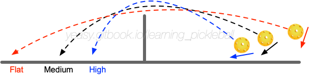

# 第 10 章 削球技术

削球是匹克球常见的过渡技术，兼具防守性和进攻性。

## 10.1 什么是削球

削球是指通过球拍摩擦球，使球产生向下的旋转（下旋），飞行到对方场地的技术。拍面以垂直地面为 0°，向上打开约 45°（与地面呈约 45° 角），从球的中下部向前摩擦，产生下旋。

削球按照轨迹高度和摩擦部位，大致可以分为如下三种：

* **高球（High Slice）**：主要摩擦球的下部，产生明显的下旋。造成球的飞行轨迹是较高的抛物线。高球旋转较强，飞行速度较慢，对方可以有更多回球时间。一般应当落入非截击区内，避免对方下压进攻；
* **中高球（Mid-High Slice）**：主要摩擦球的中下部，造成球的飞行轨迹是不太高的抛物线。中高球在比赛中使用较多，旋转和速度的平衡较好，兼具进攻性和防守性。一般应当落入非截击区内或空挡处；
* **平球（Flat/Punch Slice）**：主要摩擦球的中部，造成球的飞行轨迹是较平的抛物线。平球下旋较弱但速度较快，具备较强的进攻性。用于压制对方。

## 10.2 何时使用削球

当对方打过来的球带有较强的下旋，或者己方击球点较低时，可以使用削球。

相对抽球动作，削球动作较小，球路控制容易，并且球飞行速度较慢，可以给己方带来较多的回球时间。例如，专业运动员经常在第二、三拍回球中使用削球。

另外一种情况是对方网前回球较高时，己方以截击或抽球为主，配合使用削球来改变节奏和落点，造成对方失误。

削球的主要目的是为了过渡，放缓比赛节奏，调动对方，为下一拍找寻机会。

## 10.3 掌握削球

削球要用球拍尽量多包裹球，对球持续作用，使球产生较多的旋转。

削球时要提前移动到球前进方向，身体应处于放松状态。打开拍面（拍面与地面成约 45° 角），通过蹬地转腰用手臂发力，主动迎球摩擦球的中下部，将球送出。摩擦的方向是从球的中下部向前下方。

为了确保削球质量，注意保持从肩部到手腕的稳定。击球后球拍继续随球送出。整个过程中，发力要柔和顺畅，不要突然切球。动作幅度从肩膀带动，不要只用手腕。

掌握基本的削球动作后，还可以通过摩擦球的侧面打出带侧旋的削球。

## 10.4 应对削球

削球带有下旋，球飞行轨迹偏长，落地后向前力量较小，弹跳较低。应对削球的关键是根据来球高度做出正确判断：

* **来球高 → 上旋压制**：当削球落点较高时，主动向上发力，打出上旋球压制对方。增加球的下坠速度，造成对方被迫挑打；
* **来球低 → 削球相持**：当削球落点较低时，采用削球方式回球，相持中等待对方出现失误；
* **来球快 → 挡截重置**：当对方打出速度较快的削球时，可以用挡截击的方式吸收力量，重置回对方的非截击区。

防守削球的原则是要主动向上发力，避免回球下网。不要被下旋所迷惑而消极防守。

## 10.5 常见错误与纠正

| 错误 | 表现 | 纠正方法 |
|------|------|--------|
| 拍面角度不对 | 球无法产生有效的下旋，要么飞高要么下网 | 拍面向上打开约 45°，与地面成 45° 角，保持这个角度摩擦球 |
| 摩擦位置不对 | 击球位置过高则缺乏下旋，过低则容易下网 | 击球时接触球的中下部，位置要稳定一致 |
| 动作过大或突然 | 无法精细控制球的旋转和落点 | 削球动作要平缓、连贯，像"雨刮器"一样柔和摩擦，不要突然切球 |
| 只用手腕发力 | 控制力不足，球容易飞出界或缺乏旋转 | 用肩膀和躯干带动，从大肌肉群发力，小肌肉调整细节 |
| 回球过高 | 容易被对方截击或下压进攻 | 根据防守目的调整球的高度。防守时过网略高但过网即下坠，进攻时球更平更快 |

## 10.6 训练方法

削球对手感要求较高，可通过如下步骤进行练习。

**初级训练（第 1-2 周）**：

* 对墙削球：站在距墙约 2 米处，连续削球到墙上距地面 1 米左右的目标区域。目标是产生明显的下旋，从墙上反弹后球会向下走。每周 3 次，每次 3 组，每组 30 个。

**中级训练（第 3-4 周）**：

* 多球削球练习：陪练以不同速度和高度发球，学员削到指定区域（如非截击区前半区）。控制轨迹高度，使球能够稳定落点。每周 3 次，每次 4 组，每组 40 个。

**进阶训练（第 5 周+）**：

* 防守相持：模拟比赛中的防守场景。陪练打出各种球（吊球、抽球、削球），学员用削球防守，逐步形成相持。每周 2 次，每次 20-30 分钟。
* 应对削球：与陪练进行削球相持，学习在不同球高下的应对（上旋压制、削球相持、挡截重置）。每周 1 次，每次 15-20 分钟。
