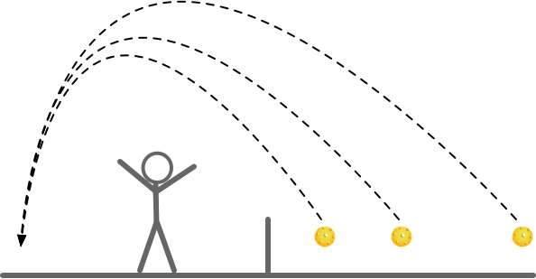
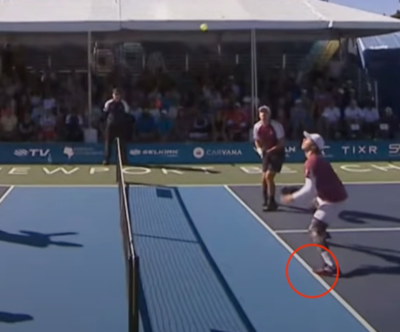

# 第 11 章 挑球技术

挑球（Lob）接近羽毛球的挑后场技术。该技术常被忽略，但应用得当可有效改变节奏、打开局面。

## 11.1 什么是挑球

挑球技术也叫挑后场技术，主要是指将球挑高且高弧线地击到对方后场的技术。与"吊球"不同，**挑球强调高弧线和距离**（迫使对手后退），**吊球强调低弧线和短距离**（保持对手在网前）。适当使用挑球技术可以调动对手跑位，改变比赛节奏，为进攻创造机会。

根据挑球位置，可以分为三类：

* **后场挑球**：从后场位置将球挑到对方后场，多用于过渡来调节比赛节奏。为避免挑球出界，可以加适当上旋；
* **中场挑球**：在中场位置将球挑到对方后场，具有较大的攻击性。例如当对方正快速跑到网前时，可以有效破坏对方的上网节奏；
* **近网挑球**：当对方在网前回球较高时，或当对方前场吊球回球质量不高时，前场挑球可以迫使对方退到后场。往往会产生较好的下一拍进攻机会。

## 11.2 何时使用挑球

当对方站位或注意力在前场时，并且起跳或后退步法不够好时，可以使用挑球技术来迫使对方回到后场击球。

挑球可以变被动为主动，也可以在前场吊球、抽球等环节使用，以主动创造进攻机会。

挑球后要及时移动到网前，准备待对方回球过高时进攻。

## 11.3 掌握挑球

挑球的核心要点在于要让球的飞行轨迹高于对方起跳后的位置，避免对方在半空截击。因此，挑球的抛物线高点应该在接近对方中场位置，使球在底线附近垂直下落，并且不出界。

**物理原理**：高弧线意味着球在下落过程中受重力加速影响，对手难以判断精确落点，为己方争取上网的时间窗口。

进行挑球时要注意：

* 网前挑球时，动作要尽量与前场吊球一致，避免对方预判截击。
* 控制球的飞行高度，刚好过对方头顶截击为佳。
* 控制球的落点，尽量接近底线附近。通常可以偏反手位，对方更难处理。
* 起跳侧身时，建议用同侧脚先蹬地快速移动，这样能更快到位；非持拍侧脚先向前跨可能造成身体失衡。

## 11.4 战术性挑球

近年来，战术性挑球在专业比赛中得到更多重视。挑球不仅是被动防守的手段，更是主动改变比赛节奏、创造进攻机会的战术武器。

### 进攻性挑球

进攻性挑球的目标不是简单地将球挑到后场，而是通过精准的落点和时机迫使对方陷入被动。

**特点**：
* **落点精准**：瞄准对方底线角落，尤其是反手位后场角落；
* **时机选择**：当对方重心靠前、准备截击时突然挑球；
* **配合上旋**：适当的上旋可以让球落地后继续向后跑，增加对方处理难度。

### 节奏变化挑球

在网前吊球相持中，双方可能都在寻找进攻机会。此时一个出其不意的挑球可以打破僵局：

* **打断对方进攻准备**：当对方准备加速进攻时，挑球可以让对方失去进攻机会；
* **争取喘息时间**：当己方处于被动或体力消耗较大时，挑球可以争取恢复时间；
* **变换比赛格局**：从网前相持转为后场对抗，适合体力和后场能力较强的球员。

### 战术性挑球的注意事项

* **不要过度使用**：挑球过多容易被对方预判，变成送分球；
* **注意隐蔽性**：挑球动作应与吊球动作尽量一致，避免被提前识破；
* **跟进上网**：挑球后要迅速向前移动到网前，准备拦截对方的回球。

## 11.5 应对挑球

当对方挑球时，应当首先快速判断是否能直接跳杀截击。如能截杀，应当快速跳起，利用手腕转动和手指抓紧的力量将球下压，目标可为对方脚下位置或空挡处。

如果不能，应当快速侧身，随球迅速跑向球落地位置的前方，等球落地弹起后击打球。回球应当以后场吊球为主，并且及时随球跑到网前。

侧身后退时要快速判断是否能直接跳杀截击。如能，果断起跳；不能则快速侧身跑向球落地位置。如下图所示。

## 11.6 常见错误与纠正

| 常见错误 | 原因 | 纠正方法 |
|---------|------|--------|
| 挑球落地出界 | 弧线过低或力度过大 | 增加击球高度，减轻力度，主要靠身体摆动而非手腕发力 |
| 挑球被对手截击 | 球过对手头顶高度不够 | 提高抛物线，让球飞过对手伸拍的高度（通常需要 7-10 英尺） |
| 挑球后无法上网 | 挑球后停滞或后撤 | 挑球完成后立即向前上网，准备拦截对手回球 |
| 挑球掉进 NVZ（非截击区） | 落点过短或动作不当 | 专注于距离控制，确保球落在底线附近 1-2 英尺处 |

## 11.7 训练方法

挑球和防守可以通过如下方法进行练习，分为三个难度等级：

**初级（新手）**：
* 多球练习（静止）：站在中场或近网位置，教练喂球，练习挑球轨迹和落点控制；
* 喂球练习：对方给出高于腰部的球，练习挑到对方底线。

**中级（有基础）**：
* 往返挑球练习：双方在后场互相挑球，体会节奏变化和位置调整；
* 挑球+上网练习：挑球后立即跑到网前，准备对手回球的截击或推球。

**进阶（高水平）**：
* 比赛场景练习：对方在网前吊球，己方在后场挑球并上网，进入网前相持；
* 时间紧约束：限制挑球后上网到位的时间（3 秒内），提高反应速度。
