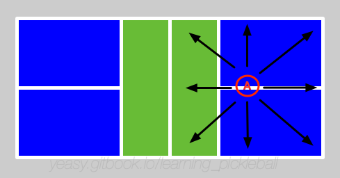

# 第 12 章 步法训练

步法是球类运动的灵魂。优秀的步法让球员始终在合适位置击球；反之，则在跑动中击球，易失误。

步法的目的，是给身体击球留出合适的时间和空间，从而能较舒适地击球。

## 12.1 常见步法类型

常见步法包括**跨步、交叉步、跳步、垫步**。

**跨步**（Split Step after momentum）：将一条腿沿运动方向用力跨出的动作，步幅较大。一般用于快速跑动中的最后一步，接近击球位置时使用，可以起到稳定重心、调整身体对位的作用。

**交叉步**（Shuffle / Crossover steps）：双腿快速交叉移动的动作，步幅较小、频率快。多用于短距离快速移动或微调身体位置，是最常用的步法。

**跳步**（Explosive leap）：通过跳跃快速移动的动作，速度最快、覆盖范围最大。一般用于需要在极短时间内击球的紧急情况（如截击对手的进攻球）。落地后要尽快稳定重心。

**垫步**（Adjustment hops / mini-steps）：小幅连续跳动，快速调整脚步距离、降低重心、准备击球。这是所有其他步法的基础，用于微调位置和身体状态。

单打比赛需要移动范围较大，可在跑动中结合交叉步、跨步动作。双打步法多为局部步法，可多采用交叉步、垫步，注意适当降低重心，以提高击球稳定性。

## 12.2 何时使用

双打中典型使用步法场景包括：

* 前场吊球时随球左右前后跑动；
* 后场吊球之后随球快速跑到网前；
* 对方挑球时快速后退跳杀，或跑到后场；
* 己方回球质量不高时，主动后退防守对方截击。

单打中典型使用步法场景包括：

* 有较好的进攻机会时，主动跑到网前准备进攻；
* 对方回球角度很大时，快速随球跑动准备回球；
* 对方挑球时快速后退跳杀，或跑到后场；
* 己方回球质量不高时，主动后退防守对方截击。

## 12.3 掌握步法

通常一个完整的步法可以分为四个关键阶段：启动、移动、制动和还原。

启动指运动员通过垫步来快速调整身体到准备状态，为移动做铺垫。移动指迅速将身体转移到最佳的击球位置。制动指将高速移动中的身体尽快减速，调整到相对静止的平衡状态以进行击球。还原指完成击球后，快速来到合适的场地位置，以准备下一拍击球。

首先要理解不同步法的特点和适宜的场景，做到自然反应。

其次，要想步法移动的快，必须学会控制和调整身体重心高度。**重心高度判断标准**：
* 移动距离在 1-2 步范围内时，保持适中重心，便于快速反应。
* 移动距离超过 3 步时，启动阶段保持较高重心（便于快速加速），移动过程中逐步降低重心。
* 到位后 0.5 秒内务必降低重心准备击球，保持膝盖弯曲（约 90 度），身体稳定。

最后，要加强腿部力量和躯干核心力量的训练。

## 12.4 常见错误与纠正

| 常见错误 | 原因 | 纠正方法 |
|---------|------|--------|
| 到位后重心仍很高 | 未能在击球前完成重心下降 | 启动后 0.5 秒内必须降低重心，膝盖弯曲至 90 度 |
| 移动时身体不稳定 | 重心高度调整不当或跨步过大 | 短距离（1-2 步）用小交叉步；长距离分段降低重心 |
| 频繁失去身体平衡 | 核心力量不足或落地脚步混乱 | 加强平板支撑和单腿平衡训练；落地时双脚开立肩宽 |
| 步法启动反应慢 | 未能快速反应对方击球时机 | 养成对方出手时立即启动的习惯；增加垫步频率 |

## 12.5 训练步法

步法训练主要包括两部分，一个是腿部和核心力量练习，一个是脚步灵活度练习，按难度分级：

**初级（基础力量）**：
* 支撑练习：平板支撑持续 1-2 分钟，3 组；
* 马步练习：靠墙蹲马步 3-5 分钟，每周 3 次；
* 跑步练习：前后左右方向慢跑，体会移动，每方向 30 秒。

**中级（综合训练）**：
* 下蹲跳起训练：每组 30 个，每天 3 组；
* 往返交叉步练习：左右来回交叉步跑动，每组 10 次，每天 3 组；
* 单腿平衡练习：单腿站立闭眼 30 秒，两条腿各 3 组。

**进阶（场景结合）**：
* 米字跑动练习：按米字依次跑动场地 8 个点，每组 10 次，每天 3 组；
* 接吊球后快速上网步法：在吊球场景中练习接球 → 侧身 → 上网 → 到位降重的完整步法序列；
* 变向步法：模拟对手压迫，快速反向移动（如被拉出位置后快速回中路）。

