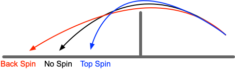
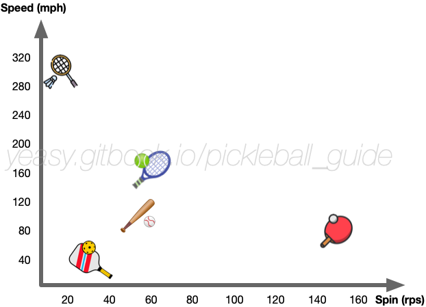

# 第 13 章 掌握旋转

旋转是球类运动的重要魅力之一。合理使用旋转可以更好地控制球的飞行轨迹和落点。

## 13.1 常见旋转类型

不同方向的旋转会造成球飞行轨迹的不同偏移。根据旋转方向，旋转可以大致分为如下种类：

* **上旋**：球向前快速滚动，造成飞行轨迹急坠，落点比非旋转球要近，球落地后旋转加速，向前窜出；
* **下旋**：球向后快速滚动，造成飞行轨迹较平，球落点比非旋转球要远，球落地后向前移动较慢甚至后退；
* **侧旋**：主要包括左侧旋或右侧旋，球会向旋转方向发生偏移。

## 13.2 何时使用旋转

旋转的主要目的是控制回球轨迹和落点，可在如下场景中考虑使用旋转：

* 发球：通过添加旋转造成接球方对球飞行轨迹产生误判；
* 吊球：通过不同旋转造成对方击球位置不佳，回球过高或下网；
* 抽球或回后场球：通过上旋避免球路过长或出界；
* 截击：通过旋转造成对方预判位置失误；
* 绕网柱回球（ATP）：通过侧旋使得从场外侧的击球，落到对方场内。

注意添加旋转打出的球，由于部分能量变成转动，而不是飞行速度，会造成球速偏慢。同时挥拍时间更多。因此，当希望打出很快速度的球或快速回击时，尽量少加旋转。

## 13.3 理解旋转

### 旋转产生原理

匹克球的旋转并非单纯靠拍面摩擦球产生，而是通过球拍击打球的不同位置，同时转动拍面包裹球产生。因此，在使用旋转时，要以击打为主，配合对球的包裹推动，要做到**“先打后磨”**。

**上旋产生**：击打球的中下部（赤道偏下），向上摩擦，使球向前快速滚动。
**下旋产生**：击打球的中上部（赤道偏上），向下摩擦，使球向后快速滚动。
**侧旋产生**：击打球的侧面（左侧或右侧），向同侧摩擦，使球向旋转方向发生偏移。

一般来说，**表面粗糙的球拍会增加对球的摩擦**，有助于制造旋转。详见[附录六《装备选购指南》](appendix_equipment.md)中关于原始碳纤维（Raw Carbon）拍面的讨论。

### 旋转数据与影响

匹克球的旋转通常在 15-30 转/秒之间（网球可超 50 转/秒，乒乓球可超 100 转/秒）。随着原始碳纤维（Raw Carbon）表面球拍的普及，职业选手使用粗糙表面球拍可以打出更强的旋转，部分顶尖选手的上旋球可达 30 转/秒以上。球飞行速度相对较慢，旋转对飞行轨迹影响有限，但会显著改变球触地后的运动方向（加速、减速或侧偏）。下图比较了常见球类的最快旋转和飞行速度。

## 13.4 如何应对旋转

要接好旋转球，首先要理解不同旋转对球飞行轨迹和落地后行为的影响。球员要对应地主动移动到位，做到充分击打。

### 按旋转类型的应对策略

**应对上旋球**：
* 上旋球飞行轨迹急坠，落点比预期要近——提前一步移动到位。
* 拍面略微压低（向下倾斜 5-10 度）以对抗向前窜出的力量。
* 可以主动借对方上旋的力量轻轻点击，不需要大幅挥拍。

**应对下旋球**：
* 下旋球飞行轨迹较平，落点比预期要远——后退一步以确保击球距离。
* 拍面打开（向上倾斜 10-15 度）向上托，避免球下网。
* 向上摩擦幅度要比回非下旋球时更充分，充分利用拍面的"托"动作。

**应对侧旋球**：
* 侧旋球向旋转方向偏移——调整站位迎着旋转方向，站位偏向球将要飞向的反方向。
* 例如对手打出向右侧旋的球，己方应向左前方移动，用拍面朝右的方式迎击，抵消侧旋的偏转。

### 通用应对原则

最简单的原则就是**与制造旋转方采用同样的方式击球**：击打球的同一部位，方向相反（中和旋转）。或者，**加快击打速度**，减少球和拍面的接触时间，减弱旋转的影响。

## 13.5 常见错误与纠正

| 常见错误 | 原因 | 纠正方法 |
|---------|------|--------|
| 接上旋球总是下网 | 拍面打开过度，未压低拍面 | 主动压低拍面 5-10 度，向下倾斜；站位靠前一步 |
| 接下旋球球飞出界 | 拍面过竖或击球位置过高 | 拍面打开向上托（10-15 度），向上摩擦充分 |
| 无法控制侧旋球方向 | 站位不当，被动迎击 | 提前识别侧旋方向，向反方向调整站位迎击 |
| 旋转球难以控制落点 | 击球节奏与旋转配合不当 | 减速击球或加速击球，找到稳定的节奏配合 |

## 13.6 训练方法

训练对旋转的理解和应对可以通过如下几种方法，注意体会柔和击打球不同位置后造成的旋转不同：

**初级（基础认知）**：
* 颠球制造旋转：体会不同方向削球（向上、向下、向左、向右）时制造的旋转感受；
* 单点颠球观察：连续制造上旋颠球 20 个，观察球是否向前跳动（上旋特征）；制造下旋颠球 20 个，观察球是否向后回缩。

**中级（实战应用）**：
* 发球制造旋转：击球不同位置（中下部、中上部、侧面），发出不同旋转球，观察落地后的轨迹变化；
* 回球制造旋转：在吊球中击打球的不同位置，体会每种击球位置产生的旋转和球路效果。

**进阶（对抗训练）**：
* 多球应对训练：一方发特定旋转球（上/下/侧旋各 5 个），另一方击打到指定位置（例如对方底线），记录成功率；
* 比赛场景：对手在网前或后场打出旋转球，己方判断旋转类型并做出相应拍面角度调整和步法反应。
