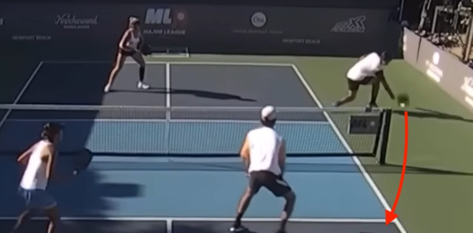
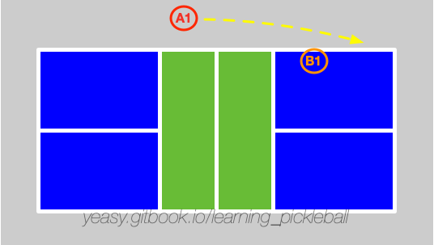

# 第 14 章 绕网柱回球

## 14.1 什么是绕网柱回球

绕网柱回球（Around The Post，ATP）是专业比赛中的常见技巧，指得是从场地侧边之外击球，绕过网柱回球到对方场地内。

## 14.2 何时使用与风险评估

当对方球员打出角度很大的网前球时，己方很难回击出高质量的网前球。此时，可以考虑将球绕过网柱，打到对方场内。

**ATP 的风险-收益分析**：
* **成功率**：相对较低，即使职业选手也难以保证高成功率。仅在领先的局分中使用为佳；
* **得分效果**：一旦成功，往往能直接得分或造成对手巨大压力，视觉冲击力强；
* **建议使用场景**：领先的局分（如 6-4）或关键分前的得分积累，而非追分时期。

如下图所示，球员打出绕网柱进攻球。

## 14.3 击球要点

绕网柱回球的关键是移动到位，并且掌握击球的最佳时机。

打出较高质量的绕网柱进攻球的要点包括：

* 击球时一定要在场地外侧，越靠外，可回球的角度范围越大，越容易打到场内；
* **击球时机要晚**，要等球快落地时再回击，避免在高点击球。这与常规击球不同。原因是：低击球点使球的飞行轨迹更平（而非上升），过网后球速快、对手反应时间短、难以有力反击。
* 击球目标应以对方后场为主要目标，这样可以尽量绕开对方身体，避免对方防守；
* 击球完成后，要尽快回到场地内。

## 14.4 防守方法与预防策略

当对方打出绕网柱回球时，其站位通常位于场地外侧，击球目标为同侧场地边缘部分。此时，己方要尽快调整站位准备防守。

**防守要点**：
* 面向对方球员站位，准确判断其击球意图；
* 跟随对方击球节奏，等对方击球瞬间最大程度拦截对方击球角度；
* 尽量截击拦截，根据来球高度调整拍面。特别当对方来球较低时，主动迎前以削球方式拦截，但过网不要过高；
* 回击球的落点首选对方球员跑到场外后造成的空挡处，尽量回击到后场。如观察发现其队友有补位意图，可以考虑打到补位后的空挡处。

**预防性策略**（重于被动防守）**：
* **打球落点时不给对方打大角度的机会**：网前吊球应打向场地中路或靠近对方的一侧，避免留出可被 ATP 利用的空档；
* **降低过网高度**：吊球尽量贴网过，让对方即使完成 ATP 也只能打出质量较低的球。

## 14.5 常见错误与纠正

| 常见错误 | 原因 | 纠正方法 |
|---------|------|--------|
| ATP 击球常出界 | 击球点过高或力度过大 | 等球快落地时再击（低击球点），降低力度，专注轨迹控制 |
| ATP 过网后被对手轻易拦截 | 击球轨迹过高 | 确保击球点低（离地 6 英寸以下），球飞行轨迹平且快 |
| 防守 ATP 时反应不及时 | 未能提前识别对手意图或站位不当 | 观察对手在场外的位置和姿态，提前向边线靠近准备 |
| 预防不力导致被 ATP 得分 | 没网球落点选择不当，留出大角度 | 吊球打向中路或对手一侧，降低过网高度，避免大空档 |

## 14.6 训练方法

训练绕网柱回球和防守可分为三个难度等级：

**初级（基础练习）**：
* 定点 ATP 练习：球员站在场外固定位置，教练喂球，练习击球点控制和轨迹（落点设定在后场）；
* 静态防守练习：防守方站在网前，ATP 方无对手干扰，练习防守位置调整。

**中级（动态对抗）**：
* 多球往返：ATP 方站在场外，防守方在网前，教练给出高质量的网前球，ATP 方尝试 ATP，防守方防守；
* 角度变化：改变教练喂球的角度和高度，让 ATP 方适应不同场景。

**进阶（比赛模拟）**：
* 全场对抗：双方打到形成 ATP 机会的场景（对方打出大角度网前球），ATP 方执行 ATP，防守方防守，记录成功率；
* 预防性训练：发球方有意制造场景（如吊球位置不当），让防守方学会通过预防而非被动防守来控制局面。
