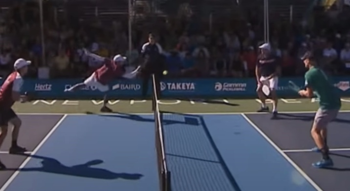
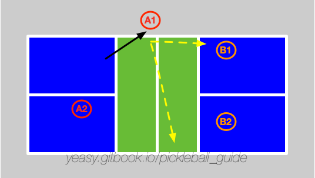

# 第 15 章 跨非截击区击球

## 15.1 什么是跨非截击区击球

按照规则，球员在截击前后或截击时，均不能触碰非截击区。但是球员可以从非截击区上空跨过同时打出截击球。这种跨越非截击区的截击球叫“厄尼”（Erne），在专业比赛中屡见不鲜。

## 15.2 何时使用

对方球员回网前球，如果球过网较高且靠近边线。此时，可以考虑进行跨非截击区拦截，快速打到对方场内。

如下图所示，球员使用跨非截击区击球，进攻对方的网前吊球。

## 15.3 击球要点

跨非截击区击球的节奏一定要突然，这样才能给对方造成较大威胁。

打出较高质量的跨非截击区击球的要点包括：

* 准确判断对方网前球的位置，靠近边线且较高时再尝试截击；
* 站位要适当靠近场地边线。越靠近越容易从非截击区上空跳过；
* 跳到球场左侧时应当右脚先落地。跳到球场右侧时应当左脚先落地；
* 击球目标首选直线打到对面球员脚下，其次可以打出大角度斜线球；
* 截击完成后，球员要尽快回到场地内；
* 己方球员击球时，队友应当往中间移动，补充截击队员留出的空挡或进攻对方的防守球。

## 15.4 防守方法

Erne 进攻速度快、角度刁钻，防守难度较高。有效防守需要提前预判和正确反应。

**识别对方 Erne 意图：**

* 观察对方是否在网前悄悄向边线靠近——这是 Erne 的前置信号；
* 对方身体重心明显偏向侧面，或已开始侧向移动时，要立刻准备防守。

**防守策略：**

* **改变吊球落点**：当发现对方准备 Erne 时，立刻将吊球打向场地中路或远离对方的一侧，破坏其起跳时机；
* **降低过网高度**：吊球尽量贴网过，让对方即使完成 Erne 也只能向上挑球，难以形成进攻；
* **截击防守**：面对 Erne 进攻球，用挡球（block volley）吸收对方力量，控制回球到对方后场或空档位置；
* **挑高球到后场**：如果对方已离开正常站位跑到场外，将球挑到其身后的后场空挡是最安全的选择；
* **打向对方身体**：如果对方正在跳跃中，直接打向其身体（尤其是持拍手肩部），让其难以调整拍面。

**Erne 与 ATP 的防守差异：**

Erne 是从侧面跳过非截击区截击，进攻方通常在网前；ATP 是从场外绕过网柱回球，进攻方通常在场地边缘。对 Erne 的防守重点在于"不给高球"和"提前改变吊球落点"；对 ATP 的防守则侧重于"快速移动到位补防空档"。

## 15.5 训练方法

* 多球练习：一方球员站在非截击区内，重复给出截击球。另一球员练习防守；
* 交互练习：双方模拟比赛场景，练习跨非截击区击球和防守。
