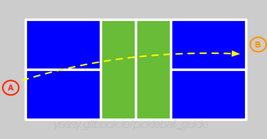
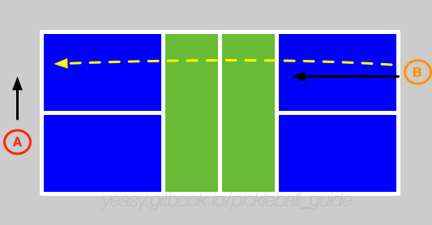
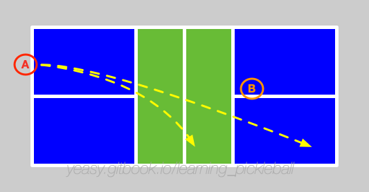

# 第 17 章 单打策略

单打是匹克球运动中对综合能力要求最高的项目，不光考察球员的移动能力和击球技巧，更重要的是看心理素质和对比赛节奏的把握能力。

## 单打与双打的本质区别

* **全场覆盖责任**：单打球员需要防守整个 20×44 英尺的场地，而双打每人仅需覆盖半个场地，导致单打的移动距离和频率大幅增加；
* **体能消耗量**：单打需要频繁的长距离移动和快速变向，体能消耗远高于双打；
* **网前进攻策略差异**：双打中网前是主阵地，但单打中不必急于上网，更多依赖后场击球和位置调动（详见 16.2 节）。

## 17.1 基本过程

假设两名球员分别为 A、B。A 先发球。

A 将球发给 B，B 要尽量将球回给 A 底线位置，并且尽量落入 A 的空当位置。

同时，B 试图跟随来到网前截击。

A 接球后，通过抽球或吊球让 B 跑动。

假设 B 网前拦截回球，将球推到 A 后场或调动 A 的网前。

此时，A、B 进入相互调动位置环节。若有一方出现空当，或回球质量不高，则会受到对方攻击，进入攻守相持阶段。与双打不同，在后场时，单打球员往往不必采用吊球技术回到网前，而是可以灵活结合抽球或挑球来调动对手。

单打中，由于球员要防守全场区域，一般要通过调动对方位置来找到进攻机会，或者尝试压制对方到后场。

一旦有一方被压制到后场，则处于劣势地位。此时若回球过高，则容易被对方杀球得分。

## 17.2 要点总结

单打比赛的关键是控制节奏，因此要尽量让对方多跑动，己方则尽量保持稳定站位。另外，有机会时应当尽快上网，同时限制对方在后场。

* 网前防守：接发球后一定要尽快上网，拦截对方的击球。注意防守两边的大角度球；
* 控制落点：单打中使用抽球较多，需要精确控制抽球的落点，一定要过网前对方的拦截区，否则很容易陷入被动；
* 使用角度：进攻要多打出角度，例如反手位，同时调动对方跑动，注意避免回球过长出界。

## 17.3 发球策略

单打发球比双打更具战术意义，可以直接影响第三拍的主动权。

### 发球模式变化

* **深发球**：发到底线附近，迫使对方在后场接球，己方有更好的上网时机；
* **短发球**：偶尔发到发球区前半段，打破对方节奏，但风险较高；
* **侧旋变化**：结合左侧旋和右侧旋，让对方难以判断球的落点。

### 发球落点选择

* **反手位深角**：大部分球员的反手是弱点，深角发球最为有效；
* **正手位急球**：偶尔发快速的正手位球，测试对方反应；
* **中路发球**：让对方站位尴尬，难以打出大角度接发球。

## 17.4 第三拍决策（多维度框架）

单打第三拍是最关键的转折点，决策需要同时考虑球的**高度、深度、速度**三个维度。

### 第三拍决策框架

| 来球高度 | 来球深度 | 来球速度 | 建议第三拍 | 原因 |
|---------|---------|---------|-----------|------|
| 高于腰部 | 短球（中场内） | 快速 | 抽球进攻 | 对方给出明确进攻机会，应直接得分 |
| 高于腰部 | 中等深度 | 中等 | 后场吊球 | 安全过渡，准备上网或继续调动 |
| 腰部及以下 | 任何深度 | 任何速度 | 挑球或平抽 | 给自己争取上网时间或位置调整 |
| 高于头顶 | 深（底线） | 快速 | 后退挑球 | 避免被压制，争取反手进攻机会 |
| 任何高度 | 大角度 | 任何速度 | 回中路 | 限制对方击球角度，缩小防守范围 |

### 技术在单打中的应用指南

* **后场吊球**（Drop）：用于稳定的过渡，球应落在网前 1-2 英尺处，迫使对手来网前；
* **后场抽球**（Groundstroke）：用于进攻机会，力度大、轨迹平，目标是对手脚下或底线角落；
* **挑球**（Lob）：用于被压制时争取喘息或防守对手网前进攻，确保高弧线和深落点。

## 17.5 体能管理

单打比赛对体能要求极高，合理的体能分配是取胜关键。

* **前半局**：保持稳定节奏，不要过早消耗体能；
* **关键分**：集中精力，可以适当提高强度；
* **被动时**：使用挑球争取喘息时间；
* **主动时**：连续压迫，但注意不要因急躁而失误。

**观察对手疲劳迹象**：
* 移动速度变慢（步幅减小、反应延迟）；
* 击球质量下降（回球变高、落点变长）；
* 呼吸和节奏紊乱（可通过观察肩膀起伏判断）。
* 一旦发现这些迹象，应立即加强进攻强度和位置调动，乘胜追击。

## 17.6 心理博弈

单打比赛是一对一的心理对决：

* **隐藏意图**：保持击球动作一致性，让对方难以预判；
* **读取对手**：观察对方的站位和身体重心，预判下一拍；
* **控制节奏**：当占优势时保持压力，当被动时放慢节奏；
* **利用暂停**：在关键时刻使用暂停，调整状态和策略。
