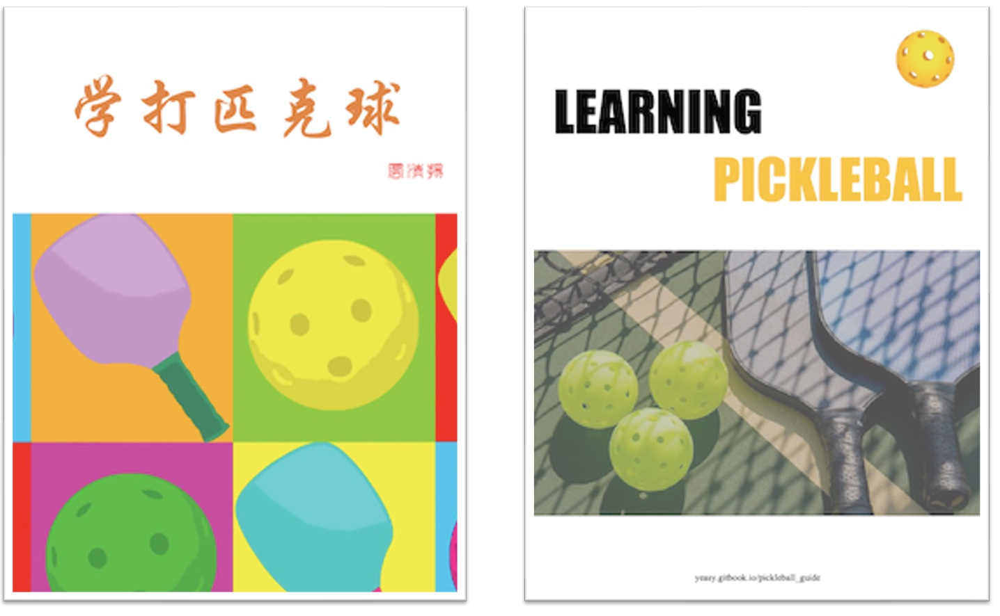

[English Version](https://github.com/yeasy/learning_pickleball/blob/main/en/README.md)

# 学打匹克球

[](https://github.com/yeasy/learning_pickleball)
[](https://github.com/yeasy/learning_pickleball/releases)
[](../LICENSE)

<p align="center">
  
</p>

## 简介

**匹克球** 是一项风靡全球的新兴运动，融合了网球、羽毛球和乒乓球的特点。它上手容易、运动量适中且趣味性强。本书结合北美教学实践，系统讲解匹克球技术，帮助读者科学训练，避免伤痛，享受运动乐趣。

> 本书提供 [PDF](https://github.com/yeasy/learning_pickleball/releases/latest) 下载。

## 阅读方式

### 在线阅读

*   [**GitBook (推荐)**](https://yeasy.gitbook.io/learning_pickleball/)
*   [GitHub](https://github.com/yeasy/learning_pickleball/blob/main/cn/SUMMARY.md)

## 下载离线版本

本书提供 PDF 版本供离线阅读，可前往 [GitHub Releases](https://github.com/yeasy/learning_pickleball/releases/latest) 页面下载最新版本。

如需获取默认分支自动更新的预览版，可直接下载 [learning_pickleball-cn.pdf](https://github.com/yeasy/learning_pickleball/releases/download/preview-pdf/learning_pickleball-cn.pdf)。该文件会随主线更新覆盖，不代表正式发布版本。

### 本地阅读

使用 [mdPress](https://github.com/yeasy/mdpress) 进行本地构建：

```bash
brew tap yeasy/tap && brew install mdpress
mdpress serve cn/
```

随后访问: http://localhost:4000。

## 内容概览

本书内容涵盖系统的匹克球训练体系：

*   **基础技术**: 握拍、发球、网前吊球 (Dink)、后场吊球 (Drop)、抽球 (Drive)、截击 (Volley)、挑球 (Lob)。
*   **进阶技术**: 旋转球、网前攻防、ATP、Erne。
*   **比赛策略**: 单打与双打策略。
*   **资源合集**: [要点总结](19_key_tips.md) & [常见问题](20_faq.md).

*注：具体比赛规则请参考 [官方手册](https://usapickleball.org/what-is-pickleball/official-rules/)。*

## 授权与版权

本书已授权 [全球多家俱乐部和学校](https://github.com/yeasy/learning_pickleball/wiki/) 用于公益培训。
**未经授权，禁止用于商业用途。**

## 参与贡献

欢迎提交 PR 修复错误或完善内容！
