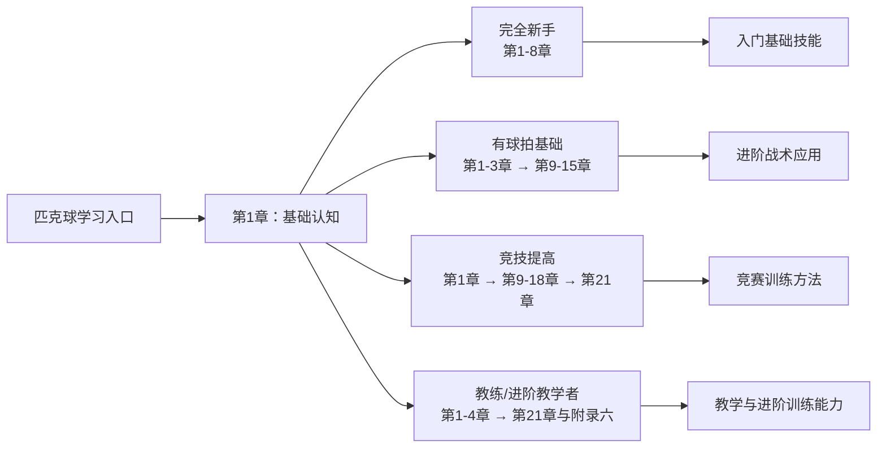

[English Version](https://github.com/yeasy/learning_pickleball/blob/main/en/README.md)

# 学打匹克球

  

## 简介

**匹克球** 是一项风靡全球的新兴运动，融合了网球、羽毛球和乒乓球的特点。它上手容易、运动量适中且趣味性强。本书结合北美教学实践，系统讲解匹克球技术，帮助读者科学训练，降低伤痛风险，享受运动乐趣。

## 内容概览

本书内容涵盖系统的匹克球训练体系：

*   **基础技术**: 握拍、发球、网前吊球 (Dink)、后场吊球 (Drop)、抽球 (Drive)、截击 (Volley)、挑球 (Lob)。
*   **进阶技术**: 旋转球、网前攻防、ATP、Erne。
*   **比赛策略**: 单打与双打策略。
*   **资源合集**: [要点总结](19_key_tips.md)、[常见问题](20_faq.md)。

## 五分钟快速上手

跟随以下步骤快速掌握基础：

1. **什么是匹克球**（第1章）：了解匹克球的来源、特点和与其他球拍运动的区别。
2. **热身与持拍发力**（第3-4章）：先完成身体准备和基础发力训练。
3. **首次发球**（第5章）：学习发球与接发球的基本要求和常见错误。
4. **基础击球**（第6-9章）：练习 Dink、Drop、Drive 和 Volley，建立稳定球感。
5. **开始实战**（第17-18章）：带着单打和双打策略上场，边打边查阅第19-20章要点与 FAQ。

## 学习路线图

| 读者角色 | 学习重点 | 核心成果 |
|---------|---------|---------|
| **完全新手** | 第1-8章 | 掌握匹克球基础技能与规则 |
| **有球拍基础** | 第1-3章 → 第9-15章 | 快速迁移经验、学习进阶战术 |
| **竞技提高** | 第1章 → 第9-18章 → 第21章 | 系统训练与比赛策略 |
| **教练/进阶教学者** | 第1-4章 → 第21章与附录六 | 教学设计、运动科学与装备决策支持 |

## 阅读方式

*   🌐 在线阅读：[GitBook](https://yeasy.gitbook.io/learning_pickleball/)、[中匹在线](https://bbs.pickleballcn.com/tools/learning-pickleball.html)
*   📄 离线下载：[PDF](https://github.com/yeasy/learning_pickleball/releases/latest)

## 授权与版权

本书已授权 [全球多家俱乐部和学校](https://github.com/yeasy/learning_pickleball/wiki/) 用于公益培训。
**未经授权，禁止用于商业用途。**
