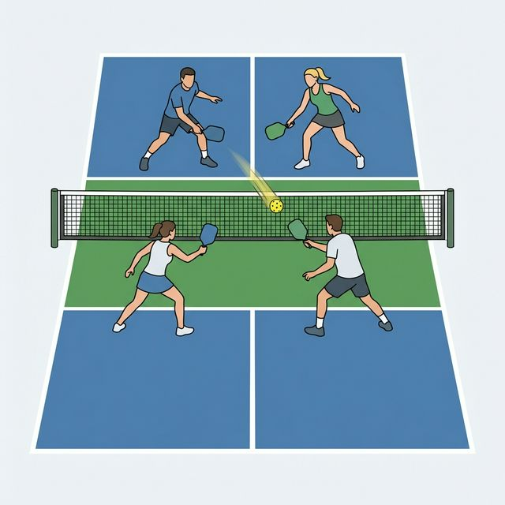

# Chapter 14 Net Battle: Attack and Defense

Attack and defense in front of the net are often used in doubles games. It is the key for the game result. The rhythm is very fast and has high requirement on players' reaction.

## 14.1 How to Attack

Near-net attack means that during the Dink process between players, one player actively hits the ball at a high speed to attack the opponent. Near-net attacks usually use volleys.

The first thing to do is to choose the right time to attack. Players on both sides will usually use the Dink when staying near the net. When the opponent hits a Dink ball with high defensive quality, due to the low flight trajectory and short landing point of the ball, the attack in this situation often causes the ball to pass the net at a slow speed and fly upwards, making it easy to be blocked by the opponent. When the opponent's incoming ball has a high or a long flight trajectory, it is more possible to get the score by attacking.

In addition, pay attention to observe the opponent's position and intention. When the opponent is in a stable position near the net and ready to block the attack ball, it's more possible that the attack will be defended; on the contrary, if the opponent is in an unstable movement, or far away from the net, it will be difficult to defend your attack.

When attacking, pay attention to the following points:

* The offensive action should be concealed, so that the opponent cannot judge the intention in advance;
* Mainly exert force through the wrist and fingers, to hit quickly and rub the ball at the same time;
* Keep the ball's flight trajectory not high, e.g., just passing the net. It is easy to be defended if it is too high;
* The attack target is mainly between the two players, and you can also try the backhand position or the shoulder of the paddle side.

## 14.2 How to Defense

Due to the short flight distance of the attacking ball in front of the net, players often need to make decisions and correct responses in a very short time (usually less than 0.2 seconds).

First, it is necessary to keep ready for defense at any time, and the rhythm of body movement should follow the rhythm of hitting by the opponent. When the ball is flying in the air, your body can move with the ball; when the opponent hits the ball, your body should remain relatively still, to get ready to defend or counterattack.

In addition, pay attention to the protection of the neutral position, including the position between two players, the backhand position, the paddle side shoulder, etc. These are the main attack targets by the opponent.

The key tips of defending include:

* Quickly judge the out-of-bounds ball and avoid the out-of-bounds offensive ball in time;
* The paddle should hit the ball in front of the body, keeping the body facing the incoming ball;
* Defensive action should be stable, grasp the paddle at the moment of hitting the ball;
* Unless the defensive opportunity is good and you can counterattack with strength, otherwise rely mainly on the ball's incoming strength;
* Make sure the ball flight trajectory is low, try to reset the ball to the front of the net;
* The return is mainly to the position between the two players to avoid going out of bounds.

## 14.3 Firefight （Hand Battle）

When both sides engage in rapid volley exchanges at the net, it creates a high-speed "Firefight," also called Hand Battle. This has become increasingly common in modern professional matches.

### When Firefight Occurs

* When opponent speeds up and you choose to counter rather than reset;
* When both sides are looking for attack opportunities and refuse to back down;
* During critical points when both want to resolve through offense.

### Key Techniques in Firefight

* **Minimize Motion**: Smaller movements mean faster reactions;
* **Track the Ball**: Keep eyes following the ball's movement;
* **Maintain Paddle Stability**: In high-speed exchanges, stability is crucial;
* **Know When to Reset**: When in disadvantageous position, decisively reset to exit the battle.

### When to Exit Firefight

* After two or more consecutive defensive shots;
* When you feel you can't keep up with opponent's rhythm;
* When opponent's shot quality remains consistently high.

At this point, use a soft reset shot to place the ball gently into opponent's NVZ and return to the dinking phase.

## 14.4 Backhand Attack Techniques: Poke, Roll, Flick

While "attack with forehand, defend with backhand" is the general principle at the net, intermediate and advanced players should also master backhand offensive techniques to add variety and surprise to their attacks.

### Poke

A quick, compact backhand "push" with minimal swing. Almost no backswing.

* **Technique**: Lock the wrist and use a small forward push from the forearm and fingers to send the ball quickly
* **When to use**: When opponent's dink is slightly high (above net tape) and close
* **Target**: Opponent's feet or the gap between partners—prioritize speed over power
* **Advantage**: Extremely concealed and fast, very hard to react to

### Roll

A backhand shot using an upward wrist roll to create topspin, causing the ball to dip quickly after crossing the net.

* **Technique**: Start with paddle face slightly closed (angled down), roll the wrist upward to generate topspin. The swing path follows an upward arc
* **When to use**: When the ball is around net-tape height with enough time to execute
* **Target**: Opponent's body or feet—topspin causes rapid descent after clearing the net
* **Advantage**: Topspin makes the ball difficult to volley cleanly, good placement control

### Flick

A quick wrist "snap" that suddenly accelerates the ball, similar to a whip action.

* **Technique**: Keep the arm relatively still; use rapid wrist rotation and finger squeeze for instant paddle acceleration
* **When to use**: When changing pace from dinking to attacking
* **Target**: Opponent's backhand side or the middle gap
* **Advantage**: Strong burst of speed, dramatic pace change—the most common speed-up from a dink rally

### Choosing Between the Three

| Technique | Ball Height | Swing Size | Ball Speed | Spin | Concealment |
|-----------|------------|------------|------------|------|-------------|
| Poke | Slightly above tape | Minimal | Med-Fast | None/Low | Highest |
| Roll | Near tape | Medium | Medium | Heavy topspin | Medium |
| Flick | Any | Small | Fastest | Medium | High |

## 14.5 Common Mistakes and Corrections

| Common Mistake | Cause | Correction |
|---|---|---|
| Attack flies out | Paddle face is too upright or force is excessive | Keep the paddle face level or slightly down and drive the ball just over the net |
| Attack gets blocked easily | Contact is too high or the target is obvious | Prioritize the middle gap and backhand side with better disguise |
| Defensive reaction is late | Position is too far back or balance is too high | Stay close to the NVZ line with weight ready on the front of the feet |
| Too many mistakes in firefights | Rally control is lost and pace stays too high | Reset earlier and keep the reply below net height |

## 14.6 Training Methods

Training can be done as follows:

* Multi-ball attack practice: one player repeatedly gives the ball in front of the net at a fixed position, and the other player attacks;
* Multi-ball defensive practice: one player repeatedly gives a faster flat shot, simulating an attacking ball in front of the net, and the other player defends;
* Interactive practice: Both players Dink in front of the net, one player tries to attack, and the other player tries to defend.
**Fast Hands Specific Training:**

Fast hands are the core skill for net battles. Here are specialized drills:

* **Timed rapid volley**: Two players engage in continuous net volleys for 60 seconds, counting successful rallies. Weekly goal: increase the count.
* **Reaction drill**: One player randomly sends fast balls to the other's left and right sides. The receiver volleys back to a designated area. 30 seconds per set, 15 seconds rest, 6-8 sets.
* **Wall drill**: Practice continuous rapid volleys against a wall from 2-3 meters away. Target: 50 consecutive hits without error.
* **Escalating Firefight**: Start with slow dinks, then both players increase speed by one level every 5 shots until one player can't maintain—trains hand stability at varying speeds.
