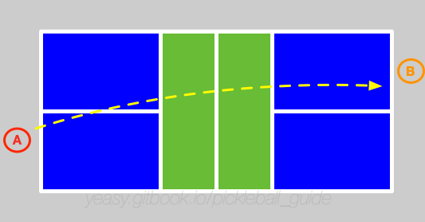
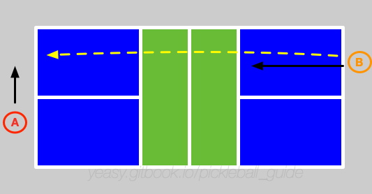
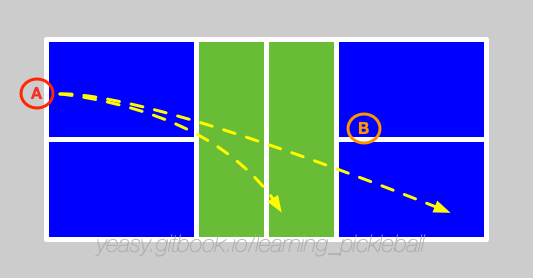

# Chapter 17 Singles Game Strategies

> **Recommended Level**: 5.5+ · The decisive differentiator at advanced levels — overall strategy and mentality

The singles game of pickleball requires the highest comprehensive ability.

It not only requires the player's running ability and hitting skills, but also demands the psychological quality and the ability to control the rhythm of the game.

> **Related technique chapters**: [Serve](05_serve.md), [Dink](06_dink.md), [Drop](07_drop.md), [Drive](08_drive.md), [Volley](09_volley.md), [Lob](11_lob.md), [Footwork](12_footwork.md)

## How Singles Fundamentally Differs from Doubles

* **Full-court coverage**: A singles player defends the entire 20×44 ft court, while each doubles player only covers half of it, which sharply increases both the distance and the frequency of movement in singles;
* **Physical cost**: Singles demands frequent long-distance movement and rapid direction changes, so it is far more taxing than doubles;
* **Net-attack strategy**: In doubles the net is the primary battleground, but in singles there is no rush to approach — you rely more on backcourt shots and on moving your opponent around.

## 17.1 Basic Process

Suppose the two players are A and B. A is serving first.

A serves the ball to B, and B tries to return the ball to near A's baseline position, and try to let it land far from A's prepared position.

At the same time, B tried to follow the ball to go to the net to prepare volleying the ball.

A tries to let B run by driving the ball or dropping the ball.

Suppose B successfully blocks the ball in front of the net, pushes the ball to A's backcourt or mobilizes A's angle near the net.

At this moment, A and B enter the mutual position mobilizing phase. If one player has a gap, or the return quality is not good, it will be attacked and enter the stage of offense and defense. Unlike doubles, players in the backcourt often do not have to use the drop technique to return to the net, but can flexibly choose driving, dropping, or lobbing to force the opponent to run.

In singles, the player needs to cover the whole court, it is generally necessary to find offensive opportunities by mobilizing the opponent's position, or to suppress the opponent to the backcourt.

Once the player is suppressed to the backcourt, it is at a big disadvantage. At this situation, if the player returns the ball too high, the opponent can volley the ball to earn the score.

## 17.2 Key Points

The key to a singles match is to control the rhythm, so try to let the opponent move as much as possible, while you try to maintain a stable position. In addition, you should go to the net as quickly as possible when you have the opportunity, while pushing the opponent to stay at the backcourt.

* Defense at the net: After receiving the serve, you must go to the net as soon as possible to block the opponent's 3rd shot. Pay attention to defending wide-angle placement on both sides;
* Control the placement: It’s very important to accurately control the placement of the ball. Any drive must pass the opponent's interception area in front of the net, otherwise it is easy to be blocked;
* Use angles: Use more angles when attacking, such as the backhand position. At the same time, mobilize the opponent to run first, and be careful to avoid returning the ball too long and going out of bounds.

## 17.3 Serving Strategies

Singles serving carries more tactical significance than doubles, directly affecting third shot advantage.

### Serve Pattern Variations

* **Deep Serve**: Serve near the baseline, forcing opponent to receive from backcourt, giving you better approach timing;
* **Short Serve**: Occasionally serve to front half of service area to disrupt rhythm, but higher risk;
* **Spin Variations**: Combine left and right sidespin to make landing point unpredictable.

### Serve Placement Selection

* **Deep Backhand Corner**: Most players' backhand is weaker, deep corner serves are most effective;
* **Fast Forehand**: Occasionally serve fast to forehand side to test opponent's reaction;
* **Center Serve**: Makes opponent's positioning awkward, difficult to hit wide-angle returns.

## 17.4 Third Shot Decision (Multi-Dimensional Framework)

The third shot in singles is the most critical turning point. The decision has to account for three dimensions of the incoming ball at once: **height, depth, and speed**.

### Third Shot Decision Framework

| Incoming Height | Incoming Depth | Incoming Speed | Suggested Third Shot | Reason |
|---------|---------|---------|-----------|------|
| Above the waist | Short (inside mid-court) | Fast | Drive attack | The opponent has handed you a clear attacking chance; go for the point |
| Above the waist | Medium depth | Medium | Drop shot | A safe transition, setting up your approach or continued maneuvering |
| At or below the waist | Any depth | Any speed | Lob or flat drive | Buys you time to approach the net or reset your position |
| Above head height | Deep (baseline) | Fast | Retreat and lob | Avoids being pinned down and creates a backhand attacking chance |
| Any height | Wide angle | Any speed | Return to the center | Limits the opponent's angles and shrinks the court you must defend |

### Applying Each Technique in Singles

* **Drop**: For a stable transition — the ball should land 1-2 feet from the net, forcing the opponent forward;
* **Drive**: For attacking chances — hit hard on a flat trajectory, targeting the opponent's feet or the baseline corners;
* **Lob**: For when you are pinned down and need breathing room, or defending an opponent's net attack — make sure it has a high arc and lands deep.

## 17.5 Energy Management

Singles demands extremely high fitness levels. Proper energy distribution is key to winning.

* **Early Game**: Maintain steady rhythm, don't expend energy too early;
* **Critical Points**: Focus intensely, can increase intensity appropriately;
* **When Defensive**: Use lobs to buy recovery time;
* **When Offensive**: Continuous pressure, but avoid errors from rushing.

## 17.6 Mental Game

Singles is a one-on-one psychological battle:

* **Hide Intentions**: Keep stroke motions consistent to prevent predictions;
* **Read Opponent**: Observe opponent's positioning and body weight to anticipate next shot;
* **Control Rhythm**: Maintain pressure when ahead, slow down when behind;
* **Use Timeouts**: Use timeouts at critical moments to adjust state and strategy.
