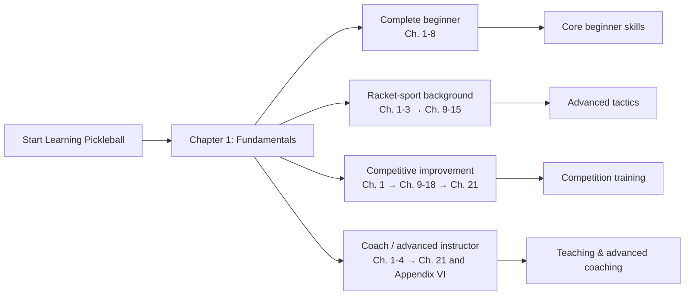

[中文版](https://github.com/yeasy/learning_pickleball/blob/main/cn/README.md)

# Learning Pickleball

  

## Introduction

**Pickleball** is an emerging sport combining features from tennis, badminton, and table tennis. It's easy to start, moderate in intensity, and highly entertaining. This book systematically introduces techniques from beginner to advanced levels to help you enjoy the sport safely.

## Contents

This book covers systematic training for pickleball:

*   **Basics**: Hold Paddle, Serve, Dinking, Dropping, Driving, Volleying, Lobbing.
*   **Advanced**: Spin, Net Battle, ATP, Erne.
*   **Strategy**: Singles and Doubles strategies.
*   **Resources**: [Key Tips](19_key_tips.md) & [FAQ](20_faq.md).

## Five-Minute Quick Start

Follow these steps to get oriented quickly:

1. **What is pickleball** (Chapter 1): learn its origins, characteristics, and how it differs from other racket sports.
2. **Warm-up and paddle fundamentals** (Chapters 3-4): start with physical preparation and basic power generation.
3. **First serve** (Chapter 5): learn the basic requirements and common mistakes for serving and returning.
4. **Core strokes** (Chapters 6-9): practice Dink, Drop, Drive, and Volley to build consistency.
5. **Start playing** (Chapters 17-18): take to the court with singles and doubles strategy, checking Chapters 19-20 for key tips and FAQ.

## Learning Roadmap

| Reader role | Focus | Outcome |
|---------|---------|---------|
| **Complete beginner** | Ch. 1-8 | Master basic pickleball skills and rules |
| **Racket-sport background** | Ch. 1-3 → Ch. 9-15 | Transfer experience quickly, learn advanced tactics |
| **Competitive improvement** | Ch. 1 → Ch. 9-18 → Ch. 21 | Systematic training and match strategy |
| **Coach / advanced instructor** | Ch. 1-4 → Ch. 21 and Appendix VI | Lesson design, sports science, and equipment decisions |

## How to Read

*   🌐 Online: [GitBook](https://yeasy.gitbook.io/learning_pickleball/)
*   📄 PDF: [GitHub Releases](https://github.com/yeasy/learning_pickleball/releases/latest)

## License & Authorization

This book is authorized for educational use by [numerous clubs and schools](https://github.com/yeasy/learning_pickleball/wiki/).
**Commercial use is prohibited without authorization.**
